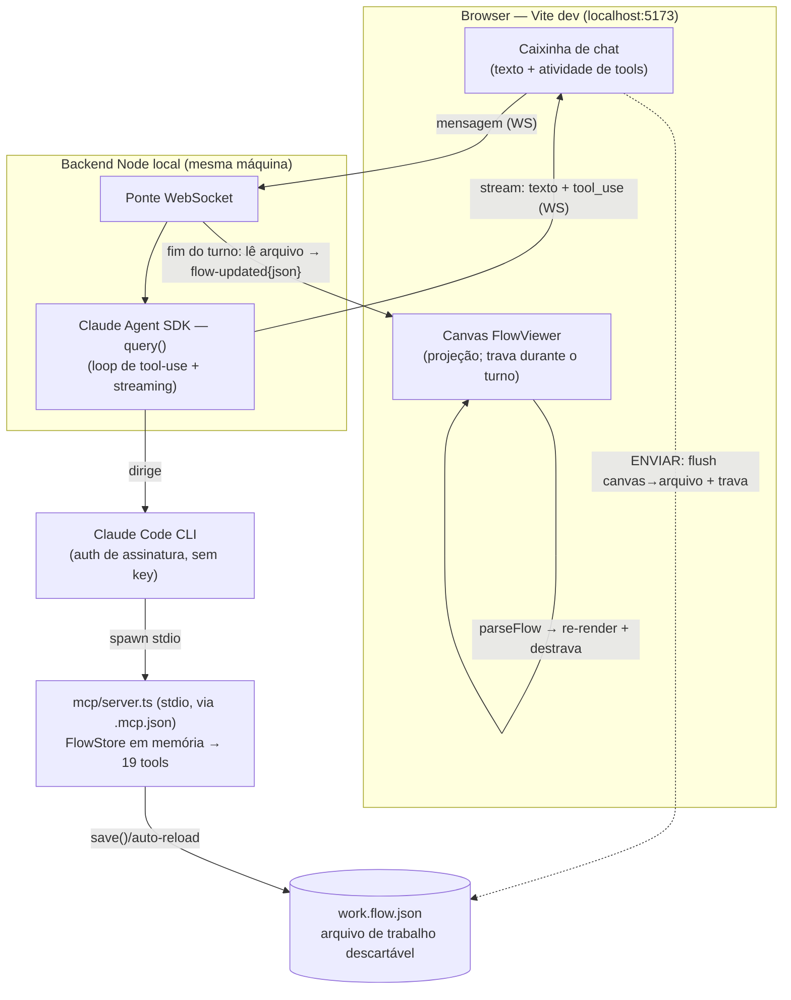

# PLANS.md — FlowViewer: de visualizador a editor de fluxos OmniChat

<!-- HANDOFF:START -->
## 🔄 Handoff — 2026-06-26

**Foco da próxima sessão:** `/verify` e2e da feature "Nó de Captura" pela caixinha — fechar o critério de aceite — e decidir o destino das branches abertas (`feat/set-message` → `feat/capture-node-guidance`).

**Onde paramos:** branch **`feat/capture-node-guidance`** (baseada na `feat/set-message`, NÃO na `main` — a `set-message` tem 4 commits docs-only não-mergeados, incl. bump v0.30.0; branchear da main daria conflito/versão inconsistente). Feature **implementada e commitada**:
- Interrogatório (skill `/interrogar`) fechou o design: a melhoria é **guidance, não tool nova** — as tools p/ construir um `captureNode` completo já existiam (nasce com `captureDataType='free'`; `set_message` carrega a pergunta; `set_action_field` tipa).
- 3 mudanças: (1) `summary`/`fields` de `captureNode`+`waitNode` reescritos em [nodeCatalog.ts](src/utils/nodeCatalog.ts); (2) regra nova nas `instructions` do [mcp/server.ts](mcp/server.ts); (3) `findAskWaitNudges` no `validate()` ([flowTools.ts](src/tools/flowTools.ts)) — aviso não-bloqueante p/ `defaultNode`-com-texto→`waitNode`, exclusivo do agente.
- **+3 testes** (472 verdes); `tsc`+`mcp:typecheck` limpos; bump **v0.31.0**.
- Commits: `5ae070a` (doc Uni.co, antes solto) + `59b6307` (feature v0.31.0).
- Arquivado nesta sessão: Fase 2 (NODE_CATALOG) migrada p/ `docs/PLANS-ARCHIVE.md` (PLANS passou de 642 linhas).

**Fios soltos / meio-feito:**
- **`/verify` e2e da Captura pendente** (critério de aceite): prompt "pergunte o CNPJ e depois o nº de atendimento" → assert no `work.flow.json` que ambos são `captureNode` (CNPJ=`cnpj`; nº atendimento=`free`), **zero** `waitNode`.
- **`/verify` e2e do `set_message` ainda pendente** (herdado): "crie um nó de mensagem com texto X" → `content`=X.
- **Decidir destino das branches:** `feat/set-message` (só docs+v0.30.0) e `feat/capture-node-guidance` (feature+v0.31.0) podem virar 1 ou 2 PRs para a `main`.

**Armadilhas desta sessão:**
- `git commit -m @'...'@` é here-string do **PowerShell**, NÃO do Bash tool — no Bash o `@` vira literal e polui a mensagem. Usar heredoc `<<'EOF'` ou `-F arquivo` no Bash tool.
- Stash entre branches com base divergente conflita no `PLANS.md` — rebasear a branch nova sobre a base certa (`feat/set-message`) resolve.

**Próximo passo imediato:**
1. `/verify` pela caixinha p/ a feature Captura (e, de quebra, o `set_message`).
2. Abrir PR(s) → `main` e decidir merge conjunto vs separado das duas branches.

**Ponteiros:**
- PLANS §"Nó de Captura no agente" — decisões + critério de aceite do `/verify`.
- PLANS §"Tool de texto da mensagem (`set_message`)" — critério herdado.
- Commits: `59b6307` (feature), `5ae070a` (doc Uni.co).
- PLANS ~559 linhas após arquivar Fase 2 (< limiar 600).

**Skills sugeridas ao retomar:** `/verify` para os dois e2e pendentes; `/code-review` antes de abrir PR; `/interrogar` antes da próxima feature.
<!-- HANDOFF:END -->

## Contexto

O FlowViewer hoje é um **visualizador read-only**: importa o JSON de intenções de um bot
OmniChat, parseia em `src/utils/parseFlow.ts` e renderiza com `@xyflow/react` (React
Flow 12) + layout automático via Dagre. A plataforma OmniChat **não tem editor visual
nem importador/exportador de arquivo** — só uma tela Angular que edita intenção por
intenção.

Objetivo do projeto: evoluir o FlowViewer para um **editor visual** (criar nós, conectar,
editar conteúdo) capaz de gerar JSON válido e, opcionalmente, enviar direto para a
plataforma via API.

## Contrato de API descoberto (engenharia reversa do bundle + captura de rede)

Base: `https://k0yowczqxg.execute-api.us-east-1.amazonaws.com/prod`
(API Gateway AWS; o front em `app.omni.chat` chama cross-origin).

| Operação | Chamada |
|---|---|
| Listar intenções | `GET /v1/{botId}/intents?fullObject=true` → `{ "list": [intent, ...] }` |
| Salvar/criar intenção | `POST /v1/{botId}/intents/{intentId}` (body = objeto intent completo) |
| Excluir intenção | `DELETE /v1/{botId}/intents/{intentId}` |
| Mesmas rotas para | `endpoints` e `entities` (coleções irmãs de intents) |
| Bot inteiro | `POST /v1/bots` (salvar), `POST /v1/bots/duplicate`, `POST /v1/{botId}/publish`, `GET /v1/{botId}/versions/{id}` |

Headers de autenticação necessários (capturados de uma sessão real):
`authorization: Bearer <token>`, `x-parse-session-token: <token>`,
`x-parse-application-id: <app id fixo>`, `x-omnichat-platform: web`.
O token é o de sessão do usuário logado (Parse Server). **Nunca commitar tokens.**

### Fatos de schema confirmados (POST capturado vs samples de GET)

- O body do POST tem **a mesma forma** dos itens do GET — round-trip é viável.
- `id` das intenções: UUID v4. A intenção inicial usa ID especial `{botId}-start`.
- `condition.next.intent` = **objeto** `{ botId, id }`.
- `action.error.next.intent` = **string** (ID), com `intentBot` como campo irmão.
  Essa assimetria existe em GET e POST igualmente — preservar na serialização.
- Campo `advanced: { active, endpointId }` existe nos exports mais novos
  (sample02/03) e no POST; ausente no sample01 (mais antigo). Tratar como opcional,
  mas sempre emitir no POST.
- O formulário Angular envia o `action` com **todos os campos presentes**
  (nulls/defaults explícitos: `captureDataTypesCategory`, `multipleFields`,
  `lastMessageTextParams`, etc.), enquanto GETs antigos omitem alguns. Serializar
  sempre a forma completa canônica (a do POST capturado).
- Ações que referenciam `endpoints`/`entities` apontam para IDs já existentes no
  bot — o editor trata como referência, nunca cria.

Payload de referência: ver captura do POST de `aguarda_atendente` (transfer) feita
em 2026-06-11 — manter cópia **sanitizada** (sem headers) se necessário em
`samples/`.

## Arquitetura alvo

**Inverter a fonte de verdade.** Hoje: JSON → parseFlow (lossy) → nós React Flow.
Alvo: o modelo `BotIntent[]` é a fonte de verdade; o canvas é uma projeção editável.

- Cada nó guarda seu `BotIntent` cru em `node.data` (campo `raw`).
- Edição estrutural no canvas (conectar/desconectar) = patch no intent
  (`condition.next`).
- Edição de conteúdo no DetailPanel = patch nas `conditions`/`assistant_says`.
- Exportar = remontar `{ list: [...] }` a partir dos intents (originais + patches).
  Nunca reconstruir campos não editados — **preservar e aplicar patch**, não
  serializar do zero.

## Agente de IA que constrói nós (Claude Code CLI + servidor MCP local)

> Promovido do handoff em 2026-06-23 após interrogatório (skill `interrogar`). Esta é a
> **feature-foco** das próximas sessões; o handoff no topo aponta pra cá. O masterFlow
> (parado/completo na Parte 12) deixa de ser o foco.

**Objetivo (1 frase):** um agente de IA que **constrói e edita nós do fluxo operando
ferramentas** (nunca escrevendo JSON cru), via **Claude Code CLI + um servidor MCP local**
sobre o arquivo de fluxo, estruturado desde já para virar produto depois.

**Decisões-âncora (travadas no design original — NÃO reabrir):**
- O agente **opera tools, nunca escreve JSON cru**. As tools envolvem as funções que já
  existem; a validade fica no código, não na memória do modelo.
- O **servidor MCP é a peça durável** — o mesmo conjunto de tools é reusado no
  caminho-produto; só troca o cliente.
- **Local:** Claude Code lança o MCP como **subprocesso por stdio** — zero portas, zero
  rede de entrada. Único tráfego é **de saída** (API Anthropic + API OmniChat). O gh-pages
  **NÃO** fala com o MCP — site e agente são ilhas que só se cruzam pelo **arquivo de fluxo
  em disco** (a UI lê o arquivo só sob demanda via "Carregar exemplo"/import — ela NÃO o lê
  ao vivo; ver [ImportDialog.tsx:27](src/components/ImportDialog.tsx#L27)).
- **Token** vive na **camada de tools** (`OMNI_TOKEN` de `flow-viewer.env`), nunca chega ao
  modelo, nunca é logado. **Resolver por nome → gravar por ID** (o ID sempre vem de resposta
  real da API ⇒ mata referência alucinada).
- **Modelo:** default `claude-sonnet-4-6`; subir p/ `claude-opus-4-8` se errar a sequência
  em pedidos compostos.

**Ordem revista (interrogatório 2026-06-23, Q1 — spike-primeiro).** O refactor do catálogo
(antiga Fase A) foi **adiado para depois do spike**: provar o conceito contra fluxos reais
antes do refactor caro que toca o [DetailPanel.tsx](src/components/DetailPanel.tsx) (~3500
linhas, 383 testes — o arquivo mais arriscado). De-risca e respeita "amostra mínima antes de
escalar". Nova ordem: **1 spike → 2 catálogo → 3 MCP → 4 resolvers → 5 produto.**

> **Fases 1, 2, 3, 4 e 4b ✅ concluídas e mergeadas na `main`** (spike: merge `15cbf54`;
> Fase 2: merge `e701026`; ambos 2026-06-24). Detalhes do spike (Fases 1/3/4/4b) **e da Fase 2
> (`NODE_CATALOG`)** em [docs/PLANS-ARCHIVE.md](docs/PLANS-ARCHIVE.md) — a Fase 2 foi migrada ao
> archive em 2026-06-26 (PLANS passou de ~600 linhas). Segue viva abaixo apenas a **Fase 5**
> (produto, direcional).

### Fase 5 — Produto (direcional, NÃO detalhar agora)

Cliente Claude Code → **backend** com tool runner do SDK (ou MCP connector); o **frontend
executa as tools via relay** (WebSocket/SSE) para a **key ficar no servidor**. Backend em
nuvem (Render/Fly/Workers), **nunca** no roteador de casa; gh-pages segue só frontend.

**Não detalhar agora (Q10):** depende de decisões de produto ainda não tomadas (hosting,
transporte do relay, modelo de auth do usuário final) — detalhar seria especulação que
envelhece mal. O que importa preservar **já são anchors**: camada de tools agnóstica de
transporte, token na camada de tools, **storage abstrato** (reforçado pela Q3). Enquanto as
Fases 1–4 respeitarem isso, a Fase 5 segue viável.

**Riscos/pendências:**
- Pureza Node das funções confirmada (só tipos) — re-verificar se algo puxar novas
  deps de browser para `src/utils`.
- API interna não documentada (risco já registrado) — o round-trip real é a rede de
  segurança.
- ~~O refactor do `NODE_CATALOG` (Fase 2) arrisca os 383 testes do DetailPanel.~~ ✅ Resolvido:
  Fase 2 mergeada (merge `e701026`) com a suíte verde como gate em cada um dos 4 commits.

### Caixinha de chat na página — PoC local do agente construtor ✅ CONCLUÍDA (merge `15cbf54` + PR #5)

> Plano fechado por interrogatório (skill `interrogar`) em 2026-06-25. Decisões TRAVADAS abaixo —
> registro do raciocínio; não reabrir sem novo interrogatório. É a **prova de conceito local da
> Fase 5**: uma demo quase-real de "construir fluxo por chat" rodando 100% na máquina do Andy,
> sem chave da Anthropic.

**Objetivo (1 frase):** uma caixinha de chat integrada à página do FlowViewer que conversa com o
agente construtor de fluxos, **rodando local via Claude Agent SDK + o CLI já logado** (sem
`ANTHROPIC_API_KEY`), reusando o `mcp/server.ts` (stdio) que já existe.

**Decisões (com o porquê):**
1. **Escopo: PoC local, só no dev build.** A caixinha vive no `npm run dev` (localhost). gh-pages
   publicado segue **read-only** (HTTPS não alcança backend em localhost — mixed-content; usar
   **proxy WS do Vite** p/ manter mesma origem). Sem hosting, sem auth de usuário final. É a
   "amostra mínima" antes de escalar p/ a Fase 5.
2. **Motor: Claude Agent SDK headless (Claude Code como lib).** Único caminho viável **sem key**:
   o SDK cru da Messages API (`@anthropic-ai/sdk`) exige `ANTHROPIC_API_KEY`; o Agent SDK roda
   dirigindo o binário `claude`, herdando a **auth do login do CLI** (assinatura). Token vive no
   cofre do CLI — nunca no backend, nunca no modelo. Sobe o `mcp/server.ts` por **stdio** reusando
   o `.mcp.json` existente. Nota: o "MCP connector" da Messages API (`mcp-client-2025-11-20`) **não**
   serve — ele só fala com MCP **remoto por URL**, não stdio.
3. **Sincronia do canvas: auto-reload por turno.** Ao fim do turno o backend lê o arquivo e manda
   o **JSON inteiro embutido no evento `flow-updated`** (sem endpoint de fetch, sem cache do Vite,
   sem esbarrar no gotcha #3 CRLF). A UI joga no `parseFlow` e re-renderiza. Mantém o anchor "site↔
   agente só se cruzam pelo arquivo em disco" — o backend faz a ponte de leitura.
4. **UX: texto streaming + linha de atividade de tools** ("criando nó Menu…", "conectando A→B…").
   Sai de graça do stream do Agent SDK (eventos `assistant` + `tool_use`/`tool_result`). É o que
   vende a demo.
5. **Autoria: agente + manual COEXISTEM, por handoff de turno + lock.** O arquivo é a verdade nas
   fronteiras de turno: ao ENVIAR, o front serializa o canvas → grava o arquivo (reusa o
   **round-trip de exportar**, Fase 1/v0.6.0) e **trava o canvas** (read-only); o agente recarrega
   o arquivo no início do turno, edita, salva; ao fim, `flow-updated` → re-render + destrava. **Um
   escritor por vez** ⇒ sem corrida de escrita.
6. **Gatilho do reload (sem acoplar backend↔MCP):** adicionar `reloadFromFile()` ao
   [FlowStore](src/tools/flowStore.ts) — hoje `fromFile()` lê **só no boot** (L38-42) e mantém o
   modelo em memória pela vida do processo, então o agente NUNCA enxergaria edições manuais. O
   store guarda o estado do que salvou por último; no início de cada tool, se o disco ≠ último-salvo,
   recarrega. Seguro porque o canvas fica travado no turno ⇒ o único escritor externo (front) só
   grava entre turnos.
7. **Rede de segurança: snapshot por turno + guard de parse.** O backend copia o arquivo ANTES de
   cada turno (não só no início da sessão como o `revert` do MCP faz), expondo **"desfazer último
   turno"** na caixinha. Guard: se o JSON do `flow-updated` não passar no `parseFlow`, a UI
   **mantém o último canvas bom + toast de erro** (nunca branqueia).
8. **Transporte WebSocket; uma sessão do Agent SDK viva por chat** (contexto + MCP persistem entre
   turnos — é por isso que a decisão 6 é necessária). Modelo = o default do CLI (Opus 4.8); pode
   passar `model` no `query()` se quiser. SSE+POST seria a alternativa de transporte.
   > **Correção empírica (verificado 2026-06-25 no `/verify` do passo 4):** o **contexto** persiste
   > (via `resume`), mas o **subprocesso MCP NÃO** — o Agent SDK re-spawna o MCP a cada turno
   > (armadilha #2). Logo o `fromFile` do boot já lê o flush, e a **decisão 6 (`reloadFromFile`)
   > ficou redundante** neste caminho (mantida como rede/Fase 5). Confirmado por teste diferencial:
   > flush do masterFlow original → o agente para de ver o nó criado no turno anterior.

**Ordem de build (amostra mínima primeiro — de-risca o desconhecido antes da UI):**
1. ✅ **Smoke do backend (sem UI):** script Node com o Agent SDK `query()`, auth do CLI, `FLOW_FILE`
   apontando p/ cópia descartável, prompt fixo ("crie um nó de mensagem"). Assert: chegam eventos
   de stream **e** o arquivo mudou. Prova o elo mais arriscado — **o Agent SDK com auth de
   assinatura dirige o MCP stdio e streama eventos de tool?** — antes de tocar em React.
2. ✅ **`reloadFromFile()` no FlowStore + teste** (load → escrita externa → reload → assert vê o novo),
   no padrão de [flowTools.test.ts](src/tools/flowTools.test.ts). (commit `18bf0e7`)
3. ✅ **Ponte WS + página HTML mínima** (fora do React): manda 1 mensagem, renderiza texto streaming +
   atividade de tools. Prova transporte + streaming ponta-a-ponta. (commit `64320c0`, `/verify` PASS)
4. ✅ **Integração no FlowViewer** (esta sessão): [ChatPanel.tsx](src/components/ChatPanel.tsx) +
   [useChatSocket.ts](src/hooks/useChatSocket.ts) (widget flutuante, texto streaming + atividade de
   tools, input travado); `flow-updated`→`parseFlow` com guard (mantém último canvas bom em falha);
   lock do canvas no turno (shield read-only + fecha o painel); flush canvas→WS no ENVIAR (reusa
   `serializeFlow`); **snapshot por turno = o Ctrl+Z já existente** (decisão 7 simplificada — front
   `FlowHistory` em vez de snapshot-de-arquivo no backend; o flush reconcilia o MCP no turno seguinte).
   Backend: `flow-updated` carrega o fluxo inteiro + aceita `{ prompt, flow }` p/ flush. Proxy WS no
   Vite (`/agent-ws`). Typecheck (app+backend) e 457 testes verdes; `/verify` da UI pendente.

**Riscos/pendências (e como cada um é testado):**
- **[maior risco, não verificado] Agent SDK + auth de assinatura dirigindo MCP stdio.** ToS da
  assinatura miram uso interativo; há limites de rate. Aceito p/ PoC interna; a Fase 5 troca por
  key server-side. **Teste:** passo 1 do build (smoke) prova/derruba isso primeiro.
- **Gotcha #2 (MCP roda código ANTIGO):** o `reloadFromFile()` novo só vale após **reiniciar o
  Claude Code** (o MCP sobe no boot). Nota de dev-loop, não bloqueia. **Teste:** unit do passo 2
  roda fora do MCP vivo (instancia o store direto).
- **Caminho infeliz coberto por teste:** (a) CLI sem login → backend emite erro claro
  ("rode `claude /login`"), não trava silencioso; (b) MCP não sobe → evento de erro, canvas não
  branqueia; (c) turno erra no meio → caixinha mostra erro, canvas destrava, snapshot permite
  desfazer (estados intermediários válidos são OK — FlowStore Q2); (d) `flow-updated` não parseia →
  mantém canvas + toast; (e) edição manual + edição do agente na mesma sessão → assert sem clobber
  (round-trip: manual flush → `reloadFromFile` → agente vê).
- **Arquivo de trabalho é descartável e fora do versionado canônico** (nunca tocar
  `public/masterFlow.json` — gotcha #2/#3); `serializeFlow` normaliza CRLF→LF, então versionar o
  `work.flow.json` é opcional.

### Tool de texto da mensagem (`set_message`) — fechar o gap do `defaultNode` ✅ CONCLUÍDA (merge `15cbf54`)

> **Resultado (2026-06-24, merge `15cbf54`, spike MCP):** entregue em
> [src/tools/flowTools.ts:149](src/tools/flowTools.ts#L149) (`setMessage`) + registrada em
> [mcp/server.ts:156](mcp/server.ts#L156) + 7 testes unitários em
> [flowTools.test.ts:277](src/tools/flowTools.test.ts#L277) (todos verdes, 40 testes no arquivo).
> Gap fechado: o agente agora constrói um `defaultNode` **com conteúdo de texto**. Pendente apenas
> o `/verify` ponta-a-ponta pela caixinha ("crie um nó de mensagem com texto X" → assert content = X).
>
> Plano fechado por interrogatório (skill `interrogar`) em 2026-06-25. Decisões TRAVADAS abaixo —
> registro do raciocínio; não reabrir sem novo interrogatório.

**Objetivo (1 frase):** uma tool MCP `set_message` que grava/edita o texto da mensagem de um nó
(o que falta para o agente construir um `defaultNode` *com conteúdo*), embrulhando `addTextMessage`/
`updateMessageText` que já existem em [editIntent.ts](src/utils/editIntent.ts) e ainda não estão
expostas em [flowTools.ts](src/tools/flowTools.ts) nem no [mcp/server.ts](mcp/server.ts).

**Decisões (com o porquê):**
1. **Nova tool `set_message`, idempotente** — NÃO estender `set_action_field`. O texto vive em
   `cond.assistant_says[].messages[].content`, estrutura distinta de `action.*`; juntar as duas no
   mesmo enum misturaria semânticas. Semântica: na condição-alvo, **0 mensagens TEXT → cria**
   (`addTextMessage`); **1 → sobrescreve** (`updateMessageText` pela ref); **N>1 → erro** ("edição
   de múltiplos balões não é suportada por aqui"). Idempotente (re-rodar não duplica) e à prova de
   surpresa (nunca edita o balão errado em silêncio; pior caso é erro honesto).
2. **Escopo só TEXT.** `IMAGE/FILE/VIDEO` (URL S3), `COLLECTION` (id) e `TEMPLATE` (id) exigem
   referência real que o agente não pode sintetizar (regra-âncora resolver-por-nome→gravar-por-id) e
   demandariam resolvers próprios. `BUTTON/LIST` é território do `set_menu`. É a amostra mínima do gap.
3. **Assinatura `set_message(node, text, condIdx?=0)`, sem `msgIdx`.** Espelha o `set_action_field`.
   O gap é *criação* (balão único) → não precisa de índice de mensagem. `msgIdx` (mirar um balão
   específico em nó multi-balão) fica como **extensão aditiva futura** se a Fase 5 pedir — não quebra.
   Edição fina multi-balão já tem dono: o DetailPanel da UI.
4. **Aceita qualquer nó EXCETO `choiceNode`.** `assistant_says` existe em toda condição e nós de ação
   (transfer/capture/api/…) podem ter um balão de texto junto da ação (ex.: "aguarde, vou te
   transferir"). Só o `choiceNode` é recusado (→ erro apontando `set_menu`), porque ali o
   `assistant_says` é *estruturalmente* a mensagem BUTTON/LIST cujos botões mapeiam para
   `action.choices` — um TEXT solto viraria balão órfão.
5. **Texto vazio/só espaços → recusa** (espelha `set_menu`, que rejeita corpo vazio). "Limpar" é
   remoção (outra operação, fora do escopo); o verbo "set" nunca grava balão vazio. Container fixo
   `'condition'` (a mensagem normal) — o caminho de erro (`action.error.assistant_says`) fica fora.
6. **Descoberta pelo agente:** registrar a tool em `mcp/server.ts` (descrição + zod) **e** citá-la na
   linha "Trabalho típico" das `instructions` (`create_node → set_message / set_action_field / …`),
   senão o agente não sabe que ela existe. Conferir se `describe_node_type(defaultNode)` precisa
   mencionar o texto.

**Como será testado (decisão 5 do interrogatório — aceite ponta-a-ponta):**
- **Unit** em [flowTools.test.ts](src/tools/flowTools.test.ts), no padrão existente: criar `defaultNode`
  → `set_message` (assert `content`) → `set_message` de novo (assert sobrescreve, idempotente) →
  N>1 TEXT → erro → `choiceNode` → erro → texto vazio → erro → nó de ação (transfer) → ok.
- **`mcp:typecheck`** limpo (registro da tool + `ACTION_FIELDS`/imports).
- **`/verify` ponta-a-ponta pela caixinha:** "crie um nó de mensagem com texto X" → assert que o
  `content` do nó novo no `work.flow.json` é X. **É o critério de aceite do gap** (prova que sumiu).

**Riscos/pendências:**
- A tool não edita um balão específico de nó multi-balão (decisão 3) — aceito no PoC; `msgIdx` é a
  saída aditiva.
- Localizar a "única TEXT" para o caminho de edição: varrer `listMessages` filtrando `condIdx` +
  `type==='TEXT'` e montar a `MessageRef` — detalhe de implementação, sem decisão pendente.

### Prompt de construção do fluxo "Grupo Uni.co (lojista)"

> Prompt multi-turno fechado por interrogatório (skill `interrogar`) em 2026-06-26. Artefato
> reutilizável: 6 turnos de chat + mapa Mermaid + critério em
> [docs/PROMPT-fluxo-uni-co.md](docs/PROMPT-fluxo-uni-co.md). Origem: PDF "Reestruturação
> Omnichat Lojista".

**Objetivo:** construir pela caixinha o fluxo do PDF **o mais fiel possível**, dentro das tools.
Topologia: tronco linear (saudação→marca→captura CNPJ→categoria→assunto de 7 opções) + os 7
direcionamentos, com **bifurcação local (menu)** só nos ramos 2 (devolução, por marca×categoria)
e 6 (partes/peças, por marca) — porque **não há condição por variável nas tools**. Dinâmicos →
variáveis reais (`@customer.name`, `@chat.customerSupportRequestId`). Serve também de `/verify`
do `set_message`. **Gap de tool descoberto:** intenção dentro/fora-de-horário com "Senão" exige
tools de condição inexistentes (add_condition + critério `@bot.isOpenNow` + flag Senão) — fora-de-
horário virou 2 nós soltos como aproximação; candidato a feature futura. Pendente: rodar pela
caixinha e avaliar contra o critério do doc.

### Nó de Captura no agente — trocar "Mensagem + Aguardar" por `captureNode` (guidance + nudge) ✅ IMPLEMENTADA (branch `feat/capture-node-guidance`, v0.31.0)

> **Resultado (2026-06-26, branch `feat/capture-node-guidance`):** entregue como **guidance + nudge**
> (sem tool nova). (1) `summary`/`fields` de `captureNode` e `waitNode` reescritos em
> [nodeCatalog.ts](src/utils/nodeCatalog.ts); (2) nova regra "perguntar+esperar = captureNode" nas
> `instructions` do [mcp/server.ts](mcp/server.ts); (3) `validate()` ([flowTools.ts](src/tools/flowTools.ts))
> ganhou `findAskWaitNudges` — aviso não-bloqueante quando `defaultNode` COM texto → `waitNode`, exclusivo
> do agente (não toca `validateFlow`/UI). **+3 testes**, suíte cheia verde (**472 testes**), `tsc`+`mcp:typecheck`
> limpos. **Pendente:** `/verify` e2e pela caixinha (critério de aceite abaixo).
>
> Plano fechado por interrogatório (skill `interrogar`) em 2026-06-26. Decisões TRAVADAS abaixo —
> registro do raciocínio; não reabrir sem novo interrogatório. Origem: ao construir o fluxo Uni.co
> (turnos 2/3/4/7, "mensagem X → aguardar a resposta"), o agente monta `defaultNode` + `waitNode`
> em vez de um `captureNode`.

**Objetivo (1 frase):** fazer o agente usar **um `captureNode`** sempre que o passo for "perguntar
algo e esperar a resposta", em vez do par `defaultNode` + `waitNode`.

**Diagnóstico (achados do código — é guidance, NÃO falta tool):**
- `captureNode` recém-criado já nasce com `captureDataType: 'free'` ([intentTemplates.ts:83](src/utils/intentTemplates.ts#L83))
  ⇒ captura não configurada = "pergunte e espere qualquer resposta" = exatamente o que Mensagem+Aguardar faz.
- `set_message` aceita `captureNode` (recusa só `choiceNode`) ⇒ o nó de Captura **carrega a própria pergunta**.
- `set_action_field` já grava `captureDataType`/`captureDataTypesCategory`/`multipleFields` ([flowTools.ts:33](src/tools/flowTools.ts#L33)).
- A UI ([DetailPanel.tsx:3215](src/components/DetailPanel.tsx#L3215)) grava **só** esses 3 campos ao salvar captura — **nunca** `variable`.
  Captura tipada (CNPJ/CPF/…) **não precisa** de variável: a plataforma armazena no campo conhecido do contato pelo
  próprio `captureDataType`. `variable` só serve ao tipo `custom` (= território do `setDataNode.bulkUpdate` não exposto, fora do escopo).
- Logo: tudo construível com as tools de hoje. O agente caiu no workaround por **guidance** — o `summary` do
  `captureNode` ("Captura dado(s) do contato…") enquadra como "dado estruturado" e não diz que é o jeito de "perguntar e esperar".

**Decisões (com o porquê):**
1. **Regra única: pergunta+espera → `captureNode` (Q1).** Qualquer "faça uma pergunta e espere a resposta" vira
   um `captureNode` — inclusive texto livre, que fica em `captureDataType='free'` (default). O `waitNode` sobra só
   para "esperar sem perguntar nada". Uma regra só, uniforme; sem o agente ter que adivinhar "é tipado?".
2. **Materialização: guidance + nudge no `validate()` (Q2).** (a) Reescrever o `summary` do `captureNode` e do
   `waitNode` em [nodeCatalog.ts](src/utils/nodeCatalog.ts) e a regra na linha "Trabalho típico" das `instructions`
   do [mcp/server.ts](mcp/server.ts); (b) `validate()` emite **aviso não-bloqueante** ao detectar o antipadrão.
   Texto guia a construção; validate pega recidiva. **Sem guardrail duro na tool** — `waitNode` tem usos legítimos
   e bloquear misturaria política de design com validação estrutural.
3. **Política de tipo: conservador (Q4).** O agente só seta `captureDataType` quando a pergunta casa **limpo** com
   **um** dos 11 `CAPTURE_FIELDS` (CNPJ→`cnpj`, e-mail→`mail`, telefone→`fullPhoneNumber`). Composto/ambíguo/sem
   mapeamento → deixa `free`. Nunca erra o tipo (pior caso = pergunta+espera); `set_action_field` **não valida** enum
   hoje, então a disciplina vive na guidance. Vocabulário = os 11 `CAPTURE_FIELDS`, não os 22 do enum da plataforma.
   *Consequência:* o "Qual seu CNPJ **e nome da loja**?" do Uni.co (composto) vira captura **free** — o humano lê a resposta.
4. **Agente NUNCA grava `variable` (decorre do diagnóstico).** Espelha a UI. `variable` = tipo `custom`, fora do escopo.
5. **Nudge preciso: só `defaultNode` COM mensagem TEXT → `waitNode` (Q5).** É a assinatura de "perguntou e esperou".
   `defaultNode` sem texto → `waitNode` não acusa (raro e ambíguo). Menos falso-positivo.

**Como será testado:**
- **Unit do nudge** (padrão de [flowTools.test.ts](src/tools/flowTools.test.ts)): defaultNode-com-texto→wait **dispara**
  aviso; defaultNode-sem-texto→wait **não** dispara; captureNode→(nada) limpo; aviso é não-bloqueante (validate não falha).
- **`mcp:typecheck`** limpo (mudança de `summary`/instructions é texto; o validate ganha uma checagem).
- **`/verify` e2e pela caixinha:** prompt "pergunte o CNPJ e depois pergunte o nº de atendimento" → assert no
  `work.flow.json` que ambos são `captureNode` (CNPJ tipado=`cnpj`; nº atendimento=`free`), **zero** `waitNode`.

**Riscos/pendências:**
- Guidance não garante 100% (Q2 recusou guardrail duro) — o nudge do `validate()` é a rede para recidiva.
- `set_action_field` ainda não valida `captureDataType` (dívida da Fase 2) — se o agente escrever tipo inválido,
  passa silencioso. Aceito por ora; consolidar junto com os sub-enums quando a Fase 5 pedir validação de campo.
- Enum reduzido (11 vs 22): captura que precisaria de `cpfOrCnpj`/`custom`/etc. cai em `free` — aceito; ampliar é aditivo.

### Gate de acesso à caixinha de chat (bot + token) ✅ CONCLUÍDA (PR #5, merge `53b3b19`)

> Plano fechado por interrogatório (skill `interrogar`) em 2026-06-25. Decisões TRAVADAS abaixo —
> registro do raciocínio; não reabrir sem novo interrogatório. É um **gate de produto antecipado**
> (ensaio da Fase 5): hoje a caixinha NÃO usa `hasFlow`/`hasToken` para operar (fala com o backend
> local via `OMNI_TOKEN`+`work.flow.json`), mas em produção bot e token virão **prontos da OmniChat**
> e o gate vira o detector de "a Omni não passou um desses dois dados".

**Objetivo (1 frase):** bloquear a abertura da caixinha de chat ([ChatPanel.tsx](src/components/ChatPanel.tsx))
enquanto faltar **(1) um fluxo carregado** (`hasFlow`) **e/ou (2) o token de sessão** (`hasToken`),
exibindo ao clicar um aviso que lista **só os requisitos pendentes** (juntos quando faltam os dois,
individual quando falta um).

**Decisões (com o porquê):**
1. **Gate = `hasFlow && hasToken` (estado do front), NÃO o token real do backend (Q1).** Reusa os dois
   estados que o [App.tsx](src/App.tsx) já tem (`hasFlow` L60; `hasToken = !!sessionToken.trim()` L1047).
   Zero infra nova e **casa com o modelo de produção**: na Fase 5 a OmniChat injeta bot carregado +
   token de sessão no front — não o `OMNI_TOKEN` do backend (que é detalhe do PoC e não vive no front).
2. **Fonte dos dois sinais isolada num ponto único (`useChatGate` no App) para a Fase 5 trocar só a
   fonte.** Duas camadas que NÃO mudam juntas: (a) **o gate** (regra "bloqueia até os dois `true` +
   aviso individual") é igual hoje e em produção; (b) **a origem dos sinais** muda — hoje `hasFlow`←
   importar/criar e `hasToken`←chave na barra; em produção ambos chegam da Omni (query param /
   `postMessage` / config no boot). O `ChatPanel` recebe dois **booleanos abstratos via props** e não
   sabe de onde vieram ⇒ a adaptação futura fica confinada a quem alimenta os booleanos. Mesmo anchor
   "camada agnóstica de transporte" da Fase 5. O **tom do aviso** muda por ambiente: "você esqueceu de
   inserir" (dev) → "a OmniChat não passou esse dado" (produção, sinal de bug de integração).
3. **Bloqueio no launcher: não abre; popover ancorado no botão (Q2).** Ao clicar com requisito
   faltando, o launcher NÃO abre o painel — dispara um popover (estilo o do token na barra) que lista
   **apenas os requisitos pendentes**. "Junto mas individual" sai de graça: 0 itens (libera) / 1 item
   (falta um) / 2 itens (faltam os dois).
4. **Popover acionável (Q3).** Cada item pendente tem CTA: "Carregar um fluxo" → `setImportOpen(true)`;
   "Inserir o token" → `requestToken()` (abre o popover da chave na barra). Reusa handlers que o App já
   tem. Em produção os CTAs somem (o usuário não age) e viram texto informativo.
5. **Gate só na abertura, não contínuo (Q4).** Avaliado no clique de abrir; uma vez dentro, a conversa
   segue mesmo que o token seja limpo depois (a caixinha não usa o `sessionToken` pra operar). Mais
   simples, sem fechar o chat no meio; o caso "cair no meio" praticamente só ocorre em dev (em produção
   os dados vêm fixos).
6. **Cadeado no launcher quando bloqueado (Q5).** Quando falta requisito, o launcher troca o pontinho de
   status WS por um cadeado — comunica "indisponível" antes do clique; o popover só explica o porquê.
7. **`ChatPanel` ganha props `hasFlow`/`hasToken`/`onRequestImport`/`onRequestToken`; gate dev-only por
   ora** (a caixinha já é dev-only, montada sob `import.meta.env.DEV` em [App.tsx:1219](src/App.tsx#L1219)).

**Como será testado:**
- **Unit (lógica pura — padrão do projeto; NÃO há testes de componente):** extrair a derivação dos
  pendentes numa função pura (ex.: `chatGatePending(hasFlow, hasToken)`) e cobrir os 4 casos — ambos OK
  → `[]`; falta bot → `[bot]`; falta token → `[token]`; faltam os dois → `[bot, token]` (este prova o
  "individual").
- **/verify manual pela caixinha (dev build):** sem fluxo + sem token → cadeado + popover com 2 itens e
  CTAs; inserir token → popover cai pra 1 item; carregar fluxo → launcher abre normal.

**Riscos/pendências:**
- Em produção a fonte dos sinais muda (query/`postMessage`/config) e o tom do aviso também — isolado no
  `useChatGate` (decisão 2), fora do `ChatPanel`.
- A caixinha não usa `sessionToken` pra operar hoje ⇒ o gate é de **produto/ensaio**, não barreira
  técnica. Aceito (é o ponto da feature: ensaiar o gate da Fase 5).

### Chat UX — textarea auto-expand + botão estilo menu + widget draggable ✅ CONCLUÍDA (PR #5, merge `53b3b19`)

> Plano fechado por interrogatório (skill `interrogar`) em 2026-06-25. Decisões TRAVADAS abaixo —
> registro do raciocínio; não reabrir sem novo interrogatório.

**Objetivo (1 frase):** melhorar a ergonomia da caixinha de chat em três frentes — o campo de texto
cresce com o conteúdo, o botão lançador se integra visualmente ao menu esquerdo, e o widget pode ser
movido livremente pela tela.

**Decisões (com o porquê):**
1. **Drag: botão e painel como UMA unidade.** Uma única coordenada `{x, y}` compartilhada; ao fechar
   o painel o botão fica onde o painel estava. Drag no header quando aberto; drag no pill quando
   recolhido. Posições independentes seriam confusas — o widget é o mesmo objeto em dois estados.
2. **Drag: hook nativo `useDraggable` (~40 linhas), sem nova dependência.** `mousedown`/`mousemove`/
   `mouseup` no `document`. Sem `react-draggable` — adicionar dep só pra este widget seria desproporcional
   e fere a filosofia do projeto (deps mínimas).
3. **Drag: livre dentro da viewport, sem snapping.** O widget não sai da tela (clamp), mas solta onde
   largar. Snap de borda seria mais polido, mas é complexidade que não vale para o PoC.
4. **Posição só em memória.** Volta ao canto inferior direito a cada reload. `localStorage` seria uma
   linha a mais mas não justifica para um PoC interno de dev.
5. **Estilo do botão: pill zinc-800/zinc-700/zinc-100 (mantém o label "Agente").** Troca `bg-indigo-600`
   pelo zinc escuro do menu (`bg-zinc-800 border border-zinc-700 text-zinc-100`). Mantém o pill com label
   — virar ícone quadrado de rail esconderia o propósito do widget sem ganho real. Acento amber (coerente
   com o logo `bg-amber-400`) quando conectado/running.
6. **Textarea: min 1 linha → cresce até 5 linhas → rola.** JS auto-resize: `el.style.height = 'auto'`
   depois `el.style.height = el.scrollHeight + 'px'` a cada `onChange`, com `max-h` equivalente a 5
   linhas (~120px). O `rows={1}` atual impedia o crescimento — o `max-h-28` (112px) estava quase certo
   mas sem o JS de resize não funcionava.

**Armadilhas de implementação:**
- `mousedown` no botão ×/minimizar NÃO deve iniciar drag — handler de drag fica no header/pill, não
  em descendentes interativos.
- Suprimir `user-select: none` no `body` durante o drag (evita selecionar texto no canvas por acidente).
- Clamp: `x` entre `0` e `window.innerWidth - panelWidth`; `y` entre `0` e `window.innerHeight - panelHeight`.

**Como será testado:**
- **Manual `/verify`:** arrastar o botão → reabrir → posição mantida; arrastar o header quando aberto →
  recolher → botão no lugar certo; arrastar até a borda → clamped.
- **Textarea:** digitar 6+ linhas → para em 5 e rola; limpar → encolhe de volta a 1 linha.
- **Estilo:** zinc no dark e no light mode; checar se o pill não briga com o fundo do canvas.

## Melhorias paralelas (independentes das fases)

- ~~Trocar `dagre@0.8.5` (sem manutenção) por `@dagrejs/dagre` (fork mantido,
  API idêntica) — só muda o import em `parseFlow.ts`.~~ ✅ FEITO (2026-06-15):
  `@dagrejs/dagre@3.0.0`. O fork embarca tipos próprios, então `@types/dagre` saiu.
  Build + 100 testes + smoke-phase5 verdes; bundle caiu ~526→477 kB.
- Avaliar `elkjs` se a estética do layout automático incomodar: é port-aware
  (considera a posição dos handles, melhora fluxos com muitos botões/saídas).
  Restrito a `parseFlow.ts:dagreLayout`.

## Riscos e decisões registradas

1. API interna não documentada — pode mudar sem aviso; o teste de round-trip com
   exports reais é a rede de segurança.
2. Usuário (Andy) trabalha na OmniChat (Suporte N2 + automações) — uso interno
   autorizado, ainda assim seguir a regra do sandbox.
3. Não criar/editar `endpoints` e `entities` no escopo atual — só referenciar.
4. A skill de projeto foi descartada (decisão de 2026-06-11): o conhecimento fica
   neste PLANS.md.
5. **`npm audit`: 2 vulnerabilidades high do esbuild ≤0.28.0 — ACEITAS, não
   corrigir com `--force` (decisão de 2026-06-15).** Ambas são de tempo de
   desenvolvimento e não chegam ao site publicado (o esbuild não vai no bundle):
   (a) GHSA-67mh-4wv8-2f99 — o dev server do esbuild permite que um site
   malicioso aberto durante `npm run dev` leia respostas (vetor só em localhost,
   produção não usa); (b) GHSA-gv7w-rqvm-qjhr — falta de verificação de
   integridade do binário **no módulo Deno** (projeto é Node, não aplica). O
   esbuild ≤0.28.0 vem do **vite 5**, e o único fix que o npm oferece é
   `vite@8` (`audit fix --force`) — major quebrando vite 5→8, desproporcional
   para falhas que não atingem produção. Se um dia quiser zerar o audit, fazer
   um **upgrade deliberado do vite** como tarefa própria, com revalidação de
   build/config/plugin-react — nunca via `--force`.

## Histórico (arquivado)

> Detalhes completos em [docs/PLANS-ARCHIVE.md](docs/PLANS-ARCHIVE.md). Uma linha por fase/feature concluída e mergeada.

- **(merge `15cbf54`)** — Spike MCP: Fases 1/3/4/4b (camada de tools, servidor MCP stdio, 8 resolvers nome→ID, set_menu + connect_to_bot)
- **(merge `e701026`)** — Fase 2: centralizar `NODE_CATALOG` (fonte única kind-level; MCP deriva o manifesto)
- **v0.27.0** — Nó Captura CSAT editável (dropdown "Tipo de captura CSAT")
- **v0.26.0** — Nó Pedido editável (dropdown "Tipo de ação": Adicionar item / Gerar pedido)
- **masterFlow.json** — fluxo de exemplo canônico, Partes 1–12 (42 intenções) — fixture viva em `public/masterFlow.json`
- **v0.25.0** — Seção "Em caso de erro" (`action.error`) nos 7 nós de ação
- **v0.24.0** — Nó "Chamada de API" editável (Tipo de Integração + picker de Endpoint)
- **v0.24.0** — Nó "Transferência" rico (seletor de 2 níveis + picker de vendedores)
- **v0.23.0** — Nó "Loja física" editável + picker dinâmico de `@entity` (Listas)
- **v0.22.0** — Próximo Fluxo (`next.intent` editável: "Neste bot" / "Em outro bot")
- **v0.20.1** — Fix `remapRefs` (refs de `context`/`condition.intent` no push)
- **v0.20.0** — Tempo de envio da resposta (`executionDelay`) — "Fase 17"
- **v0.19.0** — Fase 16: sinal de "opção de menu sem conexão" no nó de Escolha
- **v0.18.1** — Fase 15: feedback ao "Aplicar alterações" (toast + micro-animação)
- **v0.18.0** — Fase 14: nó de Captura (modos "Uma" / "Múltiplas informações")
- **v0.17.0** — Fase 13: UX do picker de variáveis (@)
- **v0.16.0** — Fase 12: Modelo de mensagem com Flow (TEMPLATE)
- **v0.15.0** — Fase 11: repaginação visual "cara de Omni" / Fase 7: duplicação de nós
- **v0.14.0** — Fase 6: nós por condição (Modelo B)
- **v0.13.0** — Fase 4: push + restore via API (CLI + UI) / Fase 5: redesign editor (v0.10–0.12)
- **v0.16.0** — Fase 10/10b/10c: mensagem Botão/Lista + nó de Escolha (menu × escolhas)
- **(branch)** — Fase 8: painel de edição alinhado ao construtor / Fase 9: variável "Times" (@team)
- **v0.8.0–0.9.0** — Fase 3a/3b: edição de conteúdo + estrutural avançada
- **v0.7.0** — Fase 2: criação de nós (paleta + templates)
- **v0.6.0** — Fase 1: round-trip (importar → reconectar → exportar)
