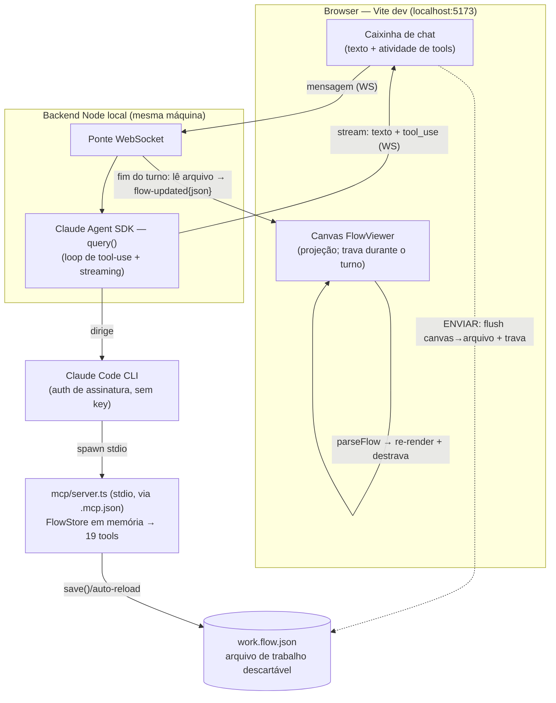

# PLANS-ARCHIVE.md — Histórico de fases concluídas (FlowViewer)

> Arquivo morto: features e fases **concluídas e mergeadas/lançadas** (têm versão), movidas verbatim do `PLANS.md` para manter o ativo enxuto.
> Não entra no contexto das retomadas de sessão — consulte sob demanda. O índice de uma linha por fase fica no fim do `PLANS.md`.
> Ordem: features standalone recentes primeiro; a seção "## Fases" segue a ordem cronológica original (Fase 1 → 16) por legibilidade histórica.

### Gate de acesso à caixinha de chat (bot + token) ✅ CONCLUÍDA (PR #5, merge `53b3b19`)

> Plano fechado por interrogatório (skill `interrogar`) em 2026-06-25. Decisões TRAVADAS abaixo —
> registro do raciocínio; não reabrir sem novo interrogatório. É um **gate de produto antecipado**
> (ensaio da Fase 5): hoje a caixinha NÃO usa `hasFlow`/`hasToken` para operar (fala com o backend
> local via `OMNI_TOKEN`+`work.flow.json`), mas em produção bot e token virão **prontos da OmniChat**
> e o gate vira o detector de "a Omni não passou um desses dois dados".

**Objetivo (1 frase):** bloquear a abertura da caixinha de chat ([ChatPanel.tsx](src/components/ChatPanel.tsx))
enquanto faltar **(1) um fluxo carregado** (`hasFlow`) **e/ou (2) o token de sessão** (`hasToken`),
exibindo ao clicar um aviso que lista **só os requisitos pendentes** (juntos quando faltam os dois,
individual quando falta um).

**Decisões (com o porquê):**
1. **Gate = `hasFlow && hasToken` (estado do front), NÃO o token real do backend (Q1).** Reusa os dois
   estados que o [App.tsx](src/App.tsx) já tem (`hasFlow` L60; `hasToken = !!sessionToken.trim()` L1047).
   Zero infra nova e **casa com o modelo de produção**: na Fase 5 a OmniChat injeta bot carregado +
   token de sessão no front — não o `OMNI_TOKEN` do backend (que é detalhe do PoC e não vive no front).
2. **Fonte dos dois sinais isolada num ponto único (`useChatGate` no App) para a Fase 5 trocar só a
   fonte.** Duas camadas que NÃO mudam juntas: (a) **o gate** (regra "bloqueia até os dois `true` +
   aviso individual") é igual hoje e em produção; (b) **a origem dos sinais** muda — hoje `hasFlow`←
   importar/criar e `hasToken`←chave na barra; em produção ambos chegam da Omni (query param /
   `postMessage` / config no boot). O `ChatPanel` recebe dois **booleanos abstratos via props** e não
   sabe de onde vieram ⇒ a adaptação futura fica confinada a quem alimenta os booleanos. Mesmo anchor
   "camada agnóstica de transporte" da Fase 5. O **tom do aviso** muda por ambiente: "você esqueceu de
   inserir" (dev) → "a OmniChat não passou esse dado" (produção, sinal de bug de integração).
3. **Bloqueio no launcher: não abre; popover ancorado no botão (Q2).** Ao clicar com requisito
   faltando, o launcher NÃO abre o painel — dispara um popover (estilo o do token na barra) que lista
   **apenas os requisitos pendentes**. "Junto mas individual" sai de graça: 0 itens (libera) / 1 item
   (falta um) / 2 itens (faltam os dois).
4. **Popover acionável (Q3).** Cada item pendente tem CTA: "Carregar um fluxo" → `setImportOpen(true)`;
   "Inserir o token" → `requestToken()` (abre o popover da chave na barra). Reusa handlers que o App já
   tem. Em produção os CTAs somem (o usuário não age) e viram texto informativo.
5. **Gate só na abertura, não contínuo (Q4).** Avaliado no clique de abrir; uma vez dentro, a conversa
   segue mesmo que o token seja limpo depois (a caixinha não usa o `sessionToken` pra operar). Mais
   simples, sem fechar o chat no meio; o caso "cair no meio" praticamente só ocorre em dev (em produção
   os dados vêm fixos).
6. **Cadeado no launcher quando bloqueado (Q5).** Quando falta requisito, o launcher troca o pontinho de
   status WS por um cadeado — comunica "indisponível" antes do clique; o popover só explica o porquê.
7. **`ChatPanel` ganha props `hasFlow`/`hasToken`/`onRequestImport`/`onRequestToken`; gate dev-only por
   ora** (a caixinha já é dev-only, montada sob `import.meta.env.DEV` em [App.tsx:1219](src/App.tsx#L1219)).

**Como será testado:**
- **Unit (lógica pura — padrão do projeto; NÃO há testes de componente):** extrair a derivação dos
  pendentes numa função pura (ex.: `chatGatePending(hasFlow, hasToken)`) e cobrir os 4 casos — ambos OK
  → `[]`; falta bot → `[bot]`; falta token → `[token]`; faltam os dois → `[bot, token]` (este prova o
  "individual").
- **/verify manual pela caixinha (dev build):** sem fluxo + sem token → cadeado + popover com 2 itens e
  CTAs; inserir token → popover cai pra 1 item; carregar fluxo → launcher abre normal.

**Riscos/pendências:**
- Em produção a fonte dos sinais muda (query/`postMessage`/config) e o tom do aviso também — isolado no
  `useChatGate` (decisão 2), fora do `ChatPanel`.
- A caixinha não usa `sessionToken` pra operar hoje ⇒ o gate é de **produto/ensaio**, não barreira
  técnica. Aceito (é o ponto da feature: ensaiar o gate da Fase 5).

### Chat UX — textarea auto-expand + botão estilo menu + widget draggable ✅ CONCLUÍDA (PR #5, merge `53b3b19`)

> Plano fechado por interrogatório (skill `interrogar`) em 2026-06-25. Decisões TRAVADAS abaixo —
> registro do raciocínio; não reabrir sem novo interrogatório.

**Objetivo (1 frase):** melhorar a ergonomia da caixinha de chat em três frentes — o campo de texto
cresce com o conteúdo, o botão lançador se integra visualmente ao menu esquerdo, e o widget pode ser
movido livremente pela tela.

**Decisões (com o porquê):**
1. **Drag: botão e painel como UMA unidade.** Uma única coordenada `{x, y}` compartilhada; ao fechar
   o painel o botão fica onde o painel estava. Drag no header quando aberto; drag no pill quando
   recolhido. Posições independentes seriam confusas — o widget é o mesmo objeto em dois estados.
2. **Drag: hook nativo `useDraggable` (~40 linhas), sem nova dependência.** `mousedown`/`mousemove`/
   `mouseup` no `document`. Sem `react-draggable` — adicionar dep só pra este widget seria desproporcional
   e fere a filosofia do projeto (deps mínimas).
3. **Drag: livre dentro da viewport, sem snapping.** O widget não sai da tela (clamp), mas solta onde
   largar. Snap de borda seria mais polido, mas é complexidade que não vale para o PoC.
4. **Posição só em memória.** Volta ao canto inferior direito a cada reload. `localStorage` seria uma
   linha a mais mas não justifica para um PoC interno de dev.
5. **Estilo do botão: pill zinc-800/zinc-700/zinc-100 (mantém o label "Agente").** Troca `bg-indigo-600`
   pelo zinc escuro do menu (`bg-zinc-800 border border-zinc-700 text-zinc-100`). Mantém o pill com label
   — virar ícone quadrado de rail esconderia o propósito do widget sem ganho real. Acento amber (coerente
   com o logo `bg-amber-400`) quando conectado/running.
6. **Textarea: min 1 linha → cresce até 5 linhas → rola.** JS auto-resize: `el.style.height = 'auto'`
   depois `el.style.height = el.scrollHeight + 'px'` a cada `onChange`, com `max-h` equivalente a 5
   linhas (~120px). O `rows={1}` atual impedia o crescimento — o `max-h-28` (112px) estava quase certo
   mas sem o JS de resize não funcionava.

**Armadilhas de implementação:**
- `mousedown` no botão ×/minimizar NÃO deve iniciar drag — handler de drag fica no header/pill, não
  em descendentes interativos.
- Suprimir `user-select: none` no `body` durante o drag (evita selecionar texto no canvas por acidente).
- Clamp: `x` entre `0` e `window.innerWidth - panelWidth`; `y` entre `0` e `window.innerHeight - panelHeight`.

**Como será testado:**
- **Manual `/verify`:** arrastar o botão → reabrir → posição mantida; arrastar o header quando aberto →
  recolher → botão no lugar certo; arrastar até a borda → clamped.
- **Textarea:** digitar 6+ linhas → para em 5 e rola; limpar → encolhe de volta a 1 linha.
- **Estilo:** zinc no dark e no light mode; checar se o pill não briga com o fundo do canvas.

### Caixinha de chat na página — PoC local do agente construtor ✅ CONCLUÍDA (merge `15cbf54` + PR #5)

> Plano fechado por interrogatório (skill `interrogar`) em 2026-06-25. Decisões TRAVADAS abaixo —
> registro do raciocínio; não reabrir sem novo interrogatório. É a **prova de conceito local da
> Fase 5**: uma demo quase-real de "construir fluxo por chat" rodando 100% na máquina do Andy,
> sem chave da Anthropic.

**Objetivo (1 frase):** uma caixinha de chat integrada à página do FlowViewer que conversa com o
agente construtor de fluxos, **rodando local via Claude Agent SDK + o CLI já logado** (sem
`ANTHROPIC_API_KEY`), reusando o `mcp/server.ts` (stdio) que já existe.



**Decisões (com o porquê):**
1. **Escopo: PoC local, só no dev build.** A caixinha vive no `npm run dev` (localhost). gh-pages
   publicado segue **read-only** (HTTPS não alcança backend em localhost — mixed-content; usar
   **proxy WS do Vite** p/ manter mesma origem). Sem hosting, sem auth de usuário final. É a
   "amostra mínima" antes de escalar p/ a Fase 5.
2. **Motor: Claude Agent SDK headless (Claude Code como lib).** Único caminho viável **sem key**:
   o SDK cru da Messages API (`@anthropic-ai/sdk`) exige `ANTHROPIC_API_KEY`; o Agent SDK roda
   dirigindo o binário `claude`, herdando a **auth do login do CLI** (assinatura). Token vive no
   cofre do CLI — nunca no backend, nunca no modelo. Sobe o `mcp/server.ts` por **stdio** reusando
   o `.mcp.json` existente. Nota: o "MCP connector" da Messages API (`mcp-client-2025-11-20`) **não**
   serve — ele só fala com MCP **remoto por URL**, não stdio.
3. **Sincronia do canvas: auto-reload por turno.** Ao fim do turno o backend lê o arquivo e manda
   o **JSON inteiro embutido no evento `flow-updated`** (sem endpoint de fetch, sem cache do Vite,
   sem esbarrar no gotcha #3 CRLF). A UI joga no `parseFlow` e re-renderiza. Mantém o anchor "site↔
   agente só se cruzam pelo arquivo em disco" — o backend faz a ponte de leitura.
4. **UX: texto streaming + linha de atividade de tools** ("criando nó Menu…", "conectando A→B…").
   Sai de graça do stream do Agent SDK (eventos `assistant` + `tool_use`/`tool_result`). É o que
   vende a demo.
5. **Autoria: agente + manual COEXISTEM, por handoff de turno + lock.** O arquivo é a verdade nas
   fronteiras de turno: ao ENVIAR, o front serializa o canvas → grava o arquivo (reusa o
   **round-trip de exportar**, Fase 1/v0.6.0) e **trava o canvas** (read-only); o agente recarrega
   o arquivo no início do turno, edita, salva; ao fim, `flow-updated` → re-render + destrava. **Um
   escritor por vez** ⇒ sem corrida de escrita.
6. **Gatilho do reload (sem acoplar backend↔MCP):** adicionar `reloadFromFile()` ao
   [FlowStore](src/tools/flowStore.ts) — hoje `fromFile()` lê **só no boot** (L38-42) e mantém o
   modelo em memória pela vida do processo, então o agente NUNCA enxergaria edições manuais. O
   store guarda o estado do que salvou por último; no início de cada tool, se o disco ≠ último-salvo,
   recarrega. Seguro porque o canvas fica travado no turno ⇒ o único escritor externo (front) só
   grava entre turnos.
7. **Rede de segurança: snapshot por turno + guard de parse.** O backend copia o arquivo ANTES de
   cada turno (não só no início da sessão como o `revert` do MCP faz), expondo **"desfazer último
   turno"** na caixinha. Guard: se o JSON do `flow-updated` não passar no `parseFlow`, a UI
   **mantém o último canvas bom + toast de erro** (nunca branqueia).
8. **Transporte WebSocket; uma sessão do Agent SDK viva por chat** (contexto + MCP persistem entre
   turnos — é por isso que a decisão 6 é necessária). Modelo = o default do CLI (Opus 4.8); pode
   passar `model` no `query()` se quiser. SSE+POST seria a alternativa de transporte.
   > **Correção empírica (verificado 2026-06-25 no `/verify` do passo 4):** o **contexto** persiste
   > (via `resume`), mas o **subprocesso MCP NÃO** — o Agent SDK re-spawna o MCP a cada turno
   > (armadilha #2). Logo o `fromFile` do boot já lê o flush, e a **decisão 6 (`reloadFromFile`)
   > ficou redundante** neste caminho (mantida como rede/Fase 5). Confirmado por teste diferencial:
   > flush do masterFlow original → o agente para de ver o nó criado no turno anterior.

**Ordem de build (amostra mínima primeiro — de-risca o desconhecido antes da UI):**
1. ✅ **Smoke do backend (sem UI):** script Node com o Agent SDK `query()`, auth do CLI, `FLOW_FILE`
   apontando p/ cópia descartável, prompt fixo ("crie um nó de mensagem"). Assert: chegam eventos
   de stream **e** o arquivo mudou. Prova o elo mais arriscado — **o Agent SDK com auth de
   assinatura dirige o MCP stdio e streama eventos de tool?** — antes de tocar em React.
2. ✅ **`reloadFromFile()` no FlowStore + teste** (load → escrita externa → reload → assert vê o novo),
   no padrão de [flowTools.test.ts](src/tools/flowTools.test.ts). (commit `18bf0e7`)
3. ✅ **Ponte WS + página HTML mínima** (fora do React): manda 1 mensagem, renderiza texto streaming +
   atividade de tools. Prova transporte + streaming ponta-a-ponta. (commit `64320c0`, `/verify` PASS)
4. ✅ **Integração no FlowViewer** (esta sessão): [ChatPanel.tsx](src/components/ChatPanel.tsx) +
   [useChatSocket.ts](src/hooks/useChatSocket.ts) (widget flutuante, texto streaming + atividade de
   tools, input travado); `flow-updated`→`parseFlow` com guard (mantém último canvas bom em falha);
   lock do canvas no turno (shield read-only + fecha o painel); flush canvas→WS no ENVIAR (reusa
   `serializeFlow`); **snapshot por turno = o Ctrl+Z já existente** (decisão 7 simplificada — front
   `FlowHistory` em vez de snapshot-de-arquivo no backend; o flush reconcilia o MCP no turno seguinte).
   Backend: `flow-updated` carrega o fluxo inteiro + aceita `{ prompt, flow }` p/ flush. Proxy WS no
   Vite (`/agent-ws`). Typecheck (app+backend) e 457 testes verdes; `/verify` da UI pendente.

**Riscos/pendências (e como cada um é testado):**
- **[maior risco, não verificado] Agent SDK + auth de assinatura dirigindo MCP stdio.** ToS da
  assinatura miram uso interativo; há limites de rate. Aceito p/ PoC interna; a Fase 5 troca por
  key server-side. **Teste:** passo 1 do build (smoke) prova/derruba isso primeiro.
- **Gotcha #2 (MCP roda código ANTIGO):** o `reloadFromFile()` novo só vale após **reiniciar o
  Claude Code** (o MCP sobe no boot). Nota de dev-loop, não bloqueia. **Teste:** unit do passo 2
  roda fora do MCP vivo (instancia o store direto).
- **Caminho infeliz coberto por teste:** (a) CLI sem login → backend emite erro claro
  ("rode `claude /login`"), não trava silencioso; (b) MCP não sobe → evento de erro, canvas não
  branqueia; (c) turno erra no meio → caixinha mostra erro, canvas destrava, snapshot permite
  desfazer (estados intermediários válidos são OK — FlowStore Q2); (d) `flow-updated` não parseia →
  mantém canvas + toast; (e) edição manual + edição do agente na mesma sessão → assert sem clobber
  (round-trip: manual flush → `reloadFromFile` → agente vê).
- **Arquivo de trabalho é descartável e fora do versionado canônico** (nunca tocar
  `public/masterFlow.json` — gotcha #2/#3); `serializeFlow` normaliza CRLF→LF, então versionar o
  `work.flow.json` é opcional.

### Tool de texto da mensagem (`set_message`) — fechar o gap do `defaultNode` ✅ CONCLUÍDA (merge `15cbf54`)

> **Resultado (2026-06-24, merge `15cbf54`, spike MCP):** entregue em
> [src/tools/flowTools.ts:149](src/tools/flowTools.ts#L149) (`setMessage`) + registrada em
> [mcp/server.ts:156](mcp/server.ts#L156) + 7 testes unitários em
> [flowTools.test.ts:277](src/tools/flowTools.test.ts#L277) (todos verdes, 40 testes no arquivo).
> Gap fechado: o agente agora constrói um `defaultNode` **com conteúdo de texto**. Pendente apenas
> o `/verify` ponta-a-ponta pela caixinha ("crie um nó de mensagem com texto X" → assert content = X).
>
> Plano fechado por interrogatório (skill `interrogar`) em 2026-06-25. Decisões TRAVADAS abaixo —
> registro do raciocínio; não reabrir sem novo interrogatório.

**Objetivo (1 frase):** uma tool MCP `set_message` que grava/edita o texto da mensagem de um nó
(o que falta para o agente construir um `defaultNode` *com conteúdo*), embrulhando `addTextMessage`/
`updateMessageText` que já existem em [editIntent.ts](src/utils/editIntent.ts) e ainda não estão
expostas em [flowTools.ts](src/tools/flowTools.ts) nem no [mcp/server.ts](mcp/server.ts).

**Decisões (com o porquê):**
1. **Nova tool `set_message`, idempotente** — NÃO estender `set_action_field`. O texto vive em
   `cond.assistant_says[].messages[].content`, estrutura distinta de `action.*`; juntar as duas no
   mesmo enum misturaria semânticas. Semântica: na condição-alvo, **0 mensagens TEXT → cria**
   (`addTextMessage`); **1 → sobrescreve** (`updateMessageText` pela ref); **N>1 → erro** ("edição
   de múltiplos balões não é suportada por aqui"). Idempotente (re-rodar não duplica) e à prova de
   surpresa (nunca edita o balão errado em silêncio; pior caso é erro honesto).
2. **Escopo só TEXT.** `IMAGE/FILE/VIDEO` (URL S3), `COLLECTION` (id) e `TEMPLATE` (id) exigem
   referência real que o agente não pode sintetizar (regra-âncora resolver-por-nome→gravar-por-id) e
   demandariam resolvers próprios. `BUTTON/LIST` é território do `set_menu`. É a amostra mínima do gap.
3. **Assinatura `set_message(node, text, condIdx?=0)`, sem `msgIdx`.** Espelha o `set_action_field`.
   O gap é *criação* (balão único) → não precisa de índice de mensagem. `msgIdx` (mirar um balão
   específico em nó multi-balão) fica como **extensão aditiva futura** se a Fase 5 pedir — não quebra.
   Edição fina multi-balão já tem dono: o DetailPanel da UI.
4. **Aceita qualquer nó EXCETO `choiceNode`.** `assistant_says` existe em toda condição e nós de ação
   (transfer/capture/api/…) podem ter um balão de texto junto da ação (ex.: "aguarde, vou te
   transferir"). Só o `choiceNode` é recusado (→ erro apontando `set_menu`), porque ali o
   `assistant_says` é *estruturalmente* a mensagem BUTTON/LIST cujos botões mapeiam para
   `action.choices` — um TEXT solto viraria balão órfão.
5. **Texto vazio/só espaços → recusa** (espelha `set_menu`, que rejeita corpo vazio). "Limpar" é
   remoção (outra operação, fora do escopo); o verbo "set" nunca grava balão vazio. Container fixo
   `'condition'` (a mensagem normal) — o caminho de erro (`action.error.assistant_says`) fica fora.
6. **Descoberta pelo agente:** registrar a tool em `mcp/server.ts` (descrição + zod) **e** citá-la na
   linha "Trabalho típico" das `instructions` (`create_node → set_message / set_action_field / …`),
   senão o agente não sabe que ela existe. Conferir se `describe_node_type(defaultNode)` precisa
   mencionar o texto.

**Como será testado (decisão 5 do interrogatório — aceite ponta-a-ponta):**
- **Unit** em [flowTools.test.ts](src/tools/flowTools.test.ts), no padrão existente: criar `defaultNode`
  → `set_message` (assert `content`) → `set_message` de novo (assert sobrescreve, idempotente) →
  N>1 TEXT → erro → `choiceNode` → erro → texto vazio → erro → nó de ação (transfer) → ok.
- **`mcp:typecheck`** limpo (registro da tool + `ACTION_FIELDS`/imports).
- **`/verify` ponta-a-ponta pela caixinha:** "crie um nó de mensagem com texto X" → assert que o
  `content` do nó novo no `work.flow.json` é X. **É o critério de aceite do gap** (prova que sumiu).

**Riscos/pendências:**
- A tool não edita um balão específico de nó multi-balão (decisão 3) — aceito no PoC; `msgIdx` é a
  saída aditiva.
- Localizar a "única TEXT" para o caminho de edição: varrer `listMessages` filtrando `condIdx` +
  `type==='TEXT'` e montar a `MessageRef` — detalhe de implementação, sem decisão pendente.

## Spike — Agente de IA que constrói nós (MCP tools): Fases 1, 3, 4, 4b

> Concluídas e **mergeadas na `main`** em 2026-06-24 (merge `15cbf54`, branch `feat/mcp-tools-spike`).
> O contexto-âncora da feature (Objetivo / Decisões-âncora / Ordem revista) segue no `PLANS.md`
> ativo. A **Fase 2 `NODE_CATALOG`** (merge `e701026`, 2026-06-24) foi migrada para cá em 2026-06-26
> (PLANS passou do limiar de ~600 linhas) — ver subseção logo abaixo.
> Segue viva no ativo apenas a **Fase 5 Produto** (direcional).

### Fase 2 — Centralizar `NODE_CATALOG` (refactor/limpeza) ✅ CONCLUÍDA (mergeada)

> **Resultado (2026-06-24, merge `e701026`, branch `feat/node-catalog`):** entregue em
> [src/utils/nodeCatalog.ts](src/utils/nodeCatalog.ts) — `NODE_CATALOG` (11 `CreatableKind`)
> como fonte única kind-level (`label`/`actionType`/`creatable`/`hasError`/`summary`/`fields`).
> `nodeMeta.ts` (`actionToNodeKind`), `intentTemplates.ts` (`CREATABLE_KINDS`/`*_LABELS`/
> `ACTION_KINDS_WITH_ERROR`), [mcp/nodeManifest.ts](mcp/nodeManifest.ts) (rename de
> `mcp/nodeCatalog.ts`, agora formatador fino) e [DetailPanel.tsx](src/components/DetailPanel.tsx)
> **derivam** do catálogo. Os 4 commits do plano abaixo executados na ordem
> (`ab2b0e5`→`5788e28`→`b290d00`→`086dffb`); teste golden em
> [src/utils/nodeCatalog.test.ts](src/utils/nodeCatalog.test.ts) trava label/actionType/hasError.
> **Suíte cheia verde (453 testes), `mcp:typecheck` limpo** (revalidado 2026-06-25). Sem mudança
> de comportamento. As decisões abaixo ficam como registro do **porquê** do código atual.

**Objetivo (entregue):** um único `src/utils/nodeCatalog.ts` (Node-pure) como fonte de
verdade *por tipo de nó*, do qual derivam as constantes antes duplicadas em ≥4 arquivos, e do
qual o manifesto MCP passou a **derivar** em vez de duplicar à mão.

> Plano fechado por interrogatório (skill `interrogar`) em 2026-06-24. As decisões abaixo
> estão TRAVADAS — registro do raciocínio; não reabrir sem novo interrogatório.

**Verdade espalhada hoje (o alvo):** `NodeKind` [types.ts:130](src/types.ts#L130);
`actionToNodeKind`/`CONDITION_TYPE_LABELS`/`PRIORITY_LABELS` [nodeMeta.ts](src/utils/nodeMeta.ts);
`CREATABLE_KINDS`/`CREATABLE_KIND_LABELS`/`ACTION_TYPE_BY_KIND`(privado)/`ACTION_KINDS_WITH_ERROR`/`buildKindAction`
[intentTemplates.ts](src/utils/intentTemplates.ts); consts inline por tipo no
[DetailPanel.tsx](src/components/DetailPanel.tsx) (`KIND_LABELS_LIGHT/DARK`, `KIND_OPTIONS`,
`STORE_ACTIONS`, `ORDER_ACTIONS`, `EXTERNAL_TYPES`, `TRANSFER_*`); manifesto hand-written
[mcp/nodeCatalog.ts](mcp/nodeCatalog.ts).

**Decisões (com o porquê):**
1. **Catálogo MAGRO, kind-level (Opção A).** Absorve só fatos *por tipo de nó*: `label`,
   `actionType`, `creatable`, `hasError`, `summary`, `fields`. Os sub-enums internos
   (`TRANSFER_*`, `STORE_ACTIONS`, `CAPTURE_FIELDS`, …) **NÃO** entram — já são fontes únicas
   locais bem-comportadas, com um só consumidor. O valor que paga tocar o arquivo de 383
   testes é (a) o MCP **derivar** o manifesto (hoje hand-written → diverge silenciosamente) e
   (b) matar a duplicação do enum-de-tipos+label (repetido em 3 lugares). Catálogo gordo seria
   consolidar o que não está espalhado.
2. **`src/utils/nodeCatalog.ts`, Node-pure; cor/ícones FORA.** O `mcp/` importa o catálogo e
   roda em Node sem DOM ⇒ catálogo = só domínio. `color` (Tailwind, light/dark) é tema → fica
   num mapa de tema à parte chaveado por `NodeKind` (regra de ouro do dark-mode: tema separado
   da estrutura). `label` é domínio e compartilhável; `color` não.
3. **Rename `mcp/nodeCatalog.ts` → `mcp/nodeManifest.ts`** para não colidir com o novo
   `src/utils/nodeCatalog.ts`. O de mcp vira derivador fino + formatador (`manifest`/`describeNodeType`).
4. **Catálogo chaveado pelos 11 `CreatableKind` (uniforme, sem union).** Descoberta no início
   do commit 1: existem **dois sistemas de label distintos**, não uma duplicação —
   **(P) paleta/descritivo** (`CREATABLE_KIND_LABELS`, 11 criáveis, ex.: "Aguardar interação",
   "Editar informação", "Encerrar conversa", "Chamada de API", "Captura CSAT"), duplicado entre
   intentTemplates → DetailPanel `KIND_OPTIONS` → MCP; e **(B) badge/canvas** (`KIND_LABELS_LIGHT/DARK`,
   16 kinds, label CURTO + cor, ex.: "Aguarda", "Variável", "Terminar", "Chamada API", "CSAT"),
   com **consumidor único** (a badge do DetailPanel). Unificar num só label mudaria a UI (viola o
   gate). Logo: **o catálogo serve só o Sistema P** (label descritivo) + actionType/hasError/summary/fields,
   chaveado pelos 11 `CreatableKind`. **O Sistema B (badge curto + cor) permanece no DetailPanel**
   como mapa de tema por `NodeKind` (mesma lógica da decisão 2 + consumidor-único dos sub-enums).
   `actionToNodeKind` nunca retorna start/externalBot/intentGroup (vêm de detecção estrutural),
   então 11 kinds bastam. **Efeito:** o commit 3 (DetailPanel) encolhe — `KIND_OPTIONS` deriva de
   graça via decisão 1; a badge nem muda.
5. **`buildKindAction` PERMANECE em `intentTemplates.ts`.** O catálogo absorve só dados puros
   (label, actionType); `actionToNodeKind`, `CREATABLE_KINDS`, `CREATABLE_KIND_LABELS`,
   `ACTION_KINDS_WITH_ERROR` (→ campo `hasError`) passam a **derivar** do catálogo, com os
   exports/assinaturas **preservados**. Os `if (kind===…)` do `buildKindAction` são lógica de
   inicialização, não tabela — declarativizá-los arrisca os testes de template sem ganho.

**Plano de migração executado (4 commits, `npm test` verde como gate entre cada um):**
1. ✅ `ab2b0e5` — criou `nodeCatalog.ts` + re-derivou as constantes antigas *nos arquivos atuais*
   (`nodeMeta`, `intentTemplates`), **sem mudar exports/assinaturas**. Suíte verde provou derivação fiel.
2. ✅ `5788e28` — apontou `mcp/nodeManifest.ts` (rename de `mcp/nodeCatalog.ts`) para o catálogo;
   `mcp:typecheck` + smoke efêmero.
3. ✅ `b290d00` — **DetailPanel** (commit isolado, o arriscado): trocou `KIND_LABELS_*`/`KIND_OPTIONS`
   pela leitura do catálogo (label do catálogo; cor do tema à parte).
4. ✅ `086dffb` — limpeza: removeu consts mortas e o re-export-andaime; zero duplicação remanescente.

**Como foi testado:** os testes do projeto foram o gate primário (consomem labels/options/defaults via
exports preservados) — suíte cheia verde após cada commit, **453 testes hoje**. Fallback defensivo de
label/cor (`catalog[kind]?.label ?? kind`) preservado igual a antes.

**Riscos/dívida nomeada:**
- **Sub-enums adiados (divergência descritiva MCP↔DetailPanel nos valores de campo).** Aceita
  enquanto o MCP usa `fields` só como prosa-dica. **Gatilho para voltar:** quando o MCP for
  **validar/enumerar valores de campo** (ex.: `set_action_field` rejeitar `transferType` inválido),
  provável na Fase 5 — aí consolidar TODOS de uma vez (inclusive `TRANSFER_*`, que é máquina de
  estado de UI de 2 níveis, mini-refactor à parte) com escopo e teste próprios.
- Anti-corrupção de `<option>` legado (`storeType`/`orderType`/`condType` desconhecidos) vive
  nos sub-enums ⇒ **fora do escopo, não tocar**.

### Fase 1 — Spike: camada de tools sobre o arquivo de fluxo (sem IA) ✅ concluída

> **Resultado (2026-06-23, branch `feat/mcp-tools-spike`):** entregue em
> [src/tools/flowStore.ts](src/tools/flowStore.ts) (storage: load/save/snapshot/revert + `.bak`,
> agnóstico de git) + [src/tools/flowTools.ts](src/tools/flowTools.ts) (tools com retorno
> compacto: `create_node`/`set_action_field`/`set_choices`/`connect`/`validate`/`revert` +
> leitura `list_nodes`/`describe_node`). **15 testes** round-trip em
> [src/tools/flowTools.test.ts](src/tools/flowTools.test.ts) (fixture `public/masterFlow.json`),
> `tsc` limpo, suíte cheia verde (398 testes). Code-review aplicado: gate de tipo
> (array só em `multipleFields`), guarda de fluxo sem início, e rótulo cross-bot
> (`next.action==='bot'` → "outro bot"). **Pendente:** ainda há um sharp edge conhecido —
> `set_action_field`/`connect` operam por `condIdx` (default 0); nós-grupo (`intentGroupNode`,
> 2+ condições) só são parcialmente endereçáveis. OK para a spike (nós de condição única);
> generalizar quando a Fase 3 (MCP) ou um caso real exigir.

**Objetivo:** camada de tools fina (TS puro) que carrega/muta/salva o arquivo de fluxo,
lendo as fontes de verdade **espalhadas que já existem** (sem refactor ainda). Provar
`create_node`+`set_field`+`connect`+`validate` contra fluxos reais **antes** de plugar
qualquer modelo.

**Tools (envolvem o que já existe):**
- `create_node(kind)` → `createIntentTemplate`/`createConditionForKind` ([intentTemplates.ts](src/utils/intentTemplates.ts)) — cria nó com defaults do kind.
- `set_action_field(...)` → `updateActionFields`/`addTextMessage` ([editIntent.ts](src/utils/editIntent.ts)).
- `set_choices(...)` → `setChoices` ([editIntent.ts](src/utils/editIntent.ts)).
- `connect(...)` → `applyConnect` ([editFlow.ts](src/utils/editFlow.ts)).
- `validate()` → `validateFlow` ([validateFlow.ts](src/utils/validateFlow.ts)) — devolve `{errors, warnings}`.
- `revert()` → restaura o snapshot de sessão (camada de storage).
- **Leitura:** `list_nodes()` (mapa compacto: nome, id, kind, category, alvo) + `describe_node(id)` (campos de um nó, compacto).

**Decisões (com o porquê):**
1. **`validate` é tool separada; mutações salvam sem gate (Q2).** Validar a cada escrita
   reprovaria estados intermediários válidos (nó criado mas ainda não conectado). O agente
   chama `validate` quando quer (tipicamente no fim). `validateFlow` já separa `errors`
   (bloqueiam export) de `warnings` (informam); nó órfão **não** é erro, ref quebrada **é**
   — mas "resolver por nome→ID" praticamente elimina ref quebrada.
2. **Undo próprio na camada de storage: snapshot por sessão + `revert` (Q3).** A primeira
   mutação da sessão copia o estado; `revert` volta ao início. **NÃO depende de git** (o
   produto não comita — o usuário final não tem repo). Local = `.bak` ao lado; produto =
   versão anterior no storage do fluxo. **1 snapshot, não pilha** — o mais simples que cobre
   interrupção/caminho-errado; subir para N níveis depois é só guardar mais snapshots, sem
   mudar a interface do `revert`.
3. **Retorno = confirmação compacta, nunca JSON cru (Q4).** `create_node`→"criado nó X
   (id …) kind=…"; `connect`→"X→Y"; `validate`→relatório. Mantém o anchor (o modelo não
   raciocina sobre JSON bruto) e o contexto enxuto (em 42 nós, repetir nodes inteiros
   estoura contexto).
4. **Leitura: `list_nodes` + `describe_node`, ambos compactos (Q5).** Dois usos distintos:
   **orientar-se** (mapa do fluxo) vs **inspecionar antes de editar** (campos de um nó). Só
   `list_nodes` levaria a edição cega; um `get_flow` inteiro incha contexto e ainda falta
   detalhe de campo. Mesma filosofia "listar barato / descrever sob demanda" dos resolvers
   (Fase 4) e do `describe_node_type` (Fase 3).

**Como será testado (Q9):** unitário round-trip em vitest (`load → muta → save → reload →
assert`) usando `public/masterFlow.json` como fixture — cobre a **orquestração**
load/save/snapshot/revert que as funções subjacentes (já testadas) não cobrem. Amostra
mínima escalando: 1 nó simples → 1 nó com bloco `error` + captura múltipla → 3 nós
conectados. Sem IA nesta fase.

### Fase 3 — Empacotar como servidor MCP (stdio) ✅ concluída

> **Resultado (2026-06-23, branch `feat/mcp-tools-spike`):** servidor em
> [mcp/server.ts](mcp/server.ts) expõe as **9 tools** da Fase 1 via
> `@modelcontextprotocol/sdk` por stdio; manifesto enxuto em
> [mcp/nodeCatalog.ts](mcp/nodeCatalog.ts) (1 linha/kind nas `instructions` +
> `describe_node_type(kind)` sob demanda). Config do Claude Code em
> [.mcp.json](.mcp.json) (`npx tsx mcp/server.ts`, `FLOW_FILE=public/masterFlow.json`).
> Arquivo de fluxo resolvido por `FLOW_FILE` (env) → 1º arg → default; **1 `FlowStore`
> por processo** (snapshot/revert pela sessão). Typecheck isolado via
> [mcp/tsconfig.json](mcp/tsconfig.json) (`npm run mcp:typecheck`) limpo; suíte cheia
> verde (398 testes); verificado ponta a ponta por cliente MCP stdio (handshake +
> `tools/list` + ciclo `create→set→connect→validate→revert`, revert restaura 1:1).
> Doc em [mcp/README.md](mcp/README.md). **Limitações herdadas da spike** (documentadas
> no README): `condIdx` default 0 (nós-grupo parciais); `setDataNode`/conteúdo de
> mensagem ainda sem tool; resolução nome→ID fica para a Fase 4. **Pendente:** ainda
> sem IA de fato exercitando o MCP — o próximo passo natural é abrir o Claude Code no
> repo e construir um nó por conversa (ou seguir para a Fase 4/2).

**Objetivo:** expor a camada de tools como servidor MCP que o Claude Code lança por stdio +
config do Claude Code + **manifesto enxuto** (14 kinds, 1 linha cada, campos que cada um
pede) sempre no contexto + tool `describe_node_type(kind)` sob demanda.

**Decisões (Q6):** **mesmo repo** (pasta `mcp/` no FlowViewer), importando `src/utils`
**direto** — confirmado TS puro/Node-safe ([intentTemplates.ts](src/utils/intentTemplates.ts)/
[editIntent.ts](src/utils/editIntent.ts)/[editFlow.ts](src/utils/editFlow.ts) só importam
tipos, zero React/DOM) — rodando via **`tsx`** (sem build separado), SDK
`@modelcontextprotocol/sdk` por stdio. A camada de tools segue **fonte única**, reusável
pelo backend de produto depois. Extrair para pacote de monorepo só quando houver 2
consumidores reais (Fase 5) — estrutura à frente da necessidade hoje.

### Fase 4 — Resolvers sobre a API OmniChat ✅ concluída

> **Resultado (2026-06-24, branch `feat/mcp-tools-spike`, commits `2f2c33b` docs + `01deed6`
> feat):** **8 tools read-only** em [src/tools/resolvers.ts](src/tools/resolvers.ts) (classe
> `Resolvers`: helpers de normalização/match/erro+AUTH/cache) expostas no
> [mcp/server.ts](mcp/server.ts): `find_team`/`list_teams`, `find_user`, `find_bot`/`list_bots`,
> `list_api_integrations`, `list_entities`, `list_intents`. Cada uma envolve uma função de fetch
> já existente (não reescrita); `fetchSupervisedUsers` ganhou param `search` opcional (decisão 6).
> Token lido de `flow-viewer.env` no startup do MCP (nunca chega ao modelo). **23 testes** com
> `fetch` injetado + **smoke read-only real verde ponta a ponta** ([scripts/smoke-phase4-resolvers.ts](scripts/smoke-phase4-resolvers.ts)):
> `find_team("Financeiro")`→`S1Cl3fbnFG` (= ID da Parte 8), `find_bot("Cadastro")` acha o alvo
> cross-bot da Parte 10, `find_user` confirma o `search` server-side. Suíte cheia verde (421);
> tsc do app e `mcp:typecheck` limpos. Code-review (alto esforço) só achou concordância pt-BR
> (corrigida). **`getBotId()` não foi criado** — `FlowStore.mainBotId` já existia e foi reusado.
> **Riscos (a)/(b)/(c) fechados.** Próximo natural: Fase 2 (`NODE_CATALOG`) ou exercitar o MCP
> completo (criar nó + resolver alvo + conectar) com IA real.

> **Decisões fechadas no interrogatório de 2026-06-24** (skill `interrogar`). Substituem o
> esboço anterior (Q7/Q8) — em especial o **pré-load eager** foi revertido para **sob demanda**.

**Objetivo (1 frase):** tools read-only que resolvem **nome → ID** batendo na API OmniChat,
**reusando as funções de fetch já existentes e testadas** ([teams.ts](src/utils/teams.ts),
[users.ts](src/utils/users.ts), [endpoints.ts](src/utils/endpoints.ts),
[entities.ts](src/utils/entities.ts), `fetchServerIntents` em [pushFlow.ts](src/utils/pushFlow.ts)) —
o agente devolve o ID e grava pelo `set_action_field` existente, **sem nunca inventar ID**.

**Conjunto de resolvers (núcleo 5 + intents):** `find_team`/`list_teams`, `find_user`,
`find_bot`/`list_bots`, `list_api_integrations`, `list_entities`, `list_intents`. **Dropado
`list_variables`** (`variables.ts` é catálogo **estático** `@customer.*`; as dinâmicas `@team`/
`@entity` já são cobertas por `find_team`/`list_entities`). Ordem: **`find_team` primeiro** (caso
mais comum — transfer; exercita o passo extra `retailerId` de `teams.ts`) e serve de **gate**
(round-trip read-only real verde) antes de abrir os outros no mesmo PR (todos o mesmo formato).

**Decisões (com o porquê):**
1. **Fonte do `botId`: derivado do flow file** (`flowStore.getBotId()` lê o id do intent
   `-start`, ou `next.intent.botId`). Fonte única — nunca diverge do fluxo sendo editado;
   evita 2ª config (env) que poderia apontar pra loja errada em silêncio. Quase todos os
   fetches precisam dele (`endpoints`/`entities` por `botId` direto; `teams`/`users` resolvem
   `retailerId` a partir dele — `find_user` é a exceção: é "supervisionados pela conta do
   token", sem `botId`). **Edge:** flow novo sem intents → sem `botId` → resolver falha com
   mensagem clara.
2. **Resolvers read-only devolvem o ID; o modelo passa ao `set_action_field` (inalterado).**
   A garantia "mata ID alucinado" é **prática, não mecânica**: o resolver é a **única fonte**
   de ID, então o modelo não tem de onde alucinar. Descartado o **gate de IDs resolvidos na
   sessão** (quebraria em IDs reais já presentes no flow importado — Parte 8 tem times/usuários
   reais — e exigiria estado de sessão) e as **tools resolve-and-write** (multiplicariam tools
   por campo e duplicariam o `set_action_field` genérico). Casa com a filosofia
   `list_nodes`/`describe_node` (leitura separada da escrita).
3. **Erros = mensagens claras + AUTH especial; sem enum formal.** O modelo lê o **texto** e
   decide. A única distinção de comportamento na camada: **401/403 → "renove o `OMNI_TOKEN`",
   sem retry** (token de sessão Parse é curto — é a falha real #1; descoberta preguiçosamente
   na 1ª chamada, com mensagem clara — não há pré-load pra "falhar rápido no startup", e erro
   de boot em subprocesso stdio é difícil de surfaçar). `NOT_FOUND`/ambíguo → devolve
   **candidatos** para o modelo desambiguar com o humano. Lista vazia / erro genérico → só
   mensagem boa. **Token ausente** (não expirado) → "configure `OMNI_TOKEN` em
   `flow-viewer.env`" (mesma família AUTH). Descartada a **taxonomia formal 4-subtipos** (o
   modelo se comporta igual a partir de uma boa mensagem; enum vira cerimônia single-user).
4. **Cache sob demanda, por sessão, sem TTL.** Nenhum pré-load no startup. A 1ª chamada de
   cada resolver dispara o fetch (a tool tem o token, lido do `flow-viewer.env` no boot do
   MCP — **nunca chega ao modelo**) e cacheia; as seguintes batem no cache. Resolvers são
   read-only contra a API e edições locais não afetam as listas remotas → **sem invalidação**
   na sessão. Um caminho de código só (lazy+cache). **Reverte o esboço eager** — o ganho do
   eager (falha rápida em token ruim, consciência imediata) é marginal e já coberto pela
   mensagem AUTH na 1ª chamada.
5. **Matching nome→ID: normalizado exato + `contains` para candidatos.** Normaliza (minúscula
   + sem acento — pt-BR). **Exato único → devolve o ID.** Senão, devolve quem **contém** a
   query como **candidatos** (serve o usuário que só sabe *parte* do nome — `contains` é
   estritamente melhor que Levenshtein nesse caso; fuzzy só corrige typo de nome já conhecido,
   ganho raro porque o modelo copia o nome que o humano deu). **Ambíguo (>1)** → devolve os
   empatados; **o modelo PARA e pergunta, nunca auto-escolhe** (é o que protege contra gravar
   o alvo errado em silêncio). Mesmo helper para `find_team`/`find_user`/`find_bot` e o match
   dentro do `list_intents`.
6. **`find_user` filtra server-side.** `fetchSupervisedUsers` ([users.ts:51](src/utils/users.ts#L51))
   hoje busca `search:'.*'` com **cap de 100** e filtra em memória — trunca em loja grande
   (alvo-produto) e pode perder o alvo. Estender o util com um param `search` opcional e mandar
   o nome para a cloud function filtrar no servidor; cache por query (`users:<nome>`).
7. **`list_intents` é o complemento cross-bot** (recebe um `botId`, reusa `fetchServerIntents`
   read-only, devolve `{id, name}` compacto). Para o bot atual o modelo usa `list_nodes`
   (local); `list_intents` resolve o caso "redireciona para a intenção X de *outro* bot" (além
   do `-start` da Parte 10): `find_bot(nome) → botId → list_intents(botId) → acha → grava
   next.intent {id, botId}`.

**Onde mora o código:** novo módulo na camada de tools (`src/tools/`) que envolve as funções
de fetch existentes (match + cache + mensagens de erro); exposto como tools MCP em
[mcp/server.ts](mcp/server.ts). Mantém a **fonte única** reusável pelo backend de produto
(Fase 5). Reusar `sessionHeaders`/`Deps` de [teams.ts](src/utils/teams.ts) (o `buildHeaders` de
`pushFlow.ts` é equivalente — não unificar agora, só reusar o que cada util já tem).

**Como será testado (decisão):** **unit com `fetch` injetado** (sem rede, igual a
`teams.test`/`users.test`) cobrindo match exato único / candidatos / ambiguidade / lista vazia /
401 AUTH (mensagem, sem retry) / cache (2 chamadas = 1 fetch) — escalando do `find_team` para os
demais. **+ 1 smoke read-only manual** contra a API real do bot de testes (`find_team` lista os
times) como rede de segurança contra drift do contrato da API interna (risco registrado).
**Sandbox dispensável:** os resolvers só **leem** da API; a escrita é local no flow file (já com
`.bak`+`revert`), então operar `public/masterFlow.json` direto segue seguro.

**Riscos/pendências:** (a) API interna não documentada pode mudar — o smoke read-only é a rede
de segurança; (b) `find_user` >100 mitigado por server-side search, mas confirmar que a cloud
function respeita `search` no smoke; (c) flow file sem `botId` (flow novo vazio) → mensagem
clara em vez de stack trace.

### Fase 4b — Fechar gaps de construção descobertos na prova foco A (set_menu + connect_to_bot) ✅ concluída

> Origem: a prova "agente↔fluxo com IA real" (2026-06-24) exercitou o pipeline completo e
> expôs DOIS gaps na camada de escrita. Decisões fechadas no interrogatório (skill
> `interrogar`) na mesma data. **Commitada em `e26eaa8`** com os 2 fixes do `/code-review`
> dentro (ver decisões abaixo); **435 testes verdes**, `tsc` + `mcp:typecheck` limpos.

**Contexto da descoberta:** a prova mandou construir um menu "Atendimento" (opção Financeiro →
transfer; opção Cadastro → redirect cross-bot). Funcionou o esperado: `create_node`,
`find_team` (resolveu `Financeiro`→`S1Cl3fbnFG`), `find_bot` (**PAROU na ambiguidade** — 3
candidatos, salvaguarda ok), `transferNode` completo, `validate`, `revert`. Mas dois buracos:
1. **`choiceNode` não é construível do zero** — nasce com `choices=[]` e **0 botões**;
   `set_choices` só mapeia destinos sobre botões **existentes** e `connect` recusa ("sem vaga
   livre"). Não há tool que crie os itens/labels do menu.
2. **redirect cross-bot não tem tool de escrita** — `find_bot`/`list_intents` resolvem o ID,
   mas `connect` só liga interno (recusou o `…-start` do outro bot) e `set_action_field` não
   cobre `next.intent`. O ID resolvido fica órfão.

**Descoberta-chave:** a lógica das duas correções **já existe e é testada** nos utils — falta
só **expor como tool + fiar no MCP** (não há algoritmo novo):
- `addButtonListMessage` ([editIntent.ts:456](src/utils/editIntent.ts#L456)) cria a mensagem
  BUTTON/LIST com itens + validação (1-10 itens, body obrigatório, LIST com 4+).
- `setNextRef` ([editFlow.ts:140](src/utils/editFlow.ts#L140)) grava `next.intent={botId,id}`
  com `action:'bot'` (serialização confirmada em export real). Nenhuma das duas está importada
  hoje no [flowTools.ts](src/tools/flowTools.ts).

**Objetivo (1 frase):** expor duas tools de escrita — `set_menu` (itens de um choiceNode) e
`connect_to_bot` (redirect cross-bot) — sobre funções já existentes, **fechando o ciclo de
construção agente↔fluxo**.

**Decisões (com o porquê):**
1. **`set_menu` cria o menu inteiro de uma vez** (não item-por-item), assinatura **completa**:
   `set_menu(node, body, items:[{text, description?}], header?, footer?, title?)`. Envolve
   `addButtonListMessage`; infere BUTTON vs LIST (`described` OU 4+ itens → LIST, regra que
   `buildButtonList` já aplica). **Por quê menu inteiro:** o agente raciocina em "menu com
   opções X,Y,Z", não em N chamadas; validação embutida. **Por quê assinatura completa:**
   fidelidade ao `messageConfig` real (header/footer/title opcionais expostos).
2. **`set_menu` cria só os ITENS; destinos à parte.** Cria N slots de `choices` **vazios
   sincronizados** com os botões (validate limpo — sem "N botões para 0 escolhas"). Destinos
   seguem via `set_choices`/`connect` (já funcionam). **Por quê:** separa conteúdo (botões) de
   topologia (choices) — o modelo posicional existente —; cobre o caso comum de o destino
   ainda não existir quando o menu é criado.
3. **`connect_to_bot(node, botId, intentId?)` — tool nova dedicada**, não estender `connect`.
   Recebe os IDs **já resolvidos** (find_bot/list_intents) e grava via `setNextRef`
   (`action:'bot'`). `intentId` opcional → default `${botId}-start` (entrada do outro bot, caso
   comum). **Por quê não estender connect:** connect resolve o alvo no flow **atual**; cross-bot
   o alvo não está no flow e precisaria do `botId` separado → viraria outra tool disfarçada.
   Mantém a salvaguarda de ambiguidade **nos resolvers** (a tool não auto-resolve).
4. **4 guardas da `connect_to_bot`** (caminho infeliz): (a) **origem de escolha**
   (`action.type==='choice'`) → recusa ("use `set_choices`; cross-bot é do `next`"); (b)
   **`botId===mainBotId`** → recusa ("mesmo bot: use `connect`" — evita `next` interno órfão);
   (c) **`next` já preenchido → SOBRESCREVE** com confirmação (semântica "defina o destino",
   ação deliberada, coerente com `setNextRef` — diferente do `connect`, que recusa vaga
   ocupada); (d) **sem validação remota do `intentId`** (a tool não chama a API do outro bot;
   confia nos resolvers + regra "nunca inventar ID"; default `-start` cobre o caso sem
   `list_intents`).

> **Fixes do `/code-review` aplicados em `e26eaa8` (não reabrir):** `connect_to_bot` recusa
> `botId` vazio (furava a guarda do próprio bot → next interno órfão); `set_menu` recusa nó com
> `choices` já preenchidos (evita wipe silencioso). A guarda de `set_menu` passou a cobrir a
> mensagem de botões **E** os choices; mensagem de erro mudou para "já tem menu/destinos".

**Onde mora o código:** duas funções novas em [flowTools.ts](src/tools/flowTools.ts)
(`setMenu`/`connectToBot`) envolvendo `addButtonListMessage`/`setNextRef` (importar dos utils —
hoje não importadas). Fiar em [mcp/server.ts](mcp/server.ts) como `set_menu`/`connect_to_bot`
(mesmo padrão das tools existentes; `set_menu` precisa de schema de `items` = array de objetos).

**Como foi testado:** **unit em [flowTools.test.ts](src/tools/flowTools.test.ts)** (não
retestar os utils, já cobertos): `set_menu` (cria botões + `choices` sincronizados; infere
BUTTON/LIST; erros: nó inexistente, nó não-choice, body vazio, 0/>10 itens); `connect_to_bot`
(grava `next.intent` objeto + `action:'bot'`; default `-start`; as 4 guardas). **+ smoke MCP
real:** repetiu o cenário da prova (menu *Atendimento* → Financeiro + cross-bot Cadastro) ponta
a ponta, `validate` limpo, `describe_node` mostrando o cross-bot, `revert`.

**Riscos/pendências (fechados):** (a) schema array-de-objetos do `items` no MCP (`z`); (b)
sincronização buttons↔choices (N slots exatos, `validate` logo após); (c) sobrescrita de `next`
(guarda c) e cross-bot num choiceNode (guarda a) com teste explícito.

## Feature — Nó Captura CSAT — dropdown "Tipo de captura CSAT" (✅ entregue v0.27.0, mergeado)

> Interrogatório + implementação 2026-06-23; **mergeado na `main` em 2026-06-24** (merge `15cbf54`).
> Era espelho **mais simples** que o nó Pedido: um único dropdown de enum, sem picker de
> variável e sem gate. Entregue: `CSAT_CAPTURE_TYPES` (fonte única), `CsatActionSection`, branch
> de serialização `csatNode`, `CsatNode` derivando o pill, +5 testes de round-trip. `tsc` limpo,
> 383 testes verdes, build OK.

**Objetivo (1 frase):** dar ao nó Captura CSAT um editor com dropdown "Tipo de captura CSAT" —
**Dados avaliação CSAT - Nota** (`captureDataType: supportRate`) e **Dados avaliação CSAT -
Comentário** (`captureDataType: supportRateComment`).

**Decisões (com o porquê):**
1. **O dropdown grava SÓ `action.captureDataType`.** Confronto dos 3 JSONs de exemplo do Andy: a única diferença consistente entre Nota e Comentário é `captureDataType`. O `action.error.next.intentBot` varia de forma independente (apareceu `""` e preenchido para o *mesmo* `supportRateComment`) → é **ruído de captura**, não correlacionado ao tipo. O bloco `error` é gerenciado pela feature "Em caso de erro" (v0.25.0) e fica **preservado verbatim** (preserve-and-patch). Tudo o mais idêntico.
2. **Rótulos: pill curto, dropdown longo, fonte única.** Nova `CSAT_CAPTURE_TYPES` com `{ value, labelDropdown, labelPill }`. Dropdown: "Dados avaliação CSAT - Nota/Comentário" (texto pedido pelo Andy). Pill do canvas mantém o curto atual ("Nota da avaliação" / "Comentário da avaliação") — espaço apertado no nó pede leitura rápida. `CsatNode.tsx` deriva `CSAT_LABELS` (pill) dessa fonte; o dropdown usa `labelDropdown`. Evita strings soltas sem espremer o texto longo no pill.
3. **Anti-corrupção:** `captureDataType` desconhecido de import (fora de `supportRate`/`supportRateComment`) preservado como `<option>` extra selecionada — igual a `storeType`/`orderType`/`captureDataType` legado. Round-trip não corrompe fluxos que não criamos.
4. **Sem gate no "Aplicar"** — diferente de Pedido/Loja, o CSAT sempre tem valor válido (nasce em `supportRate`, [intentTemplates.ts:139](src/utils/intentTemplates.ts#L139)); o dropdown nunca fica vazio. Default de nó novo **inalterado** (`supportRate`).

**Plano de implementação (mirror da `StoreActionSection`, ainda mais enxuto):**
- `editIntent.ts updateActionFields` já trata `captureDataType` ([:737](src/utils/editIntent.ts#L737)) — reusável. **Atenção:** lá faz `fields.captureDataType || null`; para CSAT o valor é sempre não-vazio, então OK.
- Draft: novo campo `csatCaptureType: string` (ou reusar `captureDataType` do draft com cuidado — preferir campo próprio para não colidir com a lógica de sentinela/multipleFields da Captura).
- Parse (buildDraft, ~[:462](src/components/DetailPanel.tsx#L462)): derivar `csatCond` (mirror `storeCond` ~[:413](src/components/DetailPanel.tsx#L413)); `csatCaptureType: csatCond?.action.captureDataType || 'supportRate'`.
- Serialização: **branch próprio** `if (kind === 'csatNode')` → `updateActionFields(intent,'csat',{captureDataType: draft.csatCaptureType},ci)`. NÃO usar o branch da Captura (que escreve `captureDataTypesCategory`/`multipleFields`/sentinela — irrelevante p/ CSAT). NÃO tocar no `error`.
- Novo `CsatActionSection` (mirror `StoreActionSection`): dropdown `CSAT_CAPTURE_TYPES` (usando `labelDropdown`) + `<option>` legado p/ valor desconhecido. Sem `VariablePicker`, sem aviso âmbar.
- Render do `CsatActionSection` quando `kind === 'csatNode'`.
- `CsatNode.tsx`: derivar `CSAT_LABELS` (pill) de `CSAT_CAPTURE_TYPES.labelPill`.

**Como será testado (decisão: unitário round-trip + visual):** casos em `editIntent.test`/`intentTemplates.test` — (a) parse `supportRate` → draft; (b) parse `supportRateComment`; (c) serialização grava o `captureDataType` certo **e preserva o bloco `error` intacto**; (d) `captureDataType` desconhecido sobrevive ao round-trip. Validação visual manual no viewer no fim. Sem Playwright (projeto não usa; UI é baixo risco).

**Riscos/pendências:** confirmar na tela oficial do construtor OmniChat se "Dados avaliação CSAT - Nota/Comentário" é o termo exato exibido (texto fornecido pelo Andy; ajustar se a plataforma usar outro).

## Feature — Nó Pedido — dropdown "Tipo de ação" (✅ entregue v0.26.0, mergeado)

> Entregue no commit `5c43d69` (2026-06-23), na `main` — **antes** da spike MCP. A implementação
> bate com **todas** as decisões abaixo: `OrderActionSection` ([DetailPanel.tsx:2343](src/components/DetailPanel.tsx#L2343)),
> serialização condicional ([:3230](src/components/DetailPanel.tsx#L3230) — `addToCart` grava `variable`,
> `generateOrder` preserva), gate âmbar (`orderInvalid` [:3341](src/components/DetailPanel.tsx#L3341)),
> `ORDER_ACTIONS` fonte única com label **"Adicionar item"** ([:47](src/components/DetailPanel.tsx#L47)) e
> `OrderNode` derivando o pill ([OrderNode.tsx:7](src/components/nodes/OrderNode.tsx#L7)). Cobertura: 3 testes
> round-trip em [editIntent.test.ts:805](src/utils/editIntent.test.ts#L805) (grava `addToCart`, preserva
> em `generateOrder`, alternância preserva) — verdes.

> Interrogatório 2026-06-23. Hoje o `OrderNode` ([OrderNode.tsx](src/components/nodes/OrderNode.tsx)) é só visual (pill com o rótulo do `orderType`) e **não há editor** no DetailPanel. Esta feature adiciona o editor.

**Objetivo (1 frase):** dar ao nó Pedido um editor com dropdown "Tipo de ação" — **Adicionar item** (`orderType: addToCart`, abre picker de variável → `action.variable`) e **Gerar pedido** (`orderType: generateOrder`, sem campos novos).

**Decisões (com o porquê):**
1. **Picker `@` livre** para a variável do "Adicionar item" — reusa `VariablePicker` ([DetailPanel.tsx:1805](src/components/DetailPanel.tsx#L1805)). Não existe endpoint que liste "variáveis de pedido" (são produzidas por nós anteriores, ex.: `@api.<uuid>.name`); dropdown fechado não tem fonte e quebraria o caso real. Consistente com captura/setData.
2. **`action.variable` só é gravada no modo `addToCart`.** Em `generateOrder` o campo some da UI e o valor subjacente é **preservado verbatim** (preserve-and-patch) — é o que a própria plataforma faz (nos 2 JSONs de exemplo, `generateOrder` mantém `variable` preenchida e só ignora). Alternar o dropdown não destrói o valor digitado (vive no draft enquanto o painel está aberto).
3. **Gate do "Aplicar"** quando `addToCart` + variável vazia (espelha a Loja física, aviso âmbar). Validação = não-vazio (picker é texto livre; não dá pra validar existência). `generateOrder` nunca trava.
4. **Rótulo unificado em "Adicionar item"** no dropdown E no pill do canvas — `ORDER_ACTIONS` (`{value,label}`) vira fonte única; `ORDER_LABELS` do `OrderNode` deriva dela. Hoje o pill diz "Adicionar ao carrinho"; muda para "Adicionar item". (Reavaliar se a tela oficial da OmniChat usar outro termo.)
5. **`orderType` desconhecido de import** (fora de `addToCart`/`generateOrder`) preservado como `<option>` extra — anti-corrupção, igual a `storeType`/`captureDataType`.

**Plano de implementação (mirror da `StoreActionSection`):**
- `editIntent.ts updateActionFields` ([:713](src/utils/editIntent.ts#L713)): adicionar `orderType?: string` aos `fields` → `if (fields.orderType !== undefined) cond.action.orderType = fields.orderType`. `variable` já é tratado (linha 738).
- Draft: novos campos `orderType: string` e `orderVariable: string`.
- Parse (buildDraft, ~[:462](src/components/DetailPanel.tsx#L462)): derivar `orderCond` (mirror `storeCond` ~[:413](src/components/DetailPanel.tsx#L413)); `orderType: orderCond?.action.orderType || 'generateOrder'`; `orderVariable: typeof orderCond?.action.variable === 'string' ? orderCond.action.variable : ''`.
- Serialização (~[:3093](src/components/DetailPanel.tsx#L3093)): `if (kind === 'orderNode')` → `addToCart`: `updateActionFields(intent,'order',{orderType:'addToCart',variable:draft.orderVariable.trim()},ci)`; senão (`generateOrder`/legado): `{orderType:draft.orderType}` (NÃO passar `variable` → preserva). **Decisão menor:** `variable` é trimada na escrita (o exemplo tem espaço final, provável artefato; setData já trima).
- Novo `OrderActionSection` (mirror `StoreActionSection`): dropdown `ORDER_ACTIONS` + `<option>` legado; `VariablePicker` condicional quando `addToCart`; aviso âmbar do gate.
- Render do `OrderActionSection` quando `kind === 'orderNode'` (mirror ~[:3579](src/components/DetailPanel.tsx#L3579)) + somar à condição `invalid` do "Aplicar".
- `OrderNode.tsx`: `ORDER_LABELS.addToCart` → "Adicionar item" (ou derivar de `ORDER_ACTIONS` exportado).

**Como será testado (decisão: unitário, sem Playwright):** round-trip em `editIntent.test`/`intentTemplates.test` — (a) parse `addToCart` com `variable` → draft; (b) parse `generateOrder`; (c) serialização grava `variable` só em `addToCart`; (d) alternância de modo preserva o valor; (e) `orderType` gravado correto. O risco real é o JSON do `action`, 100% coberto por unitário. UI (dropdown mostra/esconde campo) é baixo risco → validação visual manual no viewer como passo final.

**Riscos/pendências:** sem fonte para validar se a `variable` existe de fato (só não-vazio); termo "Adicionar item" vs. termo oficial da plataforma (confirmar na tela do construtor se possível).

## masterFlow.json — fluxo de exemplo canônico (construído por partes, Partes 1–12)

> Iniciado 2026-06-22, **completo na Parte 12** (42 intenções), **mergeado na `main` em
> 2026-06-24** (merge `15cbf54`). Arquivo vivo: [public/masterFlow.json](public/masterFlow.json)
> (servido pelo Vite; é a **fixture** dos testes da camada de tools e o `FLOW_FILE` default do MCP).
> Este é o histórico de construção parte a parte.

**Objetivo:** manter um fluxo de exemplo de referência, fiel ao formato real da plataforma OmniChat, montado incrementalmente parte a parte.

**Bot:** usa o bot de testes `2a3859ff-62d5-4c01-ae60-6ae2f812e786` (mesmo dos backups em `samples/` e do push/smoke).

**Decisões (interrogatório 2026-06-22):**
1. **Réplica fiel** do formato da plataforma (não o mínimo do parser) — para poder ir pro push real sem virar armadilha. Conjunto de campos espelhado de `samples/sample03.json` e `example.json`.
2. O `next` da mensagem **encadeia** para o nó seguinte (não é folha terminal) — formato `redirect: continueFlow / action: intent / type: context / intent:{id,botId}`.
3. Nomes/categorias: `start`·start / `mensagem_boas_vindas`·Mensagem / `encerrar`·Encerramento.
4. O encerramento usa `action.type: endConversation` **com** uma `TEXT` de despedida ("Até logo! 👋").

**Estado atual:**
- **Parte 1:** cadeia Start (`startNode`) → Mensagem "Hello world!" (`defaultNode`) → Encerrar (`endNode`).
- **Parte 2 — nós de teste (só mensagem):** cada nó documenta no `name` a referência do que testa e no corpo o texto do teste. Padrão estabelecido com `teste_contexto_palavra_chave` (`keywords:["teste"]`, `context: mensagem_boas_vindas`, corpo "Teste de Contexto + Palavra-chave", `next` folha). É standalone (gatilho por contexto+palavra-chave) → aparece como componente próprio, com aresta tracejada de contexto vinda da `mensagem_boas_vindas`.
- **Parte 3 — Anexo + Prioridade:** 4 nós standalone de mensagem (`action.none` → `defaultNode`), um por tipo de anexo, cada um com prioridade distinta: `teste_anexo_imagem_prioridade_baixa` (IMAGE, 0.25), `teste_anexo_pdf_prioridade_media` (FILE, 0.5), `teste_anexo_video_prioridade_alta` (VIDEO, 0.75), `teste_anexo_colecao_prioridade_muito_alta` (COLLECTION `collectionId:72ae0Dqbfo`, 1). Links de mídia reais fornecidos pelo Andy.
- **Parte 4 — Menu_Testes (choice/LIST) + cadeia "Teste Cabeçalho":** os 5 nós de teste tiveram `category` → `"Teste Cabeçalho"` e foram **encadeados em sequência** (contexto → imagem → pdf → vídeo → coleção → `encerrar`). Novo nó `Menu_Testes` (`action.choice` → `choiceNode`, `category: "Menu"`) com mensagem **LIST** toda preenchida (header/body/footer/título + botões com id/text/description). 3 itens: **Teste Cabeçalho** (conectado, `choices[0]` → início da cadeia) + 2 placeholders **Teste por Tipo** e **Teste por Ação** (slots `choices` vazios → aviso "sem conexão" do v0.19.0, reservados para caminhos futuros). Total: 9 intenções. `encerrar` agora é terminal compartilhado (recebe de `mensagem_boas_vindas` e da cadeia de teste). **Nota:** o JSON passou a ser formatado por `json.dump` (indent=2) a partir desta parte.
- **Parte 5 — fluxo fechado:** `mensagem_boas_vindas.next` repontado de `encerrar` → `Menu_Testes`. Agora tudo é **1 componente conexo**: `start → boas_vindas → Menu_Testes → [Teste Cabeçalho] → cadeia → encerrar`. Placeholders do menu seguem sem destino.
- **Parte 6 — Teste por Tipo (submenu de ConditionTypes):** novo nó `Menu_Tipos_Condicao` (choice/LIST, `category: "Menu"`, 8 itens), ligado a partir do botão "Teste por Tipo" do `Menu_Testes` (`choices[1]`). Para cada um dos 8 ConditionTypes que avaliam algo (`context`, `lastIntent`, `empty`, `exists`, `equals`, `contains`, `totalIsGreaterThan`, `totalIsEqual`) há um nó `teste_tipo_<slug>` (`category: "Teste por Tipo"`) com **2 condições** `[<tipo>, else]` → vira `intentGroupNode`; ambas `action.none`, com mensagem distintiva ("✅ Caiu em: <rótulo>" / "↪️ Caiu no Senão") e `next → encerrar`. Operandos placeholder: `@custom.teste` (igual="A", contém=["sim","ok"], total*="1"); `lastIntent` referencia `mensagem_boas_vindas` no campo `intent` da condição. Formas de campo por tipo espelhadas dos samples (`""` em equals/empty/contains; `null` em exists/total*). **Ajuste (Andy):** em `teste_tipo_contexto`, a condição `context` tem **`condition.context` E `condition.intent`** preenchidos com `Menu_Tipos_Condicao` (a intenção de onde o nó é alcançado). Na OmniChat o gatilho "Contexto é igual a" exige os dois campos para ser testável.
- **Parte 7 — nó Flow (TEMPLATE) na cadeia "Teste Cabeçalho":** novo nó `teste_flow` (`category: "Teste Cabeçalho"`, `action.none` → `defaultNode`) inserido **entre** `teste_anexo_colecao_prioridade_muito_alta` e `encerrar` — completa os tipos de mensagem (TEXT/IMAGE/FILE/VIDEO/COLLECTION/**TEMPLATE**). Mensagem `TEMPLATE` "Teste Flow" (`messageTemplateId: 1PytiMByYDhA`, token `@customer.name` → `{{1}}`, botão `FLOW`), modelo fornecido pelo Andy usado verbatim; `next` repontado do start (do modelo) para `encerrar` (evita laço; segue o padrão da cadeia). 19 intenções no total.
- **Parte 8 — Teste por Ação (concluída):** o 3º botão do `Menu_Testes` (`choices[2]`, "Teste por Ação") agora aponta para o novo `Menu_Acoes` (choice/LIST, `category: "Menu"`, 6 itens). Cada item percorre **exemplos das possibilidades** daquele `ActionType`. **15 nós novos → 34 intenções no total.** **Decisões (interrogatório 2026-06-22):**
  1. **Estrutura:** submenu **só na Transferência** (`Menu_Transferencia`, 6 `TransferType`s); os outros 5 ramos são **cadeias curtas** encadeadas por `next`.
  2. **Capturar informação** (`captureData`) → 2 nós: `acao_captura_um` (`captureDataType: mail`, `captureDataTypesCategory: singleField`) → `acao_captura_varios` (`captureDataTypesCategory: multipleFields`, `multipleFields` = todos os campos de dado padrão: fullName, name, mail, fullPhoneNumber, cpf, cnpj, zipcode, addressStreet, addressNumber, addressComplement, gender, birthDate).
  3. **Editar informação** (`setData`) → 2 nós: `acao_editar_um` (`bulkUpdate` 1 item) → `acao_editar_varios` (`bulkUpdate` vários). Variáveis reais padrão (`@customer.*`).
  4. **Ações sobre a loja física** (`store`) → `acao_loja` (`storeType: "first"` — único valor do enum `StoreType`).
  5. **Chamada de API** (`external`) → `acao_api` (`external: {type:"request", apiName:<placeholder>}` + bloco `error` com `next.redirect: waitInteraction` — caminho infeliz). **Placeholder obrigatório:** o bot de testes não tem nenhuma API configurada (todos os `apiName` vêm `[]`/`null`), então não existe ID real pra referenciar.
  6. **Transferência** (`transfer`) → `Menu_Transferencia` → 6 nós, um por `TransferType` (`search4group`, `direct4group`, `search4user`, `direct4user`, `directFromBranch`, `direct4userPrevious`). `value` = **IDs reais** do retailer do bot de testes (`5rFc8fXg1G`) onde aplicável: time real nos `*4group`, usuário real nos `*4user`; `directFromBranch`/`direct4userPrevious` → `value` null (resolvido em runtime).
  7. **Aguardar interação** (`waitForInteraction`) → `acao_aguardar` (`next.redirect: waitInteraction`).
  - **IDs reais (decisão do Andy):** buscados ao vivo no retailer `5rFc8fXg1G`. Times: `search4group` → `UrAnEmtASL` (Andrews Teste 1), `direct4group` → `S1Cl3fbnFG` (Financeiro). Usuários: `search4user` → `H8eCHFdDdc`, `direct4user` → `Kq1BchVtk9`. `directFromBranch`/`direct4userPrevious` → `value: null` (runtime). API → placeholder `apiName: "API_EXEMPLO"` (bot não tem API configurada). setData usa `@customer.name`/`@customer.email` (reais) + `@custom.origem`.
  - **Desvio de fidelidade (transfer = folha):** os 6 nós de transferência **não encadeiam** para `encerrar` — o `next` é folha (`{redirect:"waitInteraction", type:"context"}`), como no `transfer` real dos samples: transferir entrega ao humano e o bot para ali. Encadear para `endConversation` seria contraditório.
  - `captureData`/`setData`/`store`/`external`/`transfer` carregam bloco `error` (caminho infeliz: `next.redirect:waitInteraction`, `type:error`, `intent` = `-start`), espelhado dos samples. Cada nó-exemplo tem `name` = referência + uma `TEXT` curta. `category: "Teste por Ação"`.
  - **Estrutura final:** `Menu_Acoes` ─[Capturar]→ `acao_captura_um`→`acao_captura_varios`→encerrar · ─[Editar]→ `acao_editar_um`→`acao_editar_varios`→encerrar · ─[Loja]→ `acao_loja`→encerrar · ─[API]→ `acao_api`→encerrar · ─[Transferência]→ `Menu_Transferencia`→ 6 nós (folhas) · ─[Aguardar]→ `acao_aguardar`→encerrar.
- **Parte 9 — um encerramento por grupo de categoria (limpeza do desenho):** o `encerrar` compartilhado recebia ~22 arestas de todos os ramos (emaranhado no Dagre). Dividido em **3 sinks locais** `endConversation` (todos `category: "Encerramento"`, despedida própria): `encerrar_cabecalho` (mantém o id `f19f108f…`, 1 entrada: cadeia Cabeçalho via `teste_flow`), `encerrar_tipo` (16 entradas: 8 grupos × 2 condições do "Teste por Tipo") e `encerrar_acao` (5 entradas: ramos não-transfer do "Teste por Ação"). Repontamento feito pela **categoria da intenção de origem**. **36 intenções no total.** As transferências seguem folhas (não encerram).
- **Parte 10 — 7ª opção "Transferência para outro bot" no `Menu_Transferencia`:** **não** é um `transferType`. Forma real (samples `sample02`/`sample03`): nó `acao_transfer_outro_bot` com `action.type: "none"` e `next` especial `{redirect:"waitInteraction", action:"bot", type:"context", intent:{id:"<outroBotId>-start", botId:"<outroBotId>"}}` — folha (entrega ao outro bot e este para, como as transferências humanas). Bot-alvo = **ID real** "Andrews - Cadastro de clientes" (`8df3c1e7-a8c9-4bad-ac5a-2855462da840`), outro bot do mesmo retailer (`5rFc8fXg1G`). O viewer já renderiza nativamente como nó sintético **"Outro Bot"** (`ExternalBotNode`, detectado por `parseFlow.ts` via `next.action==='bot'`), com aresta tracejada. `Menu_Transferencia` agora tem 7 itens (limite WhatsApp LIST = 10). **37 intenções no total.**
- **Parte 11 — ajustes de `context` + `keywords` (concluída):** 3 nós de entrada de categoria ganharam aresta de contexto saindo do `Menu_Testes` (`de947f17…`) e palavra-chave: `teste_contexto_palavra_chave` (context `mensagem_boas_vindas`→`Menu_Testes`, keyword `teste`→`cabeçalho`), `Menu_Tipos_Condicao` (context→`Menu_Testes`, +keyword `tipo`), `Menu_Acoes` (context→`Menu_Testes`, +keyword `ações`). Continua **37 intenções**. ⚠️ **O arquivo real é `public/masterFlow.json`** (servido pelo Vite); `dist/masterFlow.json` é saída de build (regenerada, não editar à mão). Não há cópia na raiz — os build scripts antigos usavam path da raiz que resolvia para `public/`.
- **Parte 12 — nós faltantes: Pedido, CSAT e mensagem BUTTON (✅ concluída):** fecha a cobertura dos `NodeKind`. **Objetivo:** exemplificar os 2 ActionTypes ainda ausentes (`order`, `captureCsat`) + o único tipo de mensagem não usado (`BUTTON`). **5 nós novos → 42 intenções.** **Resultado (2026-06-23):** criados `acao_pedido_gerar` (order/generateOrder) → `acao_pedido_carrinho` (order/addToCart, `variable:"@custom.produto"`) → `encerrar_acao`; `acao_csat_nota` (captureCsat/supportRate) → `acao_csat_comentario` (captureCsat/supportRateComment) → `encerrar_acao`; e `teste_botoes` (choice + msg `BUTTON`, 2 botões → `encerrar_cabecalho`) inserido entre `teste_flow` e `encerrar_cabecalho`. `Menu_Acoes` 6→8 itens (choices[6]=Pedido, choices[7]=CSAT). **Entradas dos sinks: `encerrar_acao` 5→7** (as 2 cadeias só somam 2 entradas — o handoff dizia 5→9 por erro de conta) e **`encerrar_cabecalho` 1→2** (os 2 botões do `teste_botoes`; `teste_flow` deixou de apontar pra lá). order/csat carregam bloco `error`→start; choice não. Validação por script 100% verde (ids únicos, alvos válidos, action→NodeKind via `nodeMeta.ts`). Pendente: visual no viewer + push real. **Decisões (interrogatório 2026-06-23):**
  1. **Escopo (completo):** Pedido = 2 nós (`generateOrder` "Gerar pedido" sem campos; `addToCart` "Adicionar item" com `action.variable`); CSAT = 2 nós (`captureDataType: supportRate` nota; `supportRateComment` comentário); BUTTON = 1 nó.
  2. **Pedido e CSAT** entram como 2 novos itens do `Menu_Acoes` (6→8 itens, limite 10), cada um cadeia de 2 nós → `encerrar_acao` (padrão "submenu só na Transferência"). Ordem: Pedido `acao_pedido_gerar`→`acao_pedido_carrinho`→encerrar; CSAT `acao_csat_nota`→`acao_csat_comentario`→encerrar.
  3. **BUTTON** (não é ActionType — é `choice` com `messages[].type:"BUTTON"`, máx. 3 botões) vai no **fim da cadeia "Teste Cabeçalho"** (`teste_flow`→`teste_botoes`→`encerrar_cabecalho`), bucket dos tipos de mensagem. 2 botões, ambos → `encerrar_cabecalho`.
  4. **`addToCart`** usa `action.variable = "@custom.produto"` (variável custom autoexplicativa, não ID de objeto — fiel sem depender de catálogo real, estilo `@custom.origem` da Parte 8).
  5. **Caminho infeliz:** nós `order`/`csat` carregam bloco `error`→start (estão em `ACTION_KINDS_WITH_ERROR`); `choice` (BUTTON) não. Formas confirmadas no editor (`intentTemplates.ts`: `orderType:generateOrder`, `captureDataType:supportRate`) e no spec (`MODELO-INTENCAO-OMNICHAT.md:102`: `captureCsat`→`supportRate`/`supportRateComment`).
  - **Risco/teste:** mesma validação das partes anteriores (ids únicos, alvos válidos, action→NodeKind, contagem de entradas dos encerramentos). Pendente: visual no viewer + push real (BUTTON e CSAT nunca foram exercitados contra a API; `order` depende de catálogo no bot, que o de testes não tem).

**Como foi testado:** parse JSON OK + simulação do grafo `parseFlow` (action→NodeKind e validação de que todo `next.intent.id`/`choices[]` existe na lista, ids únicos, menus 100% conectados). IDs de time/usuário da Parte 8 obtidos ao vivo (read-only, retailer `5rFc8fXg1G`, token de sessão). Pendente: validar visualmente no viewer e, se for dar push, confirmar contra a API real (em especial o nó de API com `apiName` placeholder e o `context`).

**Próximas partes:** estender a partir da Mensagem (hoje folha após o Encerrar) com novos tipos de nó conforme necessário.

## Feature — Seção "Em caso de erro" (action.error) nos 7 nós de ação

> **PLANEJADA em 2026-06-22** (interrogatório). Branch atual: `feat/execution-delay`. Os 7 nós de ação — **Capturar informação** (`captureNode`), **Editar informação** (`setDataNode`), **Ações loja física** (`storeNode`), **Chamada API** (`apiCallNode`), **Transferência de atendimento** (`transferNode`), **Pedido** (`orderNode`), **Captura CSAT** (`csatNode`) — ganham uma seção colapsável **"Em caso de erro"** no [DetailPanel](src/components/DetailPanel.tsx), que edita `action.error.assistant_says` (mensagens de fallback) e `action.error.next` (próximo fluxo após o erro). Hoje o `action.error` é só preservado no import (transfer/capture nascem com `canonicalError`; os outros 5 nem isso) — nunca editável.

**Objetivo (uma frase):** seção colapsável "Em caso de erro" com (1) botão "+ Adicionar mensagem" (editor rico exceto BUTTON/LIST), (2) "Próximo fluxo após o erro" via `IntentSelect` (default Start) e (3) dois rádios mutuamente exclusivos — *seguir o próximo fluxo* (`continueFlow`, padrão) **ou** *aguardar interação do cliente* (`waitInteraction`).

### Estrutura JSON alvo (`action.error`)
```jsonc
"error": {
  "assistant_says": [{ "channel": "any", "messages": [ /* TEXT/IMAGE/FILE/VIDEO/COLLECTION/TEMPLATE */ ] }],
  "next": {
    "redirect": "continueFlow",          // ou "waitInteraction"
    "type": "error",
    "intent": "<botId>-start",           // id da intenção escolhida (default = start sintética)
    "intentBot": "",                     // ACOPLADO: continueFlow→"" ; waitInteraction→<botId>
    "action": "intent"
  }
}
```
> Os 2 exemplos do Andy têm o MESMO `intent` (`<botId>-start`); a única diferença entre continueFlow e waitInteraction é `redirect` **e** `intentBot` → daí a regra de acoplamento (D3).

### Decisões (interrogatório 2026-06-22)
1. **D1 — Um componente compartilhado** `ErrorActionSection`, renderizado para os 7 `kind`s (espelha `StoreActionSection`/`ApiActionSection`). DRY.
2. **D2 — Seletor "Próximo fluxo após o erro" = só intenções locais** (mesmo bot). Reusa `IntentSelect` com `intents` do fluxo (`parsedDataRef.current?.list`, [App.tsx:1075](src/App.tsx#L1075)) — já inclui a intenção sintética `start` (`id: ${botId}-start`, `category:'start'`, [intentTemplates.ts:185](src/utils/intentTemplates.ts#L185)), então o default Start = `value` inicial `${botId}-start` e renderiza como "start". **Cross-bot descartado** (não pedido; traria picker de bots + token + forma-objeto). `error.next.intent` = id string; `action:'intent'`.
3. **D3 — `intentBot` acoplado ao `redirect`:** `continueFlow` → `intentBot:''`; `waitInteraction` → `intentBot:<botId atual>`. Replica exatamente os 2 JSONs do Andy.
4. **D4 — Editor de mensagens de erro = rico EXCETO BUTTON/LIST** (TEXT, IMAGE, FILE, VIDEO, COLLECTION, TEMPLATE). BUTTON/LIST mapeiam posicionalmente para `action.choices` (o `removeMessage` bloqueia quando `action.type==='choice'`, [editIntent.ts:119](src/utils/editIntent.ts#L119)) — sem `choices` no erro, virariam config órfã. O "+ Adicionar Resposta" some as opções Botões/Lista quando o alvo é o erro.
5. **D10 — `continueFlow` como padrão em TUDO.** `canonicalError` ([intentTemplates.ts:77](src/utils/intentTemplates.ts#L77)) muda de `redirect:'waitInteraction'`+`intentBot:botId` para `redirect:'continueFlow'`+`intentBot:''` (coerente com D3). Os 7 tipos nascem iguais.
6. **D9 — Eager:** `canonicalError(botId)` passa a entrar nos 7 templates criáveis em `buildKindAction` ([intentTemplates.ts:102](src/utils/intentTemplates.ts#L102)) — hoje só transfer/capture (linhas 112,119). **Andy confirmou que a plataforma aceita `action.error` nos 7 tipos** (order/csat/store/apiCall/setData incluídos). Todo nó editado materializa `action.error`.
7. **Sem gate.** A seção sempre tem default válido (Start + continueFlow) e mensagens são opcionais → nunca bloqueia "Aplicar".
8. **Colapsada por padrão**; clique expande.

### Implementação (mapa) — decisões técnicas (minhas, não do Andy)
- **Container das mensagens:** `MessageRef` ([editIntent.ts:12](src/utils/editIntent.ts#L12)) ganha `container?: 'condition' | 'error'` (default `'condition'`). Um helper `saysOf(cond, container)` resolve `cond.assistant_says` **ou** `cond.action.error.assistant_says` (criando `error`/`assistant_says` se faltar). `getMessage`/`updateMessageText`/`addTextMessage`/`addMediaMessage`/`addCollectionMessage`/`addTemplateMessage`/`removeMessage` passam a resolver via `saysOf`. Reusa a máquina inteira sem duplicar.
- **Draft + render separados:** novo `listErrorMessages(intent)` (walks `conditions → action.error.assistant_says`) e `draft.errorMessages` separado de `draft.messages`, para a seção de erro e a de respostas ficarem isoladas no painel. O Apply (hoje em [DetailPanel.tsx:2683-2713](src/components/DetailPanel.tsx#L2683)) é parametrizado por `container`: roda o mesmo diff (update TEXT / remove refs / add novas) para os dois conjuntos.
- **Writer do `error.next`:** helper focado (estender `updateActionFields` [editIntent.ts:651](src/utils/editIntent.ts#L651) com um `errorNext`, ou novo `setActionErrorNext`) que grava `redirect`/`intent`/`intentBot` aplicando o acoplamento da D3; `type:'error'`+`action:'intent'` fixos.
- **Componente `ErrorActionSection`:** `<Section title="Em caso de erro">` colapsável, gated por `kind ∈ {7 tipos}`. Dentro: lista+editor das `errorMessages` (reuso dos editores por tipo, sem Botões/Lista), `IntentSelect` (default Start), 2 rádios redirect. Estados de COLLECTION/TEMPLATE (token/loading/erro) idênticos ao editor principal.
- **Release:** CHANGELOG (Adicionado) + bump (lote atual ou novo MINOR conforme o que já estiver não-commitado).

### Fases (1 por sessão, fecha com /handoff)
> Acoplamento baixo: a Fase 1 é 100% utils testáveis (sem React), entrega a máquina pronta; a Fase 2 só consome o que a Fase 1 expôs; a Fase 3 é release + validação manual. Cada fase abre relendo só este bloco do PLANS + o handoff anterior.

- **Fase 1 — Máquina de mensagens por container + writer do `error.next` + templates (sem React, testável): ✅ CONCLUÍDA 2026-06-23.**
  - **`editIntent.ts`:** `MessageRef` ganha `container?: 'condition' | 'error'` (default `'condition'`); helper interno `saysOf(cond, container)` resolve `cond.assistant_says` ou `cond.action.error.assistant_says` (cria `error`/`assistant_says` quando ausente). Refatorar `getMessage`/`updateMessageText`/`addTextMessage`/`addMediaMessage`/`addCollectionMessage`/`addTemplateMessage`/`removeMessage` para resolver via `saysOf`. Novo `listErrorMessages(intent)` (walks `conditions → action.error.assistant_says`, mesma forma de `EditableMessage` com `container:'error'` no ref). Novo writer `setActionErrorNext(intent, condIdx, { redirect, intent, })` aplicando o acoplamento da D3 (`type:'error'`+`action:'intent'` fixos).
  - **`intentTemplates.ts`:** `canonicalError` → `redirect:'continueFlow'`+`intentBot:''` (D10); `buildKindAction` passa a chamar `canonicalError(botId)` para os **7** kinds (hoje só transfer/capture — D9).
  - **Testes (vitest):** funções de mensagem com `container:'error'` (add/remove/update caem no container de erro; cria estrutura ausente; `container` omitido = comportamento atual → não-regressão); `setActionErrorNext` (continueFlow→`intentBot:''`, waitInteraction→`<botId>`); template dos 7 kinds nasce com `action.error` em continueFlow. Alvo: `tsc` + suíte verdes. **Sem CHANGELOG/bump** (camada interna ainda não consumida).
- **Fase 2 — `ErrorActionSection` no painel + Draft + Apply: ✅ CONCLUÍDA 2026-06-23.**
  - **`Draft`:** + `errorMessages` (cópia de trabalho separada de `messages`) + `errorRedirect`/`errorIntent`. `buildDraft` inicializa de `listErrorMessages(intent)` + `cond.action.error.next` (tolerante: `redirect` default `'continueFlow'`, `intent` default `${botId}-start`).
  - **Componente `ErrorActionSection`** (`<Section title="Em caso de erro">` colapsável, gated por `kind ∈ {7 tipos}`): lista+editores das `errorMessages` (reuso dos editores por tipo **sem** Botões/Lista — D4), `IntentSelect` (default Start, `intents` do fluxo), 2 rádios redirect. Estados COLLECTION/TEMPLATE (token/loading/erro) idênticos ao editor principal.
  - **Apply:** parametrizar o diff de mensagens existente ([DetailPanel.tsx:2683-2713](src/components/DetailPanel.tsx#L2683)) por `container` e rodá-lo também para `errorMessages`; aplicar `setActionErrorNext` na condição-alvo (`ci ?? 0`). Sem gate. Alvo: `tsc` + suíte + build verdes. (Validação visual manual pendente p/ Fase 3.)
- **Fase 3 — Validação manual + release: ✅ CONCLUÍDA 2026-06-23.** Branch própria `feat/error-action-section`. Validação visual via Playwright sobre o `masterFlow.json` (5 dos 7 kinds — order/csat compartilham o mesmo `ErrorActionSection`): seção renderiza/colapsa, `IntentSelect` default Start, 2 rádios, menu "+ Adicionar Resposta" do erro **sem** Botão/Lista (D4), e **round-trip real por export** confirmando o acoplamento D3 (waitInteraction→`intentBot:<botId>`; troca p/ continueFlow→`intentBot:""`, com `type:error`/`action:intent`/`intent` preservados). `/code-review` (alto esforço) aplicou 3 correções: acoplamento `intentBot` no `applyNodeDelete` ([editFlow.ts](src/utils/editFlow.ts)); fallback de `intent` vazio no `setActionErrorNext` ([editIntent.ts](src/utils/editIntent.ts)); deduplicação `ERROR_ACTION_KINDS`→`ACTION_KINDS_WITH_ERROR` (fonte única). CHANGELOG (Adicionado) + bump **v0.25.0** (package.json + package-lock). tsc + 376 testes + build verdes. **Pendente p/ Andy:** validar com token real os caminhos COLLECTION/TEMPLATE no erro e intenções vindas da API.

### Riscos / como testar
- **Acoplamento `intentBot` (unitário, principal):** `continueFlow` → `intentBot:''`; `waitInteraction` → `intentBot:<botId>`; troca de rádio reescreve o campo.
- **Funções de mensagem com `container:'error'` (unitário):** add/remove/update caem em `action.error.assistant_says`; cria `error`/`assistant_says` quando ausentes; `container` omitido segue em `cond.assistant_says` (não-regressão).
- **Round-trip (manual):** importar os 7 kinds → editar mensagens + intenção + rádio → export bate, demais campos preservados. Importar nó com `error.next.redirect` fora dos 2 conhecidos → preservar (risco menor, só 2 valores conhecidos na plataforma); `intent` fora do fluxo → `IntentSelect` mostra "(fora do fluxo)".
- **Caminho-infeliz:** fluxo sem `start` carregada → default `${botId}-start` aparece como "(fora do fluxo)"; COLLECTION/TEMPLATE no erro sem token → CTA de token (mesmos estados do editor principal).
- **Não-regressão:** `tsc` + `vitest` + build verdes; editor de respostas normal e templates de criação seguem idênticos (transfer/capture continuam nascendo com `action.error`, agora em continueFlow).

## Feature — Nó "Chamada de API" editável (Tipo de Integração + picker de Endpoint)

> **PLANEJADA em 2026-06-22** (interrogatório). Branch atual: `feat/execution-delay`. Dar editor ao nó **Chamada de API** (`apiCallNode` = `action.type:'external'`) — hoje só visual em [ApiCallNode.tsx](src/components/nodes/ApiCallNode.tsx)/read-only no [DetailPanel](src/components/DetailPanel.tsx). Clone quase mecânico da plumbing da feature "Loja física"/`@entity` (mesmo padrão de service → contexto → editor gated por `kind`).

**Objetivo (uma frase):** no nó Chamada de API, dois campos — **"Tipo de Integração Externa"** (dropdown: "Mapeamento de Loja"→`findStore` / "Chamada"→`request`, grava `action.external.type`) e **"Nome da API"** (picker dos endpoints cadastrados no bot, grava `action.external.apiName = <id>`).

### Fonte de dados — CONFIRMADA na API real (sonda read-only `scripts/probe-endpoints.mjs`, bot de testes `2a3859ff-…`, 2026-06-22)
- Endpoint: `GET https://k0yowczqxg.execute-api.us-east-1.amazonaws.com/prod/v1/{botId}/endpoints?fullObject=true` (mesma `execute-api` de bots/times/entities; **por `botId` direto, sem `retailerId`**). Envelope `{ list: [...] }`.
- Shape de um endpoint: `{ id, name, type, method, url, headers, parameters, result, botId, createdAt, updatedAt }`. O bot de testes tem 1: `name:"Pokemon"`, `id:"0af2957e-204b-44d0-9236-261dfab4bc43"`, `type:"custom"`.
- O `id` do endpoint **bate exatamente** com `external.apiName` dos dois exemplos do Andy → **`apiName` = `id` do endpoint** (picker mostra `name`, grava `id` — padrão `@team`/coleções/`entities`).
- ⚠️ O `type:"custom"` é o **tipo HTTP do endpoint**, NÃO o "Tipo de Integração Externa" do nó (esse é o `external.type`, independente). Um mesmo endpoint serve a `findStore` e `request`.

### Decisões (interrogatório 2026-06-22)
1. **Fonte = `endpoints` por `botId` direto; `apiName`=`id`; picker mostra `name`. SEM filtro por `type` do endpoint** — a taxonomia de `type` é desconhecida; filtrar esconderia opções válidas; os dois tipos de integração compartilham o mesmo conjunto. *(Risco: se `findStore` exigir endpoint específico, revisitar.)*
2. **Editor grava SÓ `external.type` + `external.apiName`** — `action.error.next` e todo o resto **preservados** (regra de ouro preservar+patch). O `error.next.redirect` diferente nos exemplos (`request`→`continueFlow`, `findStore`→`waitInteraction`) é config manual das intenções de teste, **não** intrínseco ao tipo → não acoplar.
3. **Serialização = strings** (`"request"`, `"<id>"`) — fidelidade ao export real (regra do CLAUDE.md). **Leitura tolerante a array/string** (o `extractApiName` em [parseFlow.ts:132](src/utils/parseFlow.ts#L132) já faz pro `apiName`; criar análogo pro `type`). O `external: { type:[], apiName:[] }` do template ([intentTemplates.ts:72](src/utils/intentTemplates.ts#L72)) é só o estado não-configurado pré-edição.
4. **"Tipo" = dropdown de 2 opções, sempre com valor** (sem "nenhum"); nó novo nasce em **"Chamada" (`request`)**. **"Nome da API" obrigatória** → gate `apiInvalid` desabilita "Aplicar" + aviso âmbar (espelha `captureInvalid`/`storeInvalid`); nunca grava `apiName:""`.
5. **Anti-corrupção de import:** `external.type` fora de {`findStore`,`request`}, ou `apiName` cujo id **não está na lista** (endpoint excluído / sem token) → preservado como `<option>` extra no dropdown/picker (padrão da captura/Loja física).
6. **Fatiamento = 1 sessão** (pequeno e espelha código existente).

### Implementação (mapa) — 1 sessão
- **Dados:** `src/utils/endpoints.ts` (espelha [entities.ts](src/utils/entities.ts)): `interface BotEndpoint { id; name; type }` + `fetchBotEndpoints(deps & { botId })` → `GET ${API}/v1/{botId}/endpoints?fullObject=true`, lê `data.list`, filtra itens com `id`, `name`→`id` fallback, `type`→`''`, ordena por nome. Reusa `API`/`sessionHeaders`/`Deps` de [teams.ts](src/utils/teams.ts). + `endpoints.test.ts` (4 casos: mapa/ordem/endpoint+headers; fallback; ignora sem-id + lista ausente→`[]`; erro sem token).
- **Contexto:** [TeamsContext](src/contexts/TeamsContext.tsx) + [App.tsx](src/App.tsx) ganham `endpoints`/`endpointsStatus`/`endpointsError`/`loadEndpoints`/`endpointsById` (espelha `entities`; ref anti-concorrência, reset no troca-de-token).
- **Editor:** [DetailPanel](src/components/DetailPanel.tsx) — `Draft` ganha `externalType`+`externalApiName`; `buildDraft` init de `cond.action.external.type`(tolerante, default `'request'`)/`.apiName`. `<Section title="Chamada de API">` gated `kind==='apiCallNode'` (componente `ApiActionSection`, espelha `StoreActionSection`): dropdown "Tipo" (2 opções + legado) + picker "Nome da API" via `useTeams()` (auto-load por token, estados sem-token/loading/erro+retry/vazio, preserva id salvo fora da lista). Gate `apiInvalid` em `applyBlocked`/`applyHint`. Apply via `updateActionFields(intent, 'external', { externalType, apiName }, ci)`.
- **Writer:** estender `updateActionFields` ([editIntent.ts:651](src/utils/editIntent.ts#L651)) para gravar `action.external = { type, apiName }` (strings) — DRY, idêntico ao `store`. + 2 testes em [editIntent.test.ts](src/utils/editIntent.test.ts) (grava external; troca de tipo preserva `error.next`).
- **Release:** CHANGELOG (Adicionado) + bump **v0.24.0** (package.json + package-lock).

### Riscos / como testar
- **`fetchBotEndpoints` (unitário, principal):** mock `fetch` → `{list:[{id,name,type}]}` mapeia certo; status 500 → lança sem token; sem `list` → `[]`.
- **Round-trip do nó (manual):** importar fluxo com `action.type:'external'` → editor traz Tipo + API certos; trocar API/Tipo + Aplicar → `external` muda, `error.next` **intacto**; export bate. Sem API → "Aplicar" bloqueado.
- **Picker (manual):** com token, carrega endpoints; sem token aviso clicável; erro retry; vazio "Nenhuma API cadastrada".
- **Não-regressão:** `tsc` + `vitest` + build verdes; pickers existentes seguem funcionando.

## Feature — Nó "Transferência" rico (seletor de 2 níveis + picker de vendedores)

> **PLANEJADA em 2026-06-22** (interrogatório). Branch atual: `feat/execution-delay`. Hoje o nó Transferência tem só um dropdown plano de 5 `transferType` + um campo "Destino (ID)" cru ([DetailPanel.tsx:3054](src/components/DetailPanel.tsx#L3054)). Vamos torná-lo um **seletor de 2 níveis** que espelha a plataforma, com o campo de valor adaptando-se ao tipo (picker de id / variável / nenhum).

**Objetivo (uma frase):** no nó Transferência, um seletor de **categoria** (Devolver ao vendedor · Endereço físico · Por vendedor · Por time) e, para "Por vendedor"/"Por time", uma **sub-opção** (nome|e-mail / simples|avançada), com o campo abaixo gravando `action.transferType` + `action.value` conforme o tipo.

### Os 6 destinos (confirmados pelo Andy) — mapa transferType → campo → value
| Categoria (nível 1) | Sub-opção (nível 2) | `transferType` | Campo | `value` gravado |
|---|---|---|---|---|
| Devolver ao vendedor | — | `direct4userPrevious` | nenhum | `""` |
| Pelo endereço físico | — | `directFromBranch` | nenhum | `""` |
| Por vendedor | Busca por nome | `direct4user` | **picker de vendedor** | `objectId` do usuário (ex. `Kq1BchVtk9`) |
| Por vendedor | Por e-mail | `search4user` | variável/texto | string (ex. `@customer.email`) |
| Por time | Busca simples | `direct4group` | **picker de time** | `objectId` do time (ex. `fdI9crpRsB`) |
| Por time | Busca avançada | `search4group` | variável/texto | string (ex. `@custom.time`) |

### Fontes de dados
- **Times = REUSO, zero fetch novo.** O picker `@team` já busca os times via `fetchStoreTeams`/`useTeams().teams` ([teams.ts:103](src/utils/teams.ts#L103)) — é exatamente o curl `GET .../classes/Team?where=<retailer Pointer>` que o Andy passou. O picker de time "busca simples" consome o `teams` do contexto.
- **Vendedores = FONTE NOVA.** Cloud function Parse `POST .../parse/functions/getSupervisedUsersV2`, body `{offset:0, limit:100, search:".*"}`. ⚠️ O curl do Andy usa base `api-private.omni.chat` (SEM o "2"), mas o projeto hoje usa `PARSE = api-private2.omni.chat/parse` ([teams.ts:21](src/utils/teams.ts#L21)) — **confirmar a base correta por sonda antes de codar**. Shape do usuário a confirmar: precisa de `objectId` (vira o `value`) + nome de exibição (rótulo do picker) + talvez `email`.

### Decisões (interrogatório 2026-06-22)
1. **UI = 2 níveis** (categoria + sub-opção), espelhando 1:1 a plataforma. Nível 1: rádios/select Vendedor anterior · Endereço físico · Por vendedor · Por time. Quando "Por vendedor"/"Por time", aparece o 2º controle e então o campo (picker/variável/nenhum). *(Escolhido sobre o dropdown plano de 6 por fidelidade à plataforma.)*
2. **Busca de vendedores = filtro no cliente.** Carrega uma vez `{offset:0,limit:100,search:".*"}`, guarda no contexto (como os Times) e o campo de busca filtra em memória. Auto-load por token, estados sem-token/loading/erro/vazio saem de graça. **Risco:** loja com >100 vendedores trunca em 100 → mitigar com aviso "mostrando os primeiros 100" quando vierem exatamente 100 (ou subir o `limit`). *(Servidor com `search` dinâmico foi descartado — exigiria debounce/cancelamento/paginação.)*
3. **`direct4userCurrent` ("Atendente atual") fora do menu, preservado na importação.** Não é o mesmo que `direct4userPrevious` (current = agente atribuído agora; previous = último humano que já atendeu). Como o Andy só pediu o *previous* ("Devolver ao vendedor"), o menu oferece só os 6; `direct4userCurrent` e qualquer transferType desconhecido viram `<option>` extra preservada (anti-corrupção de import, padrão captura/Loja física) — nunca apagados ao salvar.
4. **Gate: bloquear "Aplicar" nos 4 tipos com campo.** `direct4user`/`direct4group` exigem id selecionado; `search4user`/`search4group` exigem valor não-vazio. Os 2 sem campo (`direct4userPrevious`/`directFromBranch`) nunca bloqueiam. Espelha `captureInvalid`/`storeInvalid` ([DetailPanel.tsx:2861](src/components/DetailPanel.tsx#L2861)): desabilita botão + aviso âmbar; nunca grava `value:""` num tipo que exige valor. O campo de variável é input de texto `font-mono` (digita `@customer.email`) com **trim** nas pontas ao salvar.
5. **Default do nó novo → `direct4userPrevious`.** O template ([intentTemplates.ts](src/utils/intentTemplates.ts)) muda de `direct4group` para `direct4userPrevious` — único tipo sem campo, então o nó recém-arrastado nasce **válido** sem forçar abrir picker. Quem quiser outro tipo troca no seletor.
6. **Writer já pronto.** `updateActionFields` ([editIntent.ts:651](src/utils/editIntent.ts#L651)) já grava `transferType` + `value` (`value || null`). Apply via `updateActionFields(intent, 'transfer', { transferType, value }, ci)` — sem helper novo. Para os tipos sem campo, `value=''` cai pra `null` (ok).

### Fases (1 por sessão, fecha com /handoff)
- **Fase 1 — Sonda + camada de dados de vendedores (sem React, testável): ✅ CONCLUÍDA 2026-06-22.** Sonda `scripts/probe-users.mjs` (read-only, não loga token) rodada nas DUAS bases — **achados:** (a) **ambas** (`api-private` e `api-private2`) respondem 200 → mantida a base do projeto `PARSE` (`api-private2`), zero divergência; (b) envelope é **`{ result: [...] }`** (array DIRETO em `result`, ≠ `list` de entities, ≠ `results` de times); (c) shape `{ objectId, name, lastName, username, status, ... }` — **SEM `email`** (não faz falta: o picker usa `objectId`; o "por e-mail"/`search4user` é texto livre); (d) 69 usuários no bot de testes (<100, sem truncar). [src/utils/users.ts](src/utils/users.ts) criado espelhando `entities.ts`: `interface StoreUser { objectId; name }` + `fetchSupervisedUsers(deps)` → `POST ${PARSE}/functions/getSupervisedUsersV2` body `{offset:0,limit:100,search:".*"}`, lê `data.result`, filtra com `objectId`, **rótulo = `name + lastName`** (cai pro `objectId`), ordena por nome; `export const USERS_PAGE_LIMIT = 100`. 4 testes em [users.test.ts](src/utils/users.test.ts) (mapa+ordem+POST/body/headers; fallback name+lastName/id; ignora sem-id + `result` ausente→`[]`; erro sem expor token). Fiação: [TeamsContext](src/contexts/TeamsContext.tsx) + [App.tsx](src/App.tsx) ganharam `users`/`usersStatus`/`usersError`/`loadUsers`/`usersById` — `loadUsers` é **por conta do token (sem botId)**, espelha `loadBots`; ref anti-concorrência; reset no troca-de-token; `usersById` por `objectId`. tsc + 359 testes + build verdes. **Sem CHANGELOG/bump** (camada interna, ainda não consumida — fica pra Fase 2).
- **Fase 2 — Editor de 2 níveis + gate + release: ✅ CONCLUÍDA 2026-06-22 (pendente validação visual manual).** O `TRANSFER_TYPES` plano virou um modelo de 3 constantes em [DetailPanel.tsx](src/components/DetailPanel.tsx): `TRANSFER_CATEGORIES` (4 categorias do nível 1), `TRANSFER_MAP` (transferType → categoria/sub/campo, fonte única dos 6 destinos), `TRANSFER_SUBS` (sub-opções de `user`/`group`), `TRANSFER_NOSUB` (1↔1 das categorias sem nível 2) + helper `transferFieldOf`. Novo componente `TransferActionSection` (espelha `StoreActionSection`/`ApiActionSection`): seletor nível 1 + nível 2 condicional (Forma de busca) + campo adaptativo — `renderPicker` reusável serve vendedor (`useTeams().users`) **e** time (`useTeams().teams`, campo `byId` é id→nome string!); input `font-mono` p/ variável; nada p/ os 2 sem campo. Trocar categoria/sub zera o valor. Legado/desconhecido (`direct4userCurrent`) vira categoria extra preservada. `buildDraft` **não mudou** — segue guardando `transferType`/`transferValue` no Draft; a derivação categoria/sub é no render via `TRANSFER_MAP`. Gate `transferInvalid` (tipo com campo + valor vazio) em `applyBlocked`/`applyHint`; apply faz `trim` no valor. Default do template → `direct4userPrevious` ([intentTemplates.ts:108](src/utils/intentTemplates.ts#L108)); teste de default atualizado ([editIntent.test.ts:734](src/utils/editIntent.test.ts#L734)). CHANGELOG (Adicionado) no lote **[Não lançado] = v0.24.0** (package.json **já estava em 0.24.0** no working tree — a feature "Chamada de API" já reivindicou o bump; Transferência entra no mesmo lote não-commitado, **sem novo bump**). tsc + 359 testes + build verdes.

### Riscos / como testar
- **`fetchSupervisedUsers` (unitário, principal):** mock `fetch` → `{results:[{objectId,name}]}` mapeia certo; status 500 → lança sem token; sem `results` → `[]`. **Sonda real** confirma base + shape antes.
- **Round-trip do nó (manual):** importar fluxos com cada um dos 6 `transferType` → editor traz categoria/sub-opção/valor certos; trocar tipo + Aplicar → `transferType`+`value` mudam, `error.next` **intacto**; export bate. Importar `direct4userCurrent` → preservado como opção extra.
- **Gate (manual):** "Por vendedor → nome" sem vendedor / "→ e-mail" vazio / "Por time" sem time / "→ avançada" vazio → "Aplicar" bloqueado + aviso. Os 2 sem campo sempre liberados.
- **Picker de vendedor (manual):** com token carrega vendedores; sem token aviso clicável; erro retry; vazio "Nenhum vendedor"; >100 → aviso de truncamento.
- **Não-regressão:** `tsc` + `vitest` + build verdes; pickers `@team`/Listas/coleções seguem funcionando.

## Feature — Nó "Loja física" editável + picker dinâmico de `@entity` (Listas)

> **PLANEJADA em 2026-06-22** (interrogatório). Branch atual: `feat/execution-delay`. Duas features irmãs alimentadas pela MESMA fonte (as "Listas"/entities da loja): (1) dar editor ao nó **Loja física** (hoje só visual em [StoreNode.tsx](src/components/nodes/StoreNode.tsx), sem nada no [DetailPanel](src/components/DetailPanel.tsx)); (2) tornar o `@entity` (rótulo "Lista") um **picker dinâmico** que lista as Listas disponíveis — hoje é prefixo pelado em [variables.ts:125](src/utils/variables.ts#L125), como o `@team` era antes da Fase 9.

**Objetivo (uma frase):** no nó Loja física, campos "Tipo de ação" (única opção "Selecionar a primeira loja" → `storeType:"first"`) e "Loja" (escolhe uma Lista, grava `action.entity = <id>`); e o picker `@entity` passa a listar as Listas da loja, inserindo `@entity.<name>`.

### Fonte de dados — CONFIRMADA na API real (sonda read-only, bot de testes `2a3859ff-…`, 2026-06-22)
- Endpoint: `GET https://k0yowczqxg.execute-api.us-east-1.amazonaws.com/prod/v1/{botId}/entities` (mesma `execute-api` dos bots/times; **por `botId` direto — NÃO precisa do passo `retailerId`**). Envelope `{ list: [...] }`. `fullObject` não faz diferença pros campos que usamos (true/false idênticos aqui).
- Shape de uma Lista: `{ id, name, apiName, type, storeFilterType, format, distance, limit, values, botId, ... }`.
- A Lista "Endereco" tem `id: "97f92ce3-ae7c-40cf-bbf7-5e6ab1858280"` — **idêntico ao `action.entity`** do exemplo do nó Loja física → o nó grava o `id`. `type: "store"` (lista de loja física, por distância).

### Decisões (interrogatório 2026-06-22)
1. **Loja física grava `action.entity = <id>` da Lista** (confirmado: `id` bate com o `entity` do exemplo). `storeType: "first"`.
2. **"Tipo de ação" = select de opção única** ("Selecionar a primeira loja" → `first`). Enum completo de `storeType` segue desconhecido; mantemos só `first` (o que o Andy pediu) e preservamos valor legado fora-da-lista como `<option>` extra (anti-corrupção de import, padrão da captura).
3. **Picker "Loja" do nó filtra só `type === "store"`** — a ação "primeira loja" só opera nessas; uma lista de valores ali geraria config quebrada. Caveat: se houver lista-de-loja com `type` diferente de `store`, ficará oculta (revisitar se aparecer).
4. **Gate de save: Lista obrigatória.** Sem `entity` selecionado, "Aplicar" desabilitado + aviso âmbar (espelha `captureInvalid`, [DetailPanel.tsx:2861](src/components/DetailPanel.tsx#L2861)). Evita gravar `entity:""`.
5. **Picker `@entity` insere `@entity.<name>`** (pelo nome de exibição — confirmado pelo Andy). NÃO precisa de mapa id→nome (diferente do `@team`, que grava id): o token já é legível, então `variableDisplay` pode resolver `@entity.<x>` → "Lista.<x>" por parsing simples (ou seguir como prefixo não-resolvido; decisão menor).
6. **Picker `@entity` traz TODAS as listas** (sem filtro por `type`), ao contrário do picker do nó.
7. **Caminhos-infelizes = idênticos ao `@team`:** sem token → aviso clicável "Insira o token da sessão"; com token → auto-load no idle; erro → mensagem + botão "Tentar de novo"; lista vazia → "Nenhuma lista cadastrada". Token só nos headers, NUNCA logado (regra do projeto + `flow-viewer.env` tem `OMNI_TOKEN`).

### Fases (1 por sessão, fecha com /handoff)
- **Fase 1 — Camada de dados (sem React, testável): ✅ CONCLUÍDA 2026-06-22.** [src/utils/entities.ts](src/utils/entities.ts) criado espelhando `teams.ts`/`collections.ts`: `interface StoreEntity { id; name; type }` e `fetchStoreEntities(deps & { botId })` → `GET ${API}/v1/{botId}/entities` (por botId direto, sem `retailerId`), lê `data.list`, filtra itens com `id`, `name` cai pro `id`, `type` cai pra `''`, ordena por nome. Reusa `sessionHeaders` + `Deps` e o novo `export const API` de [teams.ts](src/utils/teams.ts) (espelha `PARSE`/`APP_ID`). 4 testes em [entities.test.ts](src/utils/entities.test.ts) (mapa+ordem+endpoint+headers; fallback id/type; ignora sem-id + lista ausente→`[]`; erro sem expor token). tsc + 344 testes verdes. Sem CHANGELOG/bump (camada interna, ainda não consumida pela UI — fica pra Fase 3).
- **Fase 2 — Fiação no contexto + picker `@entity` dinâmico: ✅ CONCLUÍDA 2026-06-22.** [TeamsContext](src/contexts/TeamsContext.tsx) ganhou `entities`/`entitiesStatus`/`entitiesError`/`loadEntities`/`entitiesById` (espelha coleções); [App.tsx](src/App.tsx) implementa `loadEntities` (token + botId, ref anti-concorrência, reset no troca-de-token, `entitiesById` por `id`) consumindo `fetchStoreEntities`. No picker (`VariableMenu` em [DetailPanel](src/components/DetailPanel.tsx)) o grupo "Lista" virou dinâmico **como o Time** (interceptado por `g.key === 'entity'`, mantendo `value:'@entity'` no catálogo): auto-load por token, coluna "Listas do bot" com estados sem-token/loading/erro+retry/vazio, e clique **insere `@entity.<name>` como prefixo** (sem sub-coluna de campos). [variables.ts](src/utils/variables.ts): `matchEntityVariable` resolve `@entity.<nome>` → "Lista.<nome>" (3 testes novos; `@entity` pelado segue não-resolvido). tsc + 347 testes + build verdes. **Sem CHANGELOG/bump ainda** — fica pra Fase 3 (release única da feature). Decisão de design: o token usa o **NOME** da lista (decisão 5 do interrogatório) — ⚠️ validar com export real se a plataforma resolve por nome ou apiName.
- **Fase 3 — Editor do nó Loja física + CHANGELOG/bump: ✅ CONCLUÍDA 2026-06-22.** `Draft` ganhou `storeType`/`storeEntity`; `buildDraft` inicializa de `storeCond.action.storeType`(|| `'first'`)/`.entity`. `<Section title="Loja física">` gated por `kind === 'storeNode'` (sub-componente `StoreActionSection`, espelha estados do picker `@entity`/coleções): select "Tipo de ação" (única opção `first` + preserva legado fora-da-lista) + picker "Loja" via `useTeams()` (filtra `type === 'store'`, auto-load por token, estados sem-token/loading/erro+retry/vazio, e preserva a Lista salva fora do conjunto como `<option>` extra). Gate `storeInvalid` (sem `storeEntity`) entra em `applyBlocked`/`applyHint`. **Decisão do interrogatório revista (helper):** em vez de novo `setStoreAction`, estendido `updateActionFields` ([editIntent.ts:651](src/utils/editIntent.ts#L651)) com `storeType`/`entity` — DRY, idêntico ao apply de transfer/capture; apply via `updateActionFields(intent, 'store', { storeType, entity }, ci)`. 2 testes novos em [editIntent.test.ts](src/utils/editIntent.test.ts) (grava store; vazio→null/`""`). CHANGELOG (Adicionado) + bump **v0.23.0** (package.json + package-lock). tsc + 349 testes + build verdes.

### Riscos / como testar
- **`fetchStoreEntities` (unitário, principal):** mock do `fetch` devolvendo `{ list: [{id,name,type}] }` → mapeia certo; status 500 → lança sem token no texto; sem `list` → `[]`.
- **Round-trip do nó (manual):** importar fluxo com nó store → editor vem com a Lista certa selecionada; trocar Lista + Aplicar → `action.entity` muda pro novo `id`; export bate. Sem lista → "Aplicar" bloqueado.
- **Picker `@entity` (manual):** com token, abrir `@` → categoria "Lista" carrega as listas; escolher insere `@entity.<name>`; sem token mostra aviso clicável; erro mostra retry.
- **Não-regressão:** `tsc` + `vitest` verdes; pickers `@team`/coleções/templates seguem funcionando (mesmo padrão de contexto, sem colisão).

## Feature — Próximo Fluxo (next.intent editável no painel: "Neste bot" / "Em outro bot")

> **PLANEJADA em 2026-06-22** na branch `feat/execution-delay`. Objetivo: nova seção "Próximo Fluxo" no `DetailPanel`, só em **nós de passo único** (mensagem, captura, setData, wait, apiCall, order, csat, store — NÃO choiceNode, que já roteia por escolha). Um toggle escolhe o destino do `next.intent` da condição: **Neste bot** (intenção do próprio fluxo) ou **Em outro bot** (busca bots da loja + intenções daquele bot via API).

### Decisões (interrogatório 2026-06-22)
1. **Escopo = só nós de passo único** (next linear). choiceNode fica de fora (seção "Escolhas" já cobre destino por item).
2. **Sem token de sessão:** "Em outro bot" mostra aviso; ao clicar, abre o popover de token já existente. "Neste bot" funciona sempre (dados locais).
3. **Persistência:** rascunho (Draft) → "Aplicar alterações" → push manual já existente. Nada de push imediato.
4. **Canvas:** reusar o `externalBotNode` read-only — sai de graça do re-parse quando `next.intent.botId ≠ mainBotId` ([parseFlow.ts:493](src/utils/parseFlow.ts#L493)).
5. **Defaults sem perguntar:** seletor tem opção "Nenhum (sem próximo)" p/ limpar; "Selecionar bot" exclui o próprio bot da lista.
6. **Serialização cross-bot — CONFIRMADA em export real** ([sample02.json:161-169](samples/sample02.json#L161-L169), condição "Comercial"): `next = { redirect: 'continueFlow', action: 'bot', type: 'context', intent: { id, botId } }`. Forma-OBJETO + `action:'bot'`, **SEM `intentBot`** no next principal (o `intentBot` só existe no `action.error.next`, que é outro objeto). Mesmo bot usa `action:'intent'`.

### Fases (1 por sessão, fecha com /handoff)
- **Fase 1 — Dados/modelo (sem React, testável): ✅ CONCLUÍDA 2026-06-22.** `fetchActiveBots` + refactor de `fetchRetailerId` em [teams.ts](src/utils/teams.ts) e `setNextRef` em [editFlow.ts](src/utils/editFlow.ts) implementados e testados. tsc limpo + 340 testes verdes (11 novos: 4 em teams.test, 6 em editFlow.test). Detalhe do plano original abaixo.
  - `fetchActiveBots(deps)` em [teams.ts](src/utils/teams.ts): mesmo `GET /v2/bots?status=active`, devolve `{ botId, name, retailerId }[]`. `fetchRetailerId` passa a reusá-la (DRY).
  - `setNextRef(cond, ref | null)` em [editFlow.ts](src/utils/editFlow.ts): cria/atualiza/limpa `cond.next.intent`, trata `next` ausente, e marca `action:'bot'`+`intentBot` quando cross-bot. Reusa intenções de outro bot via `fetchServerIntents` ([pushFlow.ts:151](src/utils/pushFlow.ts#L151)) — sem código novo de fetch de intents.
  - Testes unitários (caminho feliz + infeliz) p/ ambas.
- **Fase 2 — Seção UI no painel: ✅ CONCLUÍDA 2026-06-22 (pendente validação visual manual).** Implementado: `TeamsContext`/`App` ganharam `bots`/`botsStatus`/`loadBots` (via `fetchActiveBots`, conta toda — NÃO depende do botId do fluxo) e `botIntents`/`botIntentsStatus`/`botIntentsError`/`loadBotIntents(botId)` (cache por bot, via `fetchServerIntents`), com reset no troca-de-token. `DetailPanel`: Draft + `nextScope`/`nextSelfId`/`nextBotId`/`nextOtherId`, init `nextFlowDraft(scopedCond, intent.botId)`, flag `showNextFlow` (= `showContent && kind !== 'choiceNode' && kind !== 'endNode'`), apply via `setNextRef` na condição-alvo (`ci ?? 0`), e componente `NextFlowSection` (toggle segmentado Neste/Em outro bot, `IntentSelect` no "neste", selects bot→intenção no "outro" com estados loading/erro/fora-da-lista, e CTA "Inserir token de sessão" via `requestToken` quando sem token). tsc + 340 testes + build verdes. Detalhe do plano original abaixo.
- **Fase 3 — Integração: ✅ CONCLUÍDA 2026-06-22.** Validação visual aprovada pelo Andy (dois modos OK); único ajuste de UI: a seção "Próximo Fluxo" passou a ser **a última do painel** (movida para depois de "Condições" em [DetailPanel.tsx](src/components/DetailPanel.tsx)). Integração canvas/push **verificada por código** (não exige código novo): (a) re-parse gera `externalBotNode` read-only por `action:'bot' || botId!==mainBotId` ([parseFlow.ts:493](src/utils/parseFlow.ts#L493)); (b) `remapRefs` preserva a ref alheia — o id do outro bot não está no `idMap` de criação, então não é trocado nem recriado ([pushFlow.ts:117-144](src/utils/pushFlow.ts#L117-L144)); o pré-flight de botId não dispara porque a ref cross-bot vive em `next.intent`, não como intenção separada no `flow.list`. CHANGELOG + bump **v0.22.0** (package.json + package-lock alinhados; o lock estava defasado em 0.20.1) feitos. tsc + 340 testes + build de produção verdes.


> Última atualização: 2026-06-18 (Fase 11 — Repaginação visual "cara de Omni" PLANEJADA; ver seção "Fase 11" no fim). Este arquivo orienta sessões futuras do Claude Code.
> **Fase 7 (Duplicação de nós)** concluída e **Fase 8 (Painel de edição alinhado à plataforma)** em andamento — ambas na branch `feat/duplicate-nodes`, ainda não mergeadas. Ver as seções "Fase 7" e "Fase 8" abaixo. package.json em 0.15.0.
> **Fase 8 — progresso 2026-06-17:** tipos de mensagem IMAGE/FILE/VIDEO implementados no painel de edição. Botão "+ Adicionar Resposta" com dropdown, editor por tipo (aba Link + aba Upload via API presigned URL OmniChat), renderização de mensagens existentes de mídia (ícone + fileName + remover). Utilitário `uploadMedia.ts` + `uploadFile` no TeamsContext. 251 testes + tsc verdes. **ATENÇÃO:** os campos da resposta presigned URL (`uploadUrl` e `url`) são supostos — validar na primeira testada com upload real e ajustar `uploadMedia.ts:PresignedUrlResponse` se necessário.
> **Resposta "Coleção" (COLLECTION) — 2026-06-18, branch `feat/collection-response`:** nova opção no "+ Adicionar Resposta" que envia um catálogo de produtos. Serialização confirmada por export real: `{ type: 'COLLECTION', fileName: '', collectionId: '<objectId>' }` (campo `collectionId` novo em `BotMessage`). Service `collections.ts` espelha `teams.ts` (mesmo token de sessão, 2 passos, classe Parse `Collection` filtrada por `retailer` Pointer + `name` regex; `sessionHeaders`/`PARSE`/`APP_ID` agora exportados de `teams.ts`). UI no `DetailPanel`: `CollectionMessageEditor` (busca + lista + preview capa/nome/ID em TAG) e `CollectionSummary`. Contexto/estado de coleções no `TeamsContext`/`App.tsx` (espelha `@team`). 289 testes + tsc + build verdes. **ATENÇÃO:** o nome do campo da imagem de capa no objeto `Collection` ainda não foi validado contra um objeto real — `extractImageUrl` (em `collections.ts`) cobre `image`/`coverImage`/`cover`/`photo`/`thumbnail` (string, `{url}` ou Parse File); ajustar se a plataforma usar outro nome.
> **Cores (endNode + seleção de grupo) — 2026-06-19, branch `feat/collection-response`:** `endNode` ("Encerrar conversa") saiu do vermelho `#dc2626` para **grafite `#3f3f46`** (zinc-700, tom inédito na paleta) em `nodeVisual.ts`; badge "Terminar" no `DetailPanel` → `bg-zinc-200/800`. Nó **Mensagem** (`defaultNode`) saiu do âmbar `#f59e0b` para **fuchsia `#d946ef`** (badge `bg-fuchsia-100/950`). Seleção de intenção com **≥2 condições** (vira `intentGroupNode` por `parseFlow.ts:42`) ganhou cor própria **âmbar `#f59e0b`** (livre desde que a Mensagem virou fuchsia) via `--node-color` na classe `.react-flow__node-intentGroupNode` (CSS), em vez do violeta de fallback. O âmbar segue também na aresta de redirect a outro bot (`parseFlow.ts`, uso independente). Nota: as marching-ants grafite do `endNode` ficam discretas no tema escuro — a seleção segue sinalizada também pela sombra reforçada do `NodeShell`. Ajustes pequenos de UI.
> **Espaçamento no pill de controles — 2026-06-19, branch `feat/collection-response`:** os botões de recolher/expandir espaçamento do layout (Dagre) saíram do `Sidebar` (rail) para o pill de zoom (`ZoomControls` em `FlowCanvas.tsx`), à direita de um divisor. Diferenciação do zoom: divisor + ícones próprios de traço (barras + setas dentro/fora), mesma cor preta/branca (por pedido do Andy — o tom slate inicial pareceu "apagado"), strokeWidth 2.5 p/ igualar o peso dos ícones preenchidos. Handlers `onSpacing*` agora passam `App → FlowCanvas → ZoomControls`; removidos do `Sidebar` (junto da `MinusIcon` órfã). Como o `FlowCanvas` só monta com `hasFlow`, os botões não precisam de estado disabled.
> **Indicador de zoom nos controles — 2026-06-19, branch `feat/collection-response`:** entre os botões +/− do pill de controles passou a aparecer a porcentagem do zoom (só o número), atualizada via `useViewport`; clicar restaura para 100% (`zoomTo(1)`). Implementado em `ZoomControls` dentro de `FlowCanvas.tsx` (o `<Controls>` renderiza children depois dos botões nativos, então a linha foi remontada com `ControlButton`: +, número, −, ajustar à tela). CSS `.react-flow__controls-zoom-value` em `index.css`. tsc verde. Ajuste pequeno de UI — sem fase própria.
> Status: **Fases 1–5 concluídas, incl. 4a (push CLI) e 4b (push + restore pela
> UI). v0.13.0, MERGEADO NA `main`.**
> **MERGE NA MAIN CONCLUÍDO (2026-06-15):** a `feat/visual-editor` (v0.13.0) está
> 100% na `main`. Cuidado registrado: o PR #2 (GitHub) mergeou um estado ANTIGO
> da feature (só até a Fase 4a, `02578ca`), deixando a Fase 4b de fora; corrigido
> com um merge complementar (`feat/visual-editor` completo → `main`) + sincronização
> da `version` do `package-lock` (estava em 0.12.1). A `main` agora bate com a
> feature (100 testes verdes). A branch `feat/visual-editor` segue existindo.
> **`dagre` TROCADO por `@dagrejs/dagre@3.0.0` (2026-06-15):** fork mantido, API
> idêntica, embarca os próprios tipos (removido `@types/dagre`). Só mudou o import
> em `parseFlow.ts`. Ver "Melhorias paralelas".
> **Fase 4a PRONTA e validada ponta a ponta** — todos os critérios do protocolo
> cumpridos, incl. caminhos infelizes e rollback real (docs/fase4-resultados.md,
> Etapa 4, 2026-06-15).
> **Fase 4b PRONTA e VALIDADA na plataforma real (2026-06-15)** — push e restore
> pela UI funcionam ponta a ponta, batendo com o CLI. Push: `pushFlow.ts` +
> `PushDialog`. Restore COMPLETO (fiel ao backup: exclui + recria com remap +
> sobrescreve, ordem deletar→recriar, snapshot de segurança antes): `restoreFlow.ts`
> + `RestoreDialog`. 100 testes Vitest + 2 smokes Playwright (sem API real).
> Validação manual aprovada pelo Andy (fluxo completo e só-start). Ver
> docs/fase4-resultados.md (seção "Fase 4b") e seção "Fase 4b" abaixo.
>
> **Próximos passos sugeridos (próxima sessão):** (1) **Fase 6 — Modelo B COMPLETA**: Marcos A
> (visualização), B (aresta de Contexto), C (edição dois-modos) e **D (criação dos 11
> ActionTypes + revalidação + fix de export com grupos)** **CONCLUÍDOS** na branch
> `feat/model-b-nodes` (183 testes + 10 smokes verdes). Prontos para revisão/merge: validar
> visualmente a criação dos 5 tipos novos, decidir o bump de versão (minor, 0.14.0) e mergear
> a branch; (2) avaliar as "Melhorias paralelas" (elkjs); (3) possível recriação de refs órfãs
> no restore (caveat na "Fase 4b"). Publicação (`POST /publish`) FORA de escopo.

## Fix — `remapRefs` perde referências de `context`/`condition.intent` no push ✅ IMPLEMENTADO (v0.20.1)

> Interrogatório + implementação 2026-06-22. Causa-raiz confirmada no código + dados reais. `remapRefs` agora cobre os 3 campos faltantes nas duas cópias (`pushFlow.ts` + `push-flow.mjs`); 3 testes novos em `pushFlow.test.ts`. `tsc` + 330 testes verdes. Pendente: validação manual (push real do `masterFlow.json` num bot de testes) e commit/PR.

**Objetivo (uma frase):** estender o `remapRefs` para reapontar **todos** os campos que referenciam intenção por id ao enviar um fluxo novo pra plataforma, eliminando as referências quebradas pós-push.

**Causa-raiz:** ao criar intenções, o servidor **ignora o `id` enviado e gera um novo** (achado da Fase 4a) — por isso o push roda 2 passadas e remapeia refs na 2ª. Mas o `remapRefs` ([pushFlow.ts:115](src/utils/pushFlow.ts#L115) e [push-flow.mjs:115](scripts/push-flow.mjs#L115)) só cobre 4 campos: `condition.next.intent.id`, `condition.action.choices`, `condition.action.error.next.intent`, `condition.fallbackIntents`. Ficam de fora **`intent.context`** (raiz, string), **`condition.intent`** (string, tipos `context`/`lastIntent`) e **`condition.context`** (string). No `masterFlow.json` o `teste_contexto_palavra_chave.context` ([masterFlow.json:427](masterFlow.json#L427)) e o `condition.intent` dos `teste_tipo_contexto`/`teste_tipo_ultima_intencao` ([masterFlow.json:851](masterFlow.json#L851)) apontam pra `mensagem_boas_vindas`, que também é recriada e ganha id novo → essas refs ficam órfãs.

**Decisões (interrogatório):**
1. **Caminho afetado = UI (Fase 4b)**, mas o fix vai no `remapRefs` — que também conserta o **restore** (reusa o mesmo módulo).
2. **Escopo = 3 campos:** `intent.context`, `condition.intent`, `condition.context`. Defensivo e seguro: `swap` só troca ids presentes no `idMap` (intenções recém-criadas); cobrir um campo `null`/externo é no-op inofensivo. Não dá pra "forçar" nossos ids na criação (o servidor recusa) — remapear é o único caminho.
3. **Paridade = as duas cópias** (`pushFlow.ts` + `push-flow.mjs`). O CLI segue sendo a fonte canônica pra lote (PLANS Fase 4b); deixá-lo com a lacuna re-introduziria o bug em push de lote.

**Implementação (mapa):** em `remapRefs`, além dos 4 campos atuais, dentro do laço `for (const cond of intent.conditions)`: `if (typeof cond.intent === 'string') cond.intent = swap(cond.intent)` e `if (typeof cond.context === 'string') cond.context = swap(cond.context)`; e **fora do laço** (uma vez por intenção): `if (typeof intent.context === 'string') intent.context = swap(intent.context)`. Espelhar idêntico no `.mjs`. Atualizar o JSDoc (de "4 formas" → as formas cobertas).

**Riscos / como testar:**
- **Unitário (principal):** estender o `describe('remapRefs …')` em [pushFlow.test.ts:108](src/utils/pushFlow.test.ts#L108) — casos novos: `intent.context` raiz remapeado, `condition.intent` remapeado, `condition.context` remapeado. Renomear o describe (não é mais "4 formas").
- **Caminho infeliz (já coberto, manter):** id fora do `idMap` (ref órfã/externa ou intenção só-atualizada) fica **intacto** — é o teste de [pushFlow.test.ts:141](src/utils/pushFlow.test.ts#L141); garantir que vale também pros 3 campos novos.
- **Round-trip real:** push do `masterFlow.json` num bot de testes → conferir na tela da OmniChat que o contexto de `teste_contexto_palavra_chave` e os `condition.intent` dos `teste_tipo_*` apontam pra `mensagem_boas_vindas` (id do servidor), não pro UUID velho.
- **Não-regressão:** `tsc` + `vitest` verdes; os smokes de push/restore passam sem alteração.

## Feature — Tempo de envio da resposta (`executionDelay`)

> **IMPLEMENTADA em 2026-06-22** na branch `feat/execution-delay` (a partir da `feat/template-message`). Versão **0.20.0**. 328 testes + tsc verdes (4 testes novos em `editIntent.test.ts`). Pendente: validação visual manual (rodar o app) e commit/PR. Decisões e mapa de implementação abaixo (úteis se algo precisar de ajuste).

**Objetivo (uma frase):** adicionar, na seção "Geral" do `DetailPanel` (logo abaixo de Prioridade/Contexto), um checkbox ativo/inativo "Configurar tempo para envio da resposta" que, quando ligado, libera um campo numérico de 1–30 segundos gravado em `intent.executionDelay`.

**Descrição do campo (UI):** "Defina o tempo que o bot deve esperar para responder uma ou mais mensagens."

### Decisões (interrogatório 2026-06-22)
1. **Serialização = número puro de segundos** (`executionDelay: 13`). É o que a plataforma OmniChat realmente exporta (ver exemplo do Andy); o ramo "objeto `{active}`" do `hasExecutionDelay` era chute defensivo e fica só como leitura tolerante. Fidelidade p/ push real (regra do CLAUDE.md).
2. **Toggle OFF = remover o campo** do objeto (`delete intent.executionDelay`), **não** gravar `0`. Motivo (correção do Andy): na OmniChat *presença do campo = ativo*; gravar `0` faria toda intenção aparecer como "ativa + 0s".
3. **Toggle ON exige mínimo 1s (faixa 1–30), default 1 ao ligar.** Evita o estado contraditório "ativo + 0s". Mantém `hasExecutionDelay` (`delay > 0`) coerente sem precisar alterá-lo. O "0" do enunciado vira o piso teórico → na prática 0 = desligar.
4. **Validação rígida: bloquear "Aplicar".** Seguindo o padrão `captureInvalid` ([DetailPanel.tsx:2153](src/components/DetailPanel.tsx#L2153), botão em :2745-2755): criar `delayInvalid` e combinar no `disabled` + dica no rótulo. Inválido = toggle ON e segundos não-inteiro, vazio ou fora de 1–30 (borda de erro no input).
5. **Controle = checkbox nativo** (`accent-violet-600`), reaproveitando o único padrão on/off do projeto (ex. [DetailPanel.tsx:2613](src/components/DetailPanel.tsx#L2613)). Sem componente de switch novo.
6. **Escopo = mesmo de Prioridade/Contexto** (`showMeta` = modos `group`/`solo`, [DetailPanel.tsx:1953](src/components/DetailPanel.tsx#L1953)). Não aparece ao editar condição isolada nem em nós read-only.

### Implementação (mapa)
- **`Draft`** ([DetailPanel.tsx:166](src/components/DetailPanel.tsx#L166)): + `delayActive: boolean` e `delaySeconds: string` (string p/ tratar vazio/validação; converte no apply).
- **Init do draft** (~[DetailPanel.tsx:316](src/components/DetailPanel.tsx#L316)): ler `intent.executionDelay` → se `number > 0`: `delayActive=true`, `delaySeconds=String(n)`; senão `false`/`''`. Ao marcar o checkbox com segundos vazio → semear `'1'`.
- **JSX**: novo bloco abaixo do `<div className="flex gap-2">` de Prioridade/Contexto ([DetailPanel.tsx:2217-2234](src/components/DetailPanel.tsx#L2217-L2234)) — checkbox + label + texto de descrição (muted, 11px); input `type="number" min=1 max=30 step=1` revelado só quando `delayActive`.
- **`delayInvalid`**: `draft.delayActive && (!/^\d+$/.test(draft.delaySeconds) || n<1 || n>30)`. Combinar: `disabled={captureInvalid || delayInvalid}` e ajustar o rótulo/estilo do botão.
- **`handleApply`** (~[DetailPanel.tsx:2007](src/components/DetailPanel.tsx#L2007)): passar `executionDelay: draft.delayActive ? Number(draft.delaySeconds) : null` ao `updateIntentMeta`.
- **`updateIntentMeta`** ([editIntent.ts:607](src/utils/editIntent.ts#L607)): + param `executionDelay?: number | null`. Se `> 0` → `intent.executionDelay = n`; se `null`/`0`/`undefined-mas-presente-no-meta` → `delete intent.executionDelay`. (`undefined` = não tocar, para não quebrar outros chamadores.)
- **`types.ts`**: `executionDelay` segue como opcional; manter compatível com `hasExecutionDelay`.

### Riscos / como testar
- **Round-trip (principal):** importar JSON com `executionDelay: 13` → checkbox vem ON e campo 13; desligar + Aplicar → campo some do objeto exportado; ligar + 5s → exporta `executionDelay: 5`. **Teste unitário** em `editIntent` (Vitest): set grava número, off faz `delete`, fora de faixa não chega (barrado na UI).
- **Caminho infeliz:** segundos vazio/`0`/`31`/`2.5`/negativo com toggle ON → "Aplicar" desabilitado + borda de erro; toggle OFF ignora qualquer valor residual no input.
- **Não-regressão:** `captureInvalid` continua funcionando (a combinação `||` não pode mascarar a dica de captura). Rodar `tsc` + suíte (`vitest`) — alvo: manter verde.

## Fases

### Fase 1 — Round-trip (importar → reconectar → exportar) ✅ CONCLUÍDA (v0.6.0)

Implementação efetiva (com desvios deliberados do plano original):
- A fonte de verdade é o `BotFlowJson` original em `parsedDataRef` (App.tsx),
  **não** uma cópia em `node.data.raw` — o objeto parseado é mutado pelos patches
  e serializado direto, preservando qualquer campo extra desconhecido.
- O mapeamento aresta→modelo usa os **IDs de aresta** do parseFlow, que codificam
  a posição: `{intentId}-c{condIdx}-next|ch{idx}|ext`. Decodificação em
  `src/utils/editFlow.ts` (`parseEdgeId`).
- Reconexão: só a **ponta de destino** é editável (`reconnectable: 'target'`);
  mover a origem mudaria de qual condição a aresta nasce (ambíguo). Arestas
  externas (`-ext`) não são editáveis. `onReconnect` no App patcheia o modelo
  via `applyEdgeReconnect` e só então atualiza o canvas (`reconnectEdge` com
  `shouldReplaceId: false` — o ID precisa permanecer estável).
- Arestas de escolha: o patch substitui o destino **por valor** em
  `action.choices` (todas as ocorrências), porque o índice da aresta refere-se
  à lista deduplicada, não à original. IDs de botões são UUIDs independentes —
  não precisam de patch.
- Botão **JSON** no ExportControls baixa `serializeFlow(model)`.
- **Fora do escopo entregue** (adiado para Fase 2): criação de novas arestas
  (`onConnect`) e deleção — ambas exigem decidir qual condição recebe/perde o
  `next`, o que faz mais sentido junto da paleta de criação de nós.
- Testes: `src/utils/editFlow.test.ts` (Vitest, `npm test`) — round-trip dos 3
  samples, decodificação de IDs (incl. `{botId}-start`), patches e caminhos
  infelizes. `@types/node` instalado para o `tsc` aceitar `node:fs` nos testes.

### Fase 2 — Criação de nós ✅ CONCLUÍDA (v0.7.0)

Implementação efetiva:
- Paleta (`src/components/NodePalette.tsx`) como `<Panel position="top-left">`
  dentro do ReactFlow; drag & drop HTML5 com MIME `application/fluxo-node-kind`
  e `screenToFlowPosition` (FlowCanvas envolto em `ReactFlowProvider`).
- Templates canônicos em `src/utils/intentTemplates.ts` (forma do POST
  capturado, com nulls explícitos): transfer → `direct4group` + error→start;
  captureData → `free` + error→start; choice → `choices: []`. Nome gerado
  `nova_intencao_{n}`, categoria "Sem Categoria", `crypto.randomUUID()`.
- `onConnect` (editFlow.applyConnect): preenche `next.intent` na PRIMEIRA
  condição livre (sem ref e não-choice), com `redirect: continueFlow` (277 de
  343 refs nos bots reais usam esse valor). A aresta usa o ID posicional
  (`{id}-c{idx}-next`) via `parseFlow.buildNextEdge` — reconexão/deleção
  funcionam nela imediatamente.
- Deleção de arestas `-next` (Delete/Backspace): reseta `next` para
  `{ redirect: 'waitInteraction', type }`. Arestas de escolha são protegidas
  (botão ficaria órfão — mapeamento posicional buttons[i] ↔ choices[i]);
  externas idem. Deleção de NÓS ainda bloqueada (Fase 3: exigiria limpar
  referências de entrada).
- Estado dos nós elevado ao App (canvas controlado); `fitView` agora responde
  a `layoutVersion` (gerar/espaçamento), não à contagem de nós — criar nó não
  re-enquadra mais a viewport.
- Testes: `intentTemplates.test.ts` (23 casos) + `scripts/smoke-phase2.mjs`
  (drop cria nó, drag conecta, Delete remove, export reflete tudo).
- Aprendizado p/ testes Playwright: selecionar aresta exige clicar num ponto
  REAL do path (`getPointAtLength`) — o centro do bounding box de um
  smoothstep cai fora da linha e seleciona outro elemento.

### Fase 3a — Edição de conteúdo ✅ CONCLUÍDA (v0.8.0)

Implementação efetiva:
- DetailPanel (`src/components/DetailPanel.tsx`) virou formulário com rascunho
  local + botão "Aplicar alterações". Edita: nome/categoria/keywords; mensagens
  (TEXT editar/adicionar/remover; BUTTON/LIST só o body); texto/descrição de
  botões (id preservado); transferType/value; captureDataType/variable;
  bulkUpdate do setData. Nós externos (sintéticos) continuam read-only.
- Patches em `src/utils/editIntent.ts`, endereçamento de mensagem por
  `{condIdx, sayIdx, msgIdx}`; remoções aplicadas em ordem decrescente de
  índice (os endereços deslocam); `updatedAt` sempre atualizado.
- Pós-apply o App refaz `intentToNodeData` do nó e `buildEdges(model)` (labels
  de aresta acompanham texto de botão) sem relayout.
- Validação no export (`src/utils/validateFlow.ts`): erros bloqueiam
  (ID duplicado, sem nome, sem condições); avisos não (ref interna quebrada,
  sem start, buttons.length ≠ choices.length).
- Testes: `editIntent.test.ts` (19 casos) + `scripts/smoke-phase3.mjs`.

### Fase 3b — Edição estrutural avançada ✅ CONCLUÍDA (v0.9.0)

Implementação efetiva:
- Botões: `addButton` cria botão + slot vazio `''` em choices (posicional);
  `removeButton` remove ambos na mesma posição; `addButtonsMessage` cria a
  mensagem BUTTON canônica (`messageConfig.type: 'text'`, content null) em
  choiceNodes da paleta. Tudo no painel, seção "Opções".
- `applyConnect` estendido: em ordem de documento, preenche slot de escolha
  vazio OU `next` de condição não-choice livre. Aresta de escolha nasce com o
  texto do botão como label. Após conectar, o App reconstrói TODAS as arestas
  via `buildEdges(model)` (não mais aresta avulsa).
- `applyEdgeDelete` para escolhas: esvazia o slot por valor (índice da aresta
  é da lista deduplicada), botão preservado.
- Condições: `updateCondition`/`addCondition`/`removeCondition` (última
  protegida). Draft do painel carrega `originalIdx` (null = novo) — mesma
  técnica dos botões — e remoções aplicam em índice decrescente, condições
  por último (refs de mensagem usam condIdx pré-remoção).
- `applyNodeDelete`: limpa next refs (reset canônico), choices+botões
  (posicional), `error.next` → `{botId}-start`, fallbackIntents filtrados.
  Start não excluível. Disparado pelo Delete (via onNodesChange) ou pelo
  botão "Excluir intenção" do painel.
- ExportControls movido para top-center (DetailPanel cobria o canto direito).
- Testes: `editFlow.phase3b.test.ts` (10 casos) + `scripts/smoke-phase3b.mjs`.
- Aprendizado Playwright: não criar nós de teste no canto inferior direito —
  o MiniMap intercepta o mouse e o gesto de conexão nunca inicia.

### Fase 4 — Push direto via API

> **Fase 4a (CLI) CONCLUÍDA e VALIDADA na plataforma real (2026-06-12).**
> `scripts/push-flow.mjs` empurra fluxo exportado para o rascunho do bot, com
> remapeamento de IDs em 2 passadas (POST com ID novo é ignorado pelo servidor
> — ver docs/fase4-resultados.md). Validado: cadeia íntegra no servidor, tela
> da Omni abre/salva as intenções, simulador percorre o fluxo, publicado
> intocado. Decisão pendente: Fase 4b (mesmo push pela UI do FlowViewer — CORS
> permite) ou manter só CLI.
>
> **Fechamento do protocolo (2026-06-15):** caminhos infelizes da Etapa 2 e
> rollback real concluídos — todos os 4 critérios de "pronta" cumpridos
> (docs/fase4-resultados.md, Etapa 4). Achados: a API aceita payloads inválidos
> (sem `conditions`, ref `next` quebrada) silenciosamente, e `DELETE` é de
> consistência eventual (rollback agora reverifica em laço). **Pré-requisito da
> Fase 4b:** promover "ref interna quebrada" de aviso para ERRO bloqueante em
> `src/utils/validateFlow.ts` (a plataforma a trata como erro a preencher), já
> que o FlowViewer precisa validar antes do push — o servidor não barra lixo.

#### Fase 4b — Push pela UI do FlowViewer (PLANO — pronto para implementar)

> Desenho aprovado pelo Andy em 2026-06-15. Pré-condições satisfeitas: CORS
> aberto (`*`, sonda da Etapa 0) e Fase 4a validada ponta a ponta. Pré-requisito
> técnico já feito: ref interna quebrada é ERRO bloqueante no `validateFlow`.
> **Decisão: a UI CONVIVE com o CLI** (não substitui) — CLI é mais auditável
> para lote, UI é mais prática no dia a dia.

**Objetivo:** botão "Enviar para OmniChat" na UI que faz o mesmo push do
`scripts/push-flow.mjs` (2 passadas com remapeamento de IDs), direto do
navegador, sem exportar JSON + rodar script.

**Por que o ambiente do navegador muda 2 coisas (e só essas):**
- Backup vira **download `.json`** (não há `samples/` no browser) — baixado
  antes do primeiro POST.
- Token fica **só em memória** (estado do componente, campo password); nunca
  `localStorage`, nunca persistido, some ao recarregar.
- Observação: a consistência eventual do DELETE NÃO afeta o push — o
  remapeamento usa o `id` devolvido no corpo do POST, não um GET posterior.

**Ordem de implementação (menor risco primeiro):**

1. **`src/utils/pushFlow.ts` — extração testável do núcleo ✅ FEITO (2026-06-15).**
   Implementado com `fetch` injetável e os testes Vitest do passo 2 já verdes
   (14 casos, sem rede). Desvios/decisões da implementação:
   - `pushFlow` **clona** `flow.list` (`structuredClone`) antes de remapear — o
     CLI partia de um `JSON.parse` fresco; na UI o fluxo é o modelo vivo do App,
     que não pode ser mutado pelo push.
   - Backup virou o callback `onBackup(backupData)`, **aguardado** antes do 1º
     POST (a UI baixa o `.json` aí). O GET de estado serve de backup E de base
     do `planPush`.
   - Guardas de pré-flight **lançam** (fluxo vazio, botIds misturados, botId que
     não bate com o alvo, GET de estado falhou); erros HTTP no meio do push NÃO
     lançam — viram `failed: true` no relatório com o que entrou até parar.
   - **CLI mantido como está** (validado na 4a, não regredir): `push-flow.mjs`
     continua sendo a fonte canônica para lote/Node; `pushFlow.ts` é a versão de
     browser. A duplicação da lógica de remap está documentada no cabeçalho do
     módulo. Reunificar exigiria build step (CLI é `.mjs` puro) — não compensa.
   - Relatório (`PushReport`) sanitizado: `{ ok, failed, results[], okCount,
     idMap }`. O token só aparece nos headers, nunca no retorno (testado).
   Assinatura original planejada (para referência):
   - `planPush(flowList, serverIntents)` → `{ creates, updates }` (quem é
     criação vs. atualização, por presença do id no servidor).
   - `remapRefs(intent, idMap)` → reaponta `next.intent.id`, `action.choices`,
     `error.next.intent`, `fallbackIntents` (portar de push-flow.mjs:114-130).
   - `pushFlow(flow, { fetch, token, botId, onProgress })` → orquestra as 2
     passadas (cria → captura ids reais → remapeia → atualiza), sequencial com
     stop-on-first-error, devolve relatório estruturado (por intenção: op,
     sent, got, status).
   - O CLI `push-flow.mjs` passa a importar desse módulo (ou fica como está e o
     módulo é a fonte canônica para a UI — decidir na hora; o CLI já está
     validado, não regredir).
   - **Headers/segredos:** o módulo recebe o token por parâmetro; NUNCA loga
     token nem o inclui no relatório.

2. **Testes Vitest do `pushFlow.ts` com `fetch` mockado** ✅ FEITO (`pushFlow.test.ts`):
   - planejamento criar vs. atualizar;
   - remapeamento de ids nas 2 passadas (o cerne do achado da Etapa 1 — POST de
     id novo gera outro id; refs precisam apontar para o id real);
   - caminho infeliz: erro HTTP no meio → para, reporta o que entrou;
   - ref/serialização preservadas (não reconstruir do zero);
   - extras cobertos: clone não muta o modelo, 200 sem id no corpo = falha,
     `onBackup` antes do 1º POST, token fora do relatório mas presente nos
     headers, guardas de pré-flight.

3. **`src/components/PushDialog.tsx`** ✅ FEITO (2026-06-15) — modal com os guardrails:
   - campo de token (password, só em memória — `useState`, some ao fechar);
   - confirmação do alvo: digitar os **últimos 6 caracteres** do botId (`CONFIRM_LEN`);
   - checkbox "é um bot de testes" (trava consciente);
   - botão **dry-run/preview** (usa `fetchServerIntents` + `planPush`) mostrando
     creates/updates antes de enviar;
   - **download do backup** via callback `onBackup` antes do primeiro POST;
   - progresso por operação (via `onProgress`) + relatório final com botão
     **"copiar relatório"** sanitizado (`buildReportText`, sem token).
   - O `fetch` do browser entra como `browserFetch` (adapta a `FetchLike`).

4. **Botão "Enviar para OmniChat" na TopBar** ✅ FEITO — botão verde (esmeralda)
   `Enviar`, habilitado só com `hasFlow && report.errors.length === 0`. Abre o
   PushDialog passando `model={parsedDataRef.current}` e `report`.

5. Smoke Playwright do PushDialog ✅ FEITO (`scripts/smoke-phase4b.mjs`) — roda
   **sem tocar a API real**: intercepta `window.fetch` via `addInitScript` com um
   servidor falso (GET devolve o start; POST devolve 200). Cobre gating do botão
   (token + confirmação do botId + trava), confirmação errada do alvo, dry-run,
   download do backup antes do envio, relatório final e que o token não vaza na
   UI. Aprendizado: o mock de `fetch` por `addInitScript` é seguro porque a app é
   SPA estática (HMR usa WebSocket; módulos carregam por `<script>`, não `fetch`).

**Critério de pronto:** tsc + vitest verdes; push real num bot de testes
batendo com o resultado do CLI; token nunca persistido/logado (revisar). Versão
sugerida: minor (0.13.0).

**Guardrails herdados da 4a (repetidos aqui de propósito):** backup-first
sempre; sequencial com stop-on-first-error; publish FORA de escopo (só
rascunho); push no bot errado mitigado por confirmação dupla do botId.

#### Restaurar backup pela UI — restore COMPLETO (✅ FEITO 2026-06-15)

**Por que existe:** o push é só *upsert* (POST cria/atualiza, NUNCA apaga). Depois
de enviar um fluxo de teste, reimportar+reenviar o backup só atualiza o que está
no arquivo — o excedente criado no servidor permanece. Faltava "voltar o bot ao
estado real do backup". (Decisão do Andy 2026-06-15: restore tem que ser fiel ao
arquivo, **não** delete-only.)

**As 3 operações de um restore fiel:** (1) EXCLUIR o que está no servidor e não no
backup; (2) RECRIAR o que está no backup e sumiu; (3) SOBRESCREVER o que existe
nos dois. Recriar cai no achado da Etapa 1 (POST de ID novo → servidor gera
outro), então exige o **remap de IDs em 2 passadas** — reusamos o `pushFlow`.

**Ordem OBRIGATÓRIA: deletar PRIMEIRO, recriar/atualizar DEPOIS.** Se o push
rodasse antes, as recriadas ganham IDs que não estão no backup e o passo de
exclusão as veria como "extras" e apagaria o que acabou de criar. Deletando
antes, os conjuntos ficam disjuntos (extras nunca são do backup). Há teste
provando isso (nenhum ID `srv-*` recriado aparece nos DELETEs).

- **`src/utils/restoreFlow.ts`** — núcleo testável:
  - `planRestore(backupList, serverIntents)` → `{ extras, creates, updates,
    serverTotal, keepCount }` (classifica em excluir/recriar/sobrescrever;
    alimenta o dry-run).
  - `deleteExtras(...)` → laço **deletar → esperar → reverificar** (até
    `maxRounds`, padrão 6, espera 4s) p/ a consistência EVENTUAL do `DELETE`
    (Etapa 4 da 4a). `sleep` injetável p/ os testes.
  - `restoreToBackup(...)` → orquestrador: **snapshot de segurança** do estado
    atual (`onSafetyBackup`, baixado pela UI antes de destruir) → `deleteExtras`
    → `pushFlow(backup)` (sem `onBackup`). Relatório combinado
    `{ ok, deletePhase, pushPhase }`. Guarda de botId no topo, ANTES de destruir.
  - `deleteIntent(deps, id)` no `pushFlow.ts` (headers/API num lugar só).
- **`RestoreDialog.tsx`** — file input do `.json`, lê o botId do backup, mesmos
  guardrails do push + **aviso destrutivo**; dry-run mostra "excluir N · recriar
  M · sobrescrever K"; baixa o snapshot de segurança (`pre-restore-...json`)
  antes de executar; botão vermelho "Restaurar para o backup".
- **Botão "Restaurar" na TopBar** — sempre habilitado; abre o `RestoreDialog`.
- Testes: `restoreFlow.test.ts` (mock stateful unificado GET/POST/DELETE: restore
  completo com remap, prova da ordem, consistência eventual, maxRounds, guardas)
  + smoke `scripts/smoke-phase4b-restore.mjs` (upload + exclusão + recriação +
  safety backup, sem API real).
- **Fora de escopo:** publicação. Caveat honesto: se o backup referenciar uma
  intenção que não está no próprio arquivo (ref órfã), o remap não tem destino —
  recria como está; é problema do arquivo, não do restore.

#### Histórico do planejamento (REVISADO 2026-06-12)

Revisão de segurança feita em 2026-06-12. Protocolo completo de teste em
**docs/TESTE-FASE4.md**; sonda read-only em **scripts/probe-api.mjs**.

Decisões do redesenho seguro:
- **Fase 4a primeiro: CLI, não UI.** `scripts/push-flow.mjs` (a construir após
  a sonda) lê o fluxo.json exportado + `$env:OMNI_TOKEN` e faz os POSTs.
  Motivos: CORS pode bloquear o navegador (a API atende `app.omni.chat`;
  sonda confirma), e um script com flags explícitas (`--only <id>`,
  `--dry-run`) é mais auditável que um botão.
- **Fase 4b (UI no FlowViewer) só se**: CORS permitir E a 4a se provar estável.
  Guardrails da UI: token em memória (nunca localStorage), digitar os últimos
  caracteres do botId para confirmar, checkbox de bot de testes, backup
  automático (GET) antes do primeiro POST, relatório por intenção com botão
  "copiar relatório" sanitizado (sem token).
- **Backup-first sempre**: nenhuma escrita sem GET prévio salvo em samples/.
- **Push sequencial com stop-on-first-error** e relatório do que entrou.
- **CONFIRMADO pelo Andy (2026-06-12): salvar via API altera só o RASCUNHO.**
  A publicação é um botão manual na plataforma e fica FORA do escopo do FlowViewer
  (decisão: não implementar `POST /publish`). Risco de afetar canal ao vivo
  durante push é estruturalmente baixo.
- Riscos mapeados: push no bot errado (mitigado por confirmação explícita do
  botId), push parcial (sequencial + relatório + backup), schema rejeitado
  (a tela da Omni é o validador final — Etapa 1 do protocolo), token vazado
  (nunca logar/persistir; instrução de rotação no protocolo).

### Fase 5 — Redesign UI: de visualizador para editor ✅ CONCLUÍDA (v0.10–0.12)

Notas de implementação além do planejado:
- Versão da toolbar lida de `package.json` (import direto, resolveJsonModule).
- Undo/redo ganhou de brinde o **rollback de edição parcial** do DetailPanel:
  `onBeforeApply` captura snapshot → falha no meio dos patches → `onApplyFailed`
  restaura (antes o modelo ficava meio-aplicado).
- Snapshots usam refs espelho (nodesRef/edgesRef) para callbacks estáveis.
- Smokes migrados para `scripts/lib/loadFlow.mjs` (loadFlow/exportJson/readToast);
  novo `scripts/smoke-phase5.mjs` cobre novo fluxo + undo/redo.
- Aprendizado Playwright: cliques "em área vazia" do pane precisam evitar a
  paleta (top-left) — ela cresceu com a legenda.

Plano original (decisões e desenho):

Decisões do Andy (2026-06-11): toolbar superior + canvas cheio; importação em
modal (colar + arquivo); novo fluxo do zero pedindo botId; undo/redo no escopo.
Motivação: o sidebar permanente de 384px (JSON + branding + legenda) era o
centro do app quando ele era um visualizador estático; num editor é espaço
morto. O JSON deixa de ser visível — vira só entrada (modal) e saída (export).

#### 5a — Toolbar + canvas cheio + modal de importação
- **TopBar** (`src/components/TopBar.tsx`), barra fina no topo:
  título "FlowViewer" + versão + badge Beta; botões **Novo fluxo**, **Importar**,
  **Exportar ▾** (dropdown JSON/PNG/SVG — sai do canvas); indicador de
  validação (✓ verde / ⚠ N avisos / ✖ N erros, clicável → lista); link
  Documentação; ThemeToggle.
- **ImportDialog** (`src/components/ImportDialog.tsx`): modal com textarea
  (colar da aba Network — fluxo real de trabalho) + botão de arquivo .json +
  "Gerar fluxo". Mesma validação atual (list array etc.). Substituir fluxo já
  carregado pede confirmação (perde edições não exportadas).
- **Status/erros**: remover o painel de erro do sidebar; criar **toast**
  (canto inferior central, auto-dismiss para avisos, persistente para erros)
  usado por todas as mensagens de edição/validação que hoje vão para
  `setError` do App.
- **Remoções**: sidebar `JsonInput` inteiro; legenda de cores (a paleta já
  mostra cor+nome; acrescentar chips não arrastáveis de Início/Outro Bot nela).
- Controles de espaçamento (− espaço +) permanecem flutuando no canvas
  (top-center, agora sem os botões de export).
- **Impacto nos testes**: os 4 smoke scripts localizam `textarea` e "Gerar
  Fluxo" na página — todos precisam ser atualizados para abrir o modal.
  Extrair helper comum `scripts/lib/loadFlow.mjs`.

#### 5b — Novo fluxo do zero
- "Novo fluxo" na toolbar abre **NewFlowDialog**: pede o **botId** (copiado
  da URL da plataforma; validar formato UUID) e cria
  `{ list: [createStartIntent(botId)] }`.
- `createStartIntent(botId)` em intentTemplates: `id = "{botId}-start"`,
  `category: 'start'`, `name: 'start'`, condição canônica "Start" com action
  none (forma observada no sample02).
- Export desse fluxo nasce compatível com o push da Fase 4 (IDs reais).

#### 5c — Undo/redo (Ctrl+Z / Ctrl+Shift+Z)
- Histórico por **snapshot do modelo**: `structuredClone(model)` + nodes/edges
  (posições incluídas) após cada mutação bem-sucedida (reconnect, connect,
  delete de aresta/nó, criação de nó, apply do painel, importação).
- Centralizar num `commitChange()` no App que todas as mutações chamam —
  hoje cada handler chama setError/setNodes/setEdges por conta própria.
- Cap de 30 passos (modelo de 300 intents ≈ 1 MB por snapshot).
- Atalhos ignorados quando o foco está em input/textarea (painel de edição).
- Botões ↶ ↷ na toolbar além dos atalhos.

Ordem: 5a → 5b → 5c, uma versão minor cada (0.10.0, 0.11.0, 0.12.0).
Critério de pronto por fatia: tsc + vitest + smoke atualizados verdes.

### Fase 6 — Nós por condição alinhados ao modelo da plataforma (Modelo B) ✅ CONCLUÍDA (Marcos A–D)

> Objetivo: aproximar os tipos de nó do que a plataforma realmente expõe.
> Spec de referência completa (UI ↔ JSON + todos os enums): **[docs/MODELO-INTENCAO-OMNICHAT.md](docs/MODELO-INTENCAO-OMNICHAT.md)**.
> Decisão de modelagem (escolhida pelo Andy): **Modelo B — um nó por CONDIÇÃO,
> agrupado por intenção**. A relação `condição → action.type` é 1:1, então cada
> condição vira um nó tipado pela ação. O `getNodeKind` atual "achata" intenções
> multi-ação (ex.: `Confirmar_nome` com `[choice, captureData]` vira só `choiceNode`
> e a captura some) — o Modelo B resolve isso.

**Por que mudar.** Hoje 1 intenção = 1 nó, tipo único por prioridade
(`parseFlow.ts:getNodeKind`). O enum oficial tem **11 ActionTypes**; só 6 viram nó
dedicado. Faltam 5: `endConversation`, `external` (API), `order`, `captureCsat`,
`store`. E intenções com várias condições/ações perdem informação visual.

**Decisões fechadas:**
- **Agrupamento:** `intentGroupNode` (parent React Flow) + nós-condição como filhos
  (`parentId` + `extent: 'parent'`). Intenção com **1 condição** = **nó solto** (sem
  container — evita poluir o caso comum). Container só com **2+ condições**.
- **5 novos NodeKinds:** `endNode` (Terminar conversa), `apiCallNode` (Chamada externa
  API — **≠** `externalBotNode`, que é redirect p/ outro bot), `orderNode` (Pedido),
  `csatNode` (Captura CSAT), `storeNode` (Loja física). `action.type=none` → nó de
  mensagem (renomear `defaultNode`→conceito "Mensagem").
- **Header do grupo (rico):** Nome + Categoria (subtítulo) + **badge de Prioridade
  SEMPRE visível** (Nenhuma..Muita Alta) + keywords como chips + ícones discretos para
  Contexto e tempo de resposta (`executionDelay`).
- **Aresta especial de Contexto:** desenhar `intent.context` como aresta **tracejada**
  (intenção-de-contexto → esta intenção), distinta da aresta de fluxo (`next`/`choice`).
  Fluxos Alternativos (`fallbackIntents`) **fora de escopo por ora** (decisão do Andy).
- **Layout 2 camadas (evita dagre composto):** (1) filhos em linha dentro do grupo;
  (2) dagre atual roda sobre os **grupos**, com arestas colapsadas intent→intent só
  para posicionar. As arestas renderizadas saem do handle do filho → **grupo de destino**.
- **IDs:** nó-condição = `{intentId}::c{idx}`. O ID de aresta já codifica `condIdx`
  (`editFlow.ts`), então a origem por condição fica explícita (simplifica `applyConnect`).
- **DetailPanel dois-modos:** clicar no **grupo** edita meta da intenção (nome, categoria,
  prioridade, contexto, keywords, delay); clicar no **filho** edita condição + ação.
- **Labels de gatilho:** usar os 10 rótulos do `ConditionType` (ex.: "Valor contém",
  "Total é maior que", "Senão") em vez do label genérico atual.

**Marcos (implementar nesta ordem):**
- **Marco A — Visualização. ✅ CONCLUÍDO (branch `feat/model-b-nodes`).** Implementado:
  - `types.ts`: `NodeKind` +6 (`endNode`, `apiCallNode`, `orderNode`, `csatNode`,
    `storeNode`, `intentGroupNode`) e campos opcionais em `FlowNodeData` (triggerLabel,
    priority, conditionCount, hasContext, hasDelay, orderType, storeType, apiName).
  - `src/utils/nodeMeta.ts` (NOVO): `actionToNodeKind` (11 ActionTypes), rótulos de
    `ConditionType` e `PriorityType`, `hasExecutionDelay`. Centraliza os enums (reusado
    por parseFlow, componentes e DetailPanel).
  - `parseFlow.ts` reescrito: `buildIntentNodes` emite grupo+filhos (2+ cond) ou nó solto
    (1/0 cond); dados por condição (`conditionNodeData`); `groupNodeData` p/ o cabeçalho;
    **layout 2 camadas** (`collapseEdges` → `dagreLayout` só sobre os nós-macro; filhos
    em linha relativos ao pai). `dagreLayout`/`layoutSingle`/`bbox` agora recebem
    `sizeById` (grupos têm tamanho dinâmico). `buildEdges`/`buildNextEdge`: origem =
    nó-condição (`{id}::c{idx}` no grupo, ou ID cru no solto).
  - 6 componentes novos: `IntentGroupNode` (cabeçalho rico) + `EndNode`/`ApiCallNode`/
    `OrderNode`/`CsatNode`/`StoreNode`. Registrados em `FlowCanvas` (nodeTypes + cores).
  - `DetailPanel`: badges dos 6 kinds novos + guarda read-only p/ filho (`ReadOnlyCondition`).
  - **DECISÃO DE ID (registrar p/ Marco C):** a **entrada de uma intenção** (destino das
    arestas) é sempre o **ID cru** `{intentId}` — container do grupo OU nó solto. Só os
    **filhos** usam `{intentId}::c{idx}`. Isso mantém `edge.target` = ID cru (casa com
    `choices`/`next.intent.id`) e deixou `editFlow`/`parseEdgeId` e os 100 testes de edição
    **intactos**. Os IDs de aresta seguem `{intentId}-c{condIdx}-…`.
  - **Testes:** `parseFlow.test.ts` (35 casos, incl. caminhos infelizes) + smoke
    `scripts/smoke-phase6.mjs`. Build + **135 testes** Vitest verdes; os 7 smokes
    anteriores (round-trip, push, restore, fase2/3/3b/5) passam sem alteração. Validado
    importando `samples/sample01-v2.json` no app (4 grupos + 8 filhos, 19 arestas, sem
    erros de página).
- **Marco B — Aresta de Contexto. ✅ CONCLUÍDO (branch `feat/model-b-nodes`).** Implementado:
  - `parseFlow.ts`: `buildContextEdges(intents, intentIds)` emite, para cada intenção
    com `intent.context` apontando p/ intenção EXISTENTE, uma aresta tracejada violeta
    (`#a855f7`) `contexto → esta intenção`, com ID `ctx-{intentId}`, seta, `data.kind:
    'context'`, `deletable: false` e `reconnectable: false`. Origem/destino = **ID cru**
    da intenção (container do grupo ou nó solto), igual à entrada de fluxo. `contextEdgeStyle()`
    centraliza o estilo. Chamada ao fim de `buildEdges` (logo aparece também nos rebuilds
    do App após edição). Guardas: ignora `context` vazio, auto-referência, destino
    inexistente (sem aresta órfã) e intenção-alvo `start` (sem handle de entrada).
  - **Layout:** arestas de contexto NÃO entram no dagre — `collapseEdges` as exclui pelo
    `data.kind === 'context'`. Decisão: contexto é anotação cruzada, não a hierarquia do
    fluxo; manter fora do layout deixou o posicionamento do Marco A intacto (isolado).
  - `IntentGroupNode`: ganhou handle `source` (Bottom) — necessário porque uma
    intenção-de-contexto pode ser agrupada (o container vira origem da aresta). Os demais
    kinds que aparecem como contexto em dados reais (choice/capture/api/setData/default/
    start) já tinham `source`. Usado SÓ pela aresta de contexto (fluxo sai dos filhos).
  - **Testes:** +6 casos em `parseFlow.test.ts` (origem/destino/estilo, origem agrupada,
    auto-ref, start, fora do layout, contagem em sample02 real) + smoke
    `scripts/smoke-phase6-context.mjs` (fluxo sintético — aresta tracejada, órfã sem
    aresta, origem agrupada). Build + **141 testes** verdes; os 8 smokes anteriores passam.
    Validado visualmente (aresta violeta tracejada com rótulo "contexto", distinta do fluxo).
- **Marco C — Edição. ✅ CONCLUÍDO (branch `feat/model-b-nodes`).** Implementado:
  - **`DetailPanel` em 3 modos** (`resolveMode` pelo nó): **group** (clicar no
    `intentGroupNode`) edita meta da intenção — nome, categoria, keywords, **prioridade**
    (select) e **context** (select das outras intenções) + lista de condições (add/remove);
    **condition** (clicar num filho `{id}::c{idx}`) edita só aquela condição — gatilho
    (10 rótulos do `ConditionType`), mensagens da condição, botões e ação (transfer/
    capture/setData), com **Excluir condição**; **solo** (1 condição) = editor completo
    de antes + prioridade/context. Antes do Marco C, filho era somente-leitura.
  - **`editFlow.applyConnect`** ganhou origem por condição: `splitSourceId` parseia
    `{id}::c{idx}` e preenche a vaga DAQUELA condição (antes falhava ao conectar a partir
    de filhos de grupo). Reconnect/delete já eram por condição (o ID de aresta codifica
    `condIdx` — `parseEdgeId`), então não mudaram.
  - **`editIntent`**: `condIdx` opcional em `addTextMessage`/`addButton`/`removeButton`/
    `addButtonsMessage`/`updateButton`/`updateActionFields`/`updateSetDataItems` (sem ele =
    1ª condição compatível, retrocompatível); `updateIntentMeta` aceita `priority`+`context`.
  - **App**: `intent` do filho resolvido tirando `::c{idx}` (`intentIdOf`); `intents`
    passado ao painel p/ o seletor de context; **`handleApplyEdit` re-parseia preservando
    posições** (robusto a mudança de tipo do filho, nº de condições, grupo↔solo).
  - **DECISÃO:** condição é removida pelo modo grupo (lista) OU pelo "Excluir condição"
    no modo filho (bloqueado na última). Add/remove de condição vive no grupo/solo.
  - **Testes:** +6 em `editFlow.phase3b.test.ts` (conectar por filho), +5 em
    `editIntent.test.ts` (escopo `condIdx`, priority/context) + smoke
    `scripts/smoke-phase6-edit.mjs` (dois modos no browser). Build + **152 testes** +
    10 smokes verdes. Validado visualmente (editor de condição escopado: gatilho +
    mensagens + ação do filho).
- **Marco D — Criação + polish. ✅ CONCLUÍDO (branch `feat/model-b-nodes`).** Implementado:
  - **Paleta dos 11 ActionTypes:** `CREATABLE_KINDS`/`ACTION_TYPE_BY_KIND` (`intentTemplates.ts`)
    ganharam os 5 tipos da Fase 6 (`endNode`/`apiCallNode`/`orderNode`/`csatNode`/`storeNode`).
    A `NodePalette` separa os itens em dois grupos com divisória — **Fluxo** (os 6) e
    **Avançado** (os 5) — e espelha as cores do `FlowCanvas`. Um nó criado nasce como **nó
    solto** (1 condição), `type: kind` consistente com `soloKind` — `handleCreateNode` não mudou.
  - **Defaults dos templates (mínimos, embasados no spec §4):** `order` → `orderType:
    'generateOrder'`; `captureCsat` → `captureDataType: 'supportRate'`; `endConversation`/
    `external`/`store` sem subtipo presumido (terminal / objeto `external` canônico / enum de
    `storeType` desconhecido — decisão: não inventar). Só `transfer`/`captureData` têm `error.next`.
  - **Export PNG/SVG (fix real):** `getNodesBounds` sem `nodeLookup` lê a posição crua; filhos
    de grupo têm posição relativa → bounds errado. Novo `exportImage.boundsNodes` exclui os
    filhos (`parentId`) do cálculo (o container já os cobre). Bug latente desde o Marco A.
  - **Revalidação SEM mudança de código:** `pushFlow`/`restoreFlow` operam sobre o modelo
    (`flow.list`/`backupData.list`), nunca sobre os nós → filhos `{id}::c{idx}` nunca viram
    intenções no JSON; `validateFlow` opera sobre `json.list` e os tipos novos não criam refs.
    Confirmado por teste (serialização de fluxo agrupado mantém a contagem de `list`).
  - **Testes:** +9 em `intentTemplates.test.ts` + novo `exportImage.test.ts` (3 do `boundsNodes`)
    + smoke `scripts/smoke-phase6-create.mjs` (cria end + API, exporta PNG com grupos, JSON sem
    vazamento de filhos); `smoke-phase2` atualizado (paleta 6 → 11). Build + **183 testes** +
    10 smokes verdes.
  - **Extra (pós-Marco D): condição tipada — escolher a ação ao adicionar condição + merge pela
    paleta.** Duas entradas para criar uma condição **já tipada** (em vez de sempre `action.none`):
    (1) **select "Ação"** no **+ Adicionar condição** do DetailPanel (os 11 tipos); (2) **arrastar
    um tipo da paleta SOBRE um nó-intenção** adiciona-o como condição daquela intenção (vira grupo),
    com destaque tracejado no alvo (`merge-drop-target`). Guardas: start (nunca agrupa), bot externo
    e área vazia caem no "criar solto"; filhos de grupo ignorados. Núcleo compartilhado:
    `buildKindAction`/`createConditionForKind` (intentTemplates), `addCondition(intent, kind?)`
    (editIntent), `CREATABLE_KIND_LABELS` (fonte única de rótulos), `handleAddConditionToNode` (App)
    + `intentNodeAt`/`onAddConditionToNode` (FlowCanvas). +4 testes + smoke `smoke-phase6-merge.mjs`.
    Build + **197 testes** + 11 smokes verdes. _Escopo B (fundir dois nós EXISTENTES) ficou de fora
    por causa da integridade de refs de entrada (id da origem some) — planejar à parte se necessário._
  - **Extra (polish): Start read-only, remover conexões, exclusão limpa.** Três ajustes:
    (1) **Start não-editável** — `DetailPanel` ganhou o modo `startRO` (somente-leitura, espelha
    `externalRO`); a conexão de saída do start segue editável no canvas. (2) **Remover conexões
    pelo botão "×"** — aresta customizada `DeletableEdge` (src/components/edges/) com botão no meio,
    registrada em `edgeTypes`; só arestas internas (`-next`/`-ch`) usam `type: 'deletable'` (externas
    e de contexto seguem smoothstep, sem botão). O clique cai no mesmo caminho do Delete. (3) **Excluir
    intenção remove os filhos** — `deleteNode` re-parseia preservando posições em vez de filtrar só o
    id exato (antes os nós `{id}::c{idx}` ficavam órfãos no canvas). +2 testes (tipos de aresta) + smoke
    `smoke-phase6-edge-delete.mjs`; smokes 2/3/3b ajustados ao novo label (EdgeLabelRenderer). Build +
    **199 testes** + 12 smokes verdes.

**Como testar (incl. caminho infeliz):** samples com intenção multi-condição
(`Confirmar_nome` = choice+captureData), intenção de 1 condição (deve colapsar em nó
solto), intenção com 0 mensagens, `choice` com slot de escolha vazio, `next` ausente
(`waitInteraction`/`endConversation`), `context` apontando para intenção inexistente
(não desenhar aresta órfã), e os 5 novos action types isolados. Build + Vitest +
smoke Playwright devem seguir verdes.

**Riscos:** maior mudança desde a Fase 5 — mexe em parse, layout, edição, criação e
push/restore. Mitigação: faseado por Marco, cada um deixando o app funcional; `parseFlow`
é o núcleo isolável (Marco A primeiro, com testes).

### Fase 7 — Duplicação de nós ✅ CONCLUÍDA (v0.15.0, branch `feat/duplicate-nodes`)

> Objetivo: poder duplicar uma intenção/condição sem refazê-la à mão. 3 formas,
> decididas com o Andy em 2026-06-16.

**Decisões fechadas:**
- **Ctrl+arrastar** age só em **nó-intenção** (nó solto ou container de grupo) e gera
  uma **intenção NOVA** (cópia de TODAS as condições) no ponto do drop. Filhos-condição
  (travados em `extent:'parent'`) ficam fora do gesto — para eles, os botões do painel.
- **A cópia é FIEL**: preserva as conexões de saída (`next.intent`, `action.choices`,
  `error.next`, `context`, `fallbackIntents`). Só os **IDs de botões são regerados**
  (UUID novo). Nada aponta PARA a cópia (entrada vazia, esperado). **Start nunca é duplicado.**
- **Botão "Duplicar Condição"** aparece em **condição-filha E nó solto**
  (no solto, vira grupo). **Botão "Duplicar Intenção"** (condição-filha) extrai a
  condição para intenção nova; o mesmo rótulo no grupo/solto copia a intenção inteira.
  _(Rótulos atualizados na Fase 8; antes "Duplicar dentro/fora da intenção". Os dois
  botões ficam lado a lado quando ambos se aplicam.)_

**Implementação:**
- **`src/utils/duplicate.ts` (NOVO, núcleo puro)** — `regenButtonIds` (choices mapeiam
  posicionalmente p/ botões, então regerar o id do botão é seguro), `cloneCondition`,
  `makeUniqueName` (`_copia`/`_copia_N` — `validateFlow` só barra ID duplicado, não nome),
  `duplicateConditionInIntent` (feature 2), `cloneIntent` (features 1 e 3-grupo),
  `intentFromCondition` (feature 3-filha; meta herdada da origem).
- **`App.tsx`** — 3 handlers (`handleDuplicateIntent` com `newPos`/`restorePos`,
  `handleDuplicateConditionInIntent`, `handleDuplicateConditionOutside`) seguindo o padrão
  `takeSnap → muta modelo → parseFlow → merge de posições → bumpModel` (entram no undo/redo).
- **`FlowCanvas.tsx`** — `onNodeDragStart`/`onNodeDragStop` com `dupRef` (id + posição
  inicial p/ restaurar o original); **`multiSelectionKeyCode={null}`** liberou o Ctrl
  (era usado pela multisseleção do React Flow e conflitava com o gesto).
- **`DetailPanel.tsx`** — 3 botões (índigo) no rodapé conforme o modo; duplicação opera
  sobre o **modelo persistido** (não sobre o rascunho não salvo), snapshot tirado pelo App.
- **Testes:** `duplicate.test.ts` (10 casos, incl. `condIdx` inválido) + smoke
  `scripts/smoke-phase7-duplicate.mjs` (3 formas + IDs de botão sem colisão). **209 testes**
  Vitest + tsc verdes; smokes de regressão passam.
- **Polish — feedback visual (esmeralda "marching ants"):** no **Ctrl+arrastar** a cópia
  nasce **no início** do gesto (anexada via `setNodes(curr => [...curr, ...copyNodes])`, sem
  re-parsear, para não cancelar o arraste do original) e original+cópia ficam tracejados
  animados + arestas animadas; **ao soltar** (`handleDuplicateFinish`) a cópia vai ao drop, o
  original volta ao início e o destaque limpa. Pelos **botões**, a cópia nasce destacada e
  some na 1ª interação (clique/arraste). Estado `highlightIds` no App + `displayNodes`/
  `displayEdges` derivados (nunca no modelo/histórico); arestas reusam `animated` do React
  Flow, CSS novo só para o nó (`.fluxo-dup` + `@keyframes fluxo-marching` em `src/index.css`).
  Smoke `scripts/smoke-phase7-dup-highlight.mjs`. _Risco do re-render cancelar o arraste
  mitigado pelo append (objetos existentes intactos) — validado pelo smoke._
- **Fora de escopo:** fundir DOIS nós existentes num só (a integridade de refs de entrada
  some o id de origem — mesmo caveat do "Escopo B" da Fase 6/Marco D).

### Fase 8 — Painel de edição alinhado ao construtor da plataforma ✅ EM ANDAMENTO (branch `feat/duplicate-nodes`)

> Objetivo: o painel de detalhes deve se comportar como o builder real da OmniChat
> ao editar meta da intenção e gatilho da condição. Trabalhado com o Andy em 2026-06-16,
> tipo de condição por tipo de condição (cada um conferido contra exemplos reais da plataforma).

**Decisões fechadas (todas validadas com exemplos do builder):**
- **Nome da intenção é `mixed_snake_case`** (`[A-Za-z0-9_]`). O builder usa a diretiva
  Angular `specialcharacter`, que **bloqueia a digitação**. Espelhamos: sanitização em tempo
  real (espaço → `_`, remove acento/símbolo) + validação no submit (`updateIntentMeta`).
- **Categoria** tem default **"Sem Categoria"**, dropdown das existentes e cria nova ao digitar.
  As variáveis e categorias **não vêm do JSON do fluxo** — são dado de conta/bot. Categorias:
  store de sessão acumulativo (`knownCategories`), coletado na importação (`collectCategories`)
  e a cada save (a plataforma grava a cada save; nós só no push, então guardamos local).
- **Campos por tipo de condição** (só os tipos abaixo até agora; os demais seguem Variável/Valor):
  - `context` → **Intenção** (`condition.intent`) + **Contexto** (`condition.context`), ambos IDs.
  - `lastIntent` → só **Intenção**.
  - `empty` / `exists` → **Variável** com picker de `@`.
  - `equals` / `contains` / `totalIsGreaterThan` / `totalIsEqual` → campo **Variável** usa o
    `VariablePicker` (busca de `@`), não mais texto livre.
  - `contains` → **Variável** + **"Valores"** (lista de TAGs, mesmo `KeywordTags` das palavras-chave).
    Fonte de verdade = array `condition.values` (confirmado em `samples/sample03.json`), com
    `condition.value` mantido como placeholder `"any"`. Ao trocar o gatilho para outro tipo,
    `updateCondition` **limpa `values`** (sem lista órfã). `Condition.values: string[] | null`.
  - `totalIsGreaterThan` / `totalIsEqual` → **Variável** + **"Total"** (stepper numérico
    `NumberStepper`: botões −/+, começa em 0, aceita negativo). Fonte de verdade = `condition.valueNumber`
    como **string** (confirmado nas amostras, ex.: `"1"`), com `condition.value` placeholder `"any"`.
    `updateCondition` limpa `valueNumber` ao trocar de tipo. `Condition.valueNumber: string | null`.
- **Variáveis: catálogo CURADO** (a plataforma NÃO expõe por API — não há request ao abrir o
  picker; é lista estática no front). Sintaxe `@namespace.campo[.sub]#modificador`. O front
  **exibe rótulo amigável e grava o cru**. Picker em 3 níveis (Categoria → Variável →
  Modificador); modificador **só quando há escolha real** (2+ combinações fornecidas).
  Combinações = só as fornecidas pelo Andy (não é produto cartesiano variável×modificador).

**Implementação:**
- **`src/utils/variables.ts` (NOVO)** — `VARIABLE_GROUPS` (grupos com `items`/`value` folha),
  `variableDisplay(raw)` (resolve cru → "Categoria › Item (Modificador)"). Horários do bot
  gerados (2 campos × 7 dias, 2 modificadores cada).
- **`src/utils/editIntent.ts`** — `sanitizeIntentName`, validação em `updateIntentMeta`,
  `collectCategories`, e `updateCondition` passou a aceitar/gravar `intent`/`context` (opcionais,
  round-trip — não sobrescreve quem não os passa).
- **`DetailPanel.tsx`** — componentes `CategorySelect`, `KeywordTags`, `IntentSelect`,
  `VariablePicker` e o compartilhado **`ConditionTypeFields`** (usado no editor de condição
  individual E na lista de condições — corrige o buraco de o nó solo não ter os campos).
  Helper `patchCond` para a lista.
- **`App.tsx`** — `knownCategories` (estado), `collectCategories` na `loadModel` e no
  `handleApplyEdit`, prop `categories` pro painel.
- **`nodeMeta.ts`** — rótulos: `empty` → "O valor está vazio", `lastIntent` → "A última intenção foi".
- **Testes:** `variables.test.ts` (NOVO) + casos em `editIntent.test.ts`. **251 testes** verdes.

**Próximos tipos a alinhar (pendentes):** `else` (sem operando, já coberto). Os campos de
operando dos 10 tipos estão alinhados; resta conferir labels finais e o campo "Valor" do
`equals` contra o builder (hoje texto livre).

## Fase 9 — Variável "Times" (grupo dinâmico) — EM ANDAMENTO

**Objetivo:** o picker de Time deve espelhar o do Bot, mas com a lista de **times da loja**
como 2ª coluna: `Time → [times] → Nome / Aberto Agora / Horário de Abertura/Fechamento → dias
→ componentes`. O token só difere do Bot por um segmento de **ID**: `@team.{id}.campo[.dia]#comp`
(amostra real: `@team.fdI9crpRsB.name#normalizeQuery`, `@team.S1Cl3fbnFG.isOpenNow`,
`@team.UrAnEmtASL.openingTime.monday#getHourOfDate`).

**Decisões (Andy, 2026-06-16):** (1) **sondar a fonte de dados antes de codar a parte dinâmica**;
(2) **Fase 1 (estática) primeiro**.

**O nó de segurança:** as duas curls que listam times usam credenciais diferentes:
- `GET /v2/bots?status=active` → **token de sessão** + app-id, **mesmo host do push** (CORS de
  navegador já provado). ✅ browser-safe.
- `GET api-private2.omni.chat/.../Team` → **master key REST** (`x-parse-rest-api-key`), host
  privado. ❌ **NUNCA no frontend** (vaza segredo + CORS). Segredo de servidor.
  → A pergunta da Fase 2 é: existe endpoint de times por **token de sessão** com CORS?

**Fase 1 — schema estático (FEITO, 233 testes verdes):**
- `variables.ts`: `botDayItems()` → `dayItems(base)` + `entityFieldItems(base)` (parametrizados
  pelo prefixo); grupo Bot agora usa `entityFieldItems('@bot')` (saída idêntica).
- `variableDisplay` resolve `@team.{id}.campo[.dia]#comp` → "Time.{id}.…" reusando o schema do
  Bot (`matchTeamVariable`). O `@team` pelado segue prefixo livre. **ID aparece cru** por ora.
- Testes novos em `variables.test.ts` (os 4 campos da amostra, forma crua, pelado, campo inexistente).

**Probe (FEITO, aguarda execução do Andy):** `scripts/probe-teams.mjs` — read-only, **só token de
sessão** (master key nunca usada). Rodar: `$env:OMNI_TOKEN='r:...'; node scripts/probe-teams.mjs <botId>`.
Verifica CORS+auth+shape de `/v2/bots` (traz `retailerId`/`teams`?) e sonda endpoints candidatos
de times. **Resultado decide a Fase 2.**

**Probe — RESULTADO (2026-06-16, bot de testes `2a3859ff-…786`):**
- `/v2/bots?status=active`: **browser-safe** (CORS `*`, token de sessão OK), traz `retailerId` por
  bot (bot de testes → `5rFc8fXg1G`).
- Endpoints de times no execute-api (`/v2/teams`, `/v1/{bot}/teams`, `/v2/bots/{bot}/teams`): **403**
  (não existem/não liberam).
- **Team-class no Parse por SESSÃO** (`GET api-private2.omni.chat/parse/classes/Team?where=<retailer
  pointer>`, headers Bearer + `x-parse-session-token` + app-id, **SEM master key**): **CORS 204 (origin
  ecoado) + GET 200 com 14 times**. Cada time traz `objectId` e `name`. → **A master key da curl era
  desnecessária; sessão + CORS bastam.**

**Fase 2 — módulo de dados (FEITO, 242 testes verdes):**
- `src/utils/teams.ts` (`fetch` injetável, padrão `pushFlow.ts`; token só nos headers, nunca logado):
  - `fetchRetailerId({fetch, token, botId})` → casa o `botId` do modelo (campo `botId` da lista,
    confirmado contra a API real) com `/v2/bots` e devolve `retailerId`.
  - `fetchTeams({fetch, token, retailerId})` → `GET api-private2.../classes/Team?where=<pointer>`
    → `[{objectId, name}]` ordenado por nome (fallback `name`→`objectId`).
  - `fetchStoreTeams({fetch, token, botId})` → compõe os dois (a UI tem o botId, não o retailerId).
- Testes: `teams.test.ts` (retailer/times + caminhos infelizes) e os casos de Time em `variables.test.ts`.

**Fase 2 — UI do picker (FEITO, 243 testes + smoke real verdes):**
- **Token GLOBAL da sessão** (decisão do Andy): elevado ao `App` (`sessionToken`), com campo único
  na `TopBar` (botão de chave + popover, só em memória). `PushDialog`/`RestoreDialog` agora recebem
  `token`/`onTokenChange` em vez de estado local — fonte única reaproveitada por push/restore/times.
- **`TeamsContext`** (`src/contexts/TeamsContext.tsx`) expõe `{teams, status, error, loadTeams, byId}`;
  o fetch real (`fetchStoreTeams`) vive no `App` (tem token+botId). Evita threadar props por
  App → DetailPanel → VariablePicker/TextArea → VariableMenu.
- **`VariableMenu`**: categoria **Time** abre coluna dinâmica de times (carregamento sob demanda,
  estados idle/loading/error/vazio); escolher um time abre `entityFieldItems('@team.{id}')` (mesmo
  schema do Bot). Trocar o token reseta os times (conta diferente).
- **`variableDisplay(value, byId)`**: troca o ID pelo **nome do time** no rótulo ("Time.{nome}.…");
  o `VariablePicker` passa o `byId` do contexto.
- Validação: `scripts/smoke-phase9-teams.mjs` (toca a API real) — token global → "Carregar times"
  → time real → campo → grava `@team.{id}.isOpenNow`. **Sem master key no bundle.**

**Fase 2 — pendências menores (próxima sessão):**
- O `variableDisplay` dos rótulos resolvidos em mensagens (`VariableTextArea` mostra token cru
  inline — ok p/ a plataforma); avaliar se vale traduzir na exibição.
- Considerar cache de times persistente por `retailerId` (hoje recarrega ao trocar token).

## Fase 10 — Mensagem Botão/Lista no "Adicionar Resposta" — ✅ IMPLEMENTADA (núcleo + UI; falta validação manual)

> Objetivo: o menu "+ Adicionar Resposta" ganha o tipo **Botão/Lista**, que cria uma
> mensagem interativa (moldura + itens) em `assistant_says`, como Texto/Imagem.
> Trabalhado com o Andy em 2026-06-17. **Escopo desta fase: variante "sem descrição",
> SÓ EXIBIÇÃO** (a "lista com descrição" e a ramificação ficam para depois).
>
> **Status:** `addButtonListMessage` + `ButtonListEditor` implementados, 262 testes + tsc
> verdes. **Pendente:** validação manual na UI (criar → exportar → conferir contra amostra
> → push no bot de testes `2a3859ff-…786`).

**Decisões fechadas (validadas contra 2 capturas reais do builder):**
- **Só exibição (action `none`)** nesta fase. O editor autora APENAS o `messageConfig`;
  NÃO mexe em `action.choices` nem cria arestas. A ramificação (combinar com action
  `choice`) fica para etapa futura — ver "Fato descoberto" abaixo.
- **`type` da mensagem alterna pela contagem de itens:** **2–3 itens → `"BUTTON"`**,
  **4–10 itens → `"LIST"`** (espelha o limite do WhatsApp: botões de resposta ≤ 3;
  lista até 10). É o que explica "Título botão opções" só aparecer com 4+ itens.
- **Obrigatórios para salvar:** `body` (Corpo) preenchido + **1 a 10 itens** com texto.
  `header`/`footer`/`title` ("Título botão opções") são **sempre opcionais** (vazio → `""`).
  (A UI abre com 1 campo de item; mínimo válido é 1, máximo 10.)

**Mapeamento de campos (CONTRA-INTUITIVO — fixar):**

| Rótulo na UI            | Limite | Campo no JSON            |
|-------------------------|--------|--------------------------|
| Título                  | 60     | `messageConfig.header`   |
| Corpo do texto          | 80     | `messageConfig.body`     |
| Rodapé                  | 60     | `messageConfig.footer`   |
| Título botão opções     | 20     | `messageConfig.title`    |
| Item N                  | 20     | `buttons[N].text`        |

- Cada item → `{ id: crypto.randomUUID(), text, description: "" }`.
- Campos vazios saem como **`""`** (string vazia), não `null` — é o que as capturas
  mostram para este tipo de mensagem (diverge do `addButtonsMessage` legado, que usa `null`).
- `messageConfig.type` = `"text"` fixo; `content` e `fileName` = `""`.

**Fato descoberto (impacto da combinação com Escolha — para a etapa futura):**
- O `messageConfig` é **idêntico** em exibição (action `none`) e em escolha (action `choice`);
  só o `action` muda. Logo, este editor serve aos dois — a ramificação é decisão do `action`.
- A captura com escolha tinha **10 botões e 2 `choices`** apenas porque o Andy conectou só 2
  no exemplo — `buttons` e `choices` **podem** ser paralelos (10 botões → 10 choices). O
  mapeamento posicional `buttons[i] ↔ choices[i]` do código atual **continua válido**. Resta
  só confirmar, na etapa de ramificação, como a plataforma representa o **caso parcial**
  (alguns botões sem destino: choices mais curto vs. slots `''`).

**Implementação planejada:**
- **`src/types.ts`** — `ButtonMessageConfig`/`ButtonOption` já existem e bastam.
- **`src/utils/editIntent.ts` — `addButtonListMessage(intent, cfg, condIdx = 0)`** (NOVA):
  - `cfg = { header, body, footer, title, items: { text, description }[] }`.
  - Valida: `1 ≤ items.length ≤ 10`, `body` não-vazio, cada `item.text` não-vazio; se
    `items.length ≥ 4` exige `title`. Retorna `EditResult` com `reason` claro em cada falha.
  - `const type = items.length >= 4 ? 'LIST' : 'BUTTON'`; `title` só quando LIST (senão `""`).
  - Empurra a mensagem em `assistant_says[0].messages` (cria o say se faltar). `touch(intent)`.
  - **Não toca em `action`** (fica `none`/o que já era) nem em `choices`.
- **`removeMessage`** — hoje recusa BUTTON/LIST ("mapeiam para escolhas"). Ajustar para
  **permitir remover** quando a condição **não** for `action.type === 'choice'` (mensagem de
  exibição não tem choices para órfãos). Mantém o bloqueio nas de escolha.
- **`DetailPanel.tsx`:**
  - `NewDraftMessage` vira união discriminada: além de TEXT/IMAGE/FILE/VIDEO, a variante
    `{ type: 'BUTTONLIST', variant: 'plain', header, body, footer, title, items: {text,description}[] }`
    (`variant: 'plain'` = "sem descrição"; `'described'` virá depois).
  - `ADD_MESSAGE_OPTIONS` ganha `{ type: 'BUTTONLIST', label: 'Botão/Lista' }`. O `onAdd`
    cria o draft com 2 itens vazios.
  - Novo componente **`ButtonListEditor`** (render quando `msg.type === 'BUTTONLIST'`):
    - 3 campos de moldura com `maxLength` + contador "(x/limite)": Título(60), Corpo(80), Rodapé(60).
    - Seletor "botão/lista sem descrição" | "lista com descrição" (a 2ª **desabilitada/"em breve"** nesta fase).
    - Lista de itens: input `maxLength=20` cada + "remover" (trava em **mín. 1**; inicia com 1).
    - "+ Adicionar Item" (trava em **máx. 10**).
    - "Título botão opções" (`maxLength=20`): **só visível quando `items.length ≥ 4`**.
    - Dica visual do tipo resultante (ex.: "Botões (até 3)" vs "Lista (4+)").
  - No submit (`handleApply`): para cada `newMessages` BUTTONLIST chamar `addButtonListMessage`.
    Erros de validação entram no mesmo fluxo de `EditResult` já usado.

**Como vai ser testado (antes de codar a UI):**
- **Unit (`editIntent.test.ts`)** sobre `addButtonListMessage`:
  - 1, 2 e 3 itens → `type: 'BUTTON'`; 4 e 10 itens → `type: 'LIST'`.
  - Mapeamento: header/body/footer/title nas chaves certas; itens viram `buttons` com UUID e `description: ""`.
  - LIST mantém `title`; BUTTON força `title: ""`.
  - Caminho infeliz: `0` itens, `> 10` itens, `body` vazio, item vazio, LIST sem `title` → `ok: false` com `reason`.
  - **Round-trip:** exportar e comparar a forma com as 2 amostras coladas pelo Andy.
- **Manual:** criar via UI no bot de testes `2a3859ff-…786`, preencher, exportar JSON,
  conferir contra as amostras e (opcional) push + render na plataforma.

### Fase 10b — variante "lista com descrição" — ✅ IMPLEMENTADA (núcleo + UI; falta validação manual)

> Objetivo: habilitar a 2ª opção do seletor. Decisões com o Andy em 2026-06-17;
> exemplo real analisado (LIST de 10 itens, alguns com `description`, outros vazios).

**Regras (confirmadas):**
- **"com descrição" é SEMPRE `type: "LIST"`** (1-10 itens) — descrição só existe em linha
  de lista, não em botão de resposta. Por isso o **"Título botão opções" fica sempre
  visível** nessa variante (não depende dos 4+) — mas é **opcional** (vazio → `""`).
- **"sem descrição" inalterada:** 1-3 → BUTTON, 4-10 → LIST.
- **Cada item ganha um campo "Descrição"** (limite **72**, padrão WhatsApp — ver
  [[reference-omnichat-whatsapp-limits]]). Descrição é **opcional** por item (o exemplo
  tem itens com `description: ""`).
- **Troca de variante PRESERVA os itens digitados.** Exceção: se todos os itens estão
  vazios (estado pristine), trocar reinicia para o padrão da variante — **"com descrição"
  começa com 1 item**, "sem descrição" com 2. (Satisfaz "vir com 1 por padrão na 1ª vez"
  sem perder dados digitados.)
- **`description` só vai pro JSON quando `type === 'LIST'`** (BUTTON força `""`), garantindo
  que botões de resposta nunca carreguem descrição.

**Implementação:**
- **`editIntent.ts` — `ButtonListConfig` ganha `variant: 'plain' | 'described'`.**
  `addButtonListMessage`: `type = variant === 'described' || items.length >= 4 ? 'LIST' : 'BUTTON'`;
  título **sempre opcional**; `description: type === 'LIST' ? it.description : ''`.
- **`DetailPanel.tsx`:**
  - `NewButtonListMessage.variant` passa a aceitar `'described'`; **habilitar o 2º botão** do seletor.
  - Handler de troca de variante: preserva itens; se pristine, reinicia ao padrão (1/2).
  - `isList = variant === 'described' || items.length >= 4` → controla rótulo, título e tipo.
  - Quando `described`: cada item mostra um `CharField` extra **Descrição** (max 72).
  - `BL_LIMITS.desc = 72`. Submit passa `variant` ao `addButtonListMessage`.
  - **`ButtonListSummary`** (mensagem salva): recebe o `type` real (rótulo Lista/Botões correto)
    e mostra a descrição ao lado de cada item quando houver.
- **Testes (`editIntent.test.ts`):** described com 1-3 itens → ainda `LIST`; `description`
  serializada nos itens; título opcional (LIST sem título → `ok`, `title:""`); BUTTON força
  `description:""`; round-trip contra a amostra "com descrição".

**Fora de escopo desta fase (explícito):** ramificação
(action `choice` + conectar itens a destinos no canvas); editar Botão/Lista **já existentes**
(esta fase só CRIA novas via draft — remover/editar persistidas vem depois).

### Fase 10c — Nó de Escolha: separar Menu (itens) de Escolhas (destinos) — ✅ IMPLEMENTADA (núcleo + UI; falta validação manual)

> **Status:** núcleo (`addChoice`/`removeChoice`/`setChoiceDestination`/`setChoices`/
> `replaceButtonListMessage` + builder compartilhado) e UI (seções "Menu" + "Escolhas",
> preview `MenuPreview`, restrição ao choiceNode) implementados. 277 testes + tsc verdes.
> **Pendente:** validação manual na UI (criar menu → adicionar escolhas com destino →
> ver conexão no canvas → editar menu salvo → exportar e conferir contra a amostra).
>
> **Conectar opção livre pelo canvas (Andy, 2026-06-18):** handle ÚNICO — arrastar do
> nó conecta a próxima opção livre na ordem, criando o slot da Escolha automaticamente
> (`connectCondition` cria slot enquanto `choices.length < nº de itens do menu`).
> Desconectar = esvaziar o slot (mantém a Escolha). Implementado em `editFlow.ts` + testes.

> Decisão do Andy (2026-06-17): a opção **Botão/Lista fica restrita ao nó de Escolha** e a
> edição do nó passa a ter duas partes: **menu** (em cima) e **escolhas/destinos** (embaixo),
> ligados pela ORDEM. Exemplo real analisado: LIST com 10 itens + `action.choices` com 2 IDs.

**Modelo conceitual (confirmado pelo Andy):**
- **Topo = MENU:** o editor Botão/Lista (moldura Título/Corpo/Rodapé/Título botão opções + itens
  com texto e, em "com descrição", descrição). Os itens são `messageConfig.buttons[]`.
- **Baixo = ESCOLHAS:** seção renomeada de "Opções (botões ↔ escolhas)" para **"Escolhas"**.
  Lista de **destinos** (`action.choices[]`), cada um um **dropdown de intenção** (`IntentSelect`).
- **Ligação por ORDEM:** `choices[i]` é o destino do item de menu `i` (`buttons[i]`).
- **`choices` pode ser menor que `buttons`** — nem todo item tem destino (transição por
  palavra-chave cobre o resto). `choices` continua posicional com `''` para slots vazios.
- Botão **"Criar mensagem de botões"/"Adicionar botão" → "Adicionar Escolha"**, começa com **zero**;
  ao adicionar, abre o dropdown de destino.
- **"Botão/Lista" só aparece no menu "Adicionar Resposta" em `choiceNode`** (some nos demais).

**Decisões CONFIRMADAS (Andy, 2026-06-17):**
1. **Duas vias pro mesmo dado.** O dropdown grava `choices[i] = intentId` e o **canvas atualiza o
   desenho da conexão** (App reconstrói as arestas do modelo). Arraste no canvas continua valendo.
2. **Slots parciais OK.** "Adicionar Escolha" anexa um slot (`''`) ligado ao próximo item por ordem;
   destino vazio é válido (`''`); vazios no fim aparados na serialização (amostra: 10 itens, 2 choices).
3. **Editar menu salvo SIM.** Inclui editar itens (texto/descrição) e a moldura da Botão/Lista
   persistida. Além disso: exibir um **PREVIEW do menu legível e agradável** (não só os campos).

**Implementação prevista (alto nível):**
- `editIntent.ts`: `addChoice`/`removeChoice`/`setChoiceDestination(intent, condIdx, idx, intentId)`
  (gravam `action.choices` sem acoplar a `buttons`). Desacoplar `addButton` (parar de empurrar `''`
  em choices) — itens do menu e choices passam a crescer separados.
- `DetailPanel.tsx`: seção "Escolhas" com `IntentSelect` por slot rotulado pelo item correspondente
  (por ordem); "Adicionar Escolha"; o editor Botão/Lista no topo vira o autor do menu do choiceNode.
- Restringir `BUTTONLIST` no `ADD_MESSAGE_OPTIONS`/menu a `kind === 'choiceNode'`.
- Sincronia com `parseFlow`/`editFlow` (arestas `…-ch{idx}`) preservada — `choices` segue posicional.

**Testes:** `choices` posicional com `''`; `setChoiceDestination` grava o ID certo; menos choices
que itens; round-trip contra a amostra (10 itens / 2 choices); arestas batem com os índices.

## Fase 11 — Repaginação visual ("cara de Omni") — PLANO (aprovado p/ planejar 2026-06-18)

> Objetivo: aproximar o visual do FlowViewer do **construtor de campanhas da OmniChat**,
> a partir de uma print do produto real (analisada com o Andy em 2026-06-18).
> **Escopo escolhido pelo Andy: COMPLETO (A+B+C+D, incluindo o rail lateral).**
> **Direção do fluxo: MANTER vertical (cima→baixo).** Virar horizontal (L→R, como a
> Omni) exigiria refatorar Dagre (`rankdir`), os handles (Top/Bottom→Left/Right) e
> todas as arestas — esforço alto e ganho estético baixo: a "cara de Omni" vem ~90%
> do estilo dos cards e da paleta, não da direção.
>
> **Regra de theming (NÃO violar):** este projeto NÃO usa `dark:` do Tailwind — o tema
> é `ThemeContext` (`isDark: boolean`) + classes condicionais. Toda cor nova entra como
> par claro/escuro nas classes, igual ao restante. Ver [[feedback-dark-mode-theming]].

### Tokens extraídos da print (hex ESTIMADOS visualmente — sem DevTools; usar como ponto de partida)

> **Aviso:** o Andy só tem a print (sem acesso ao DevTools do produto nesta sessão). Os hex
> abaixo são a melhor aproximação a olho — a print comprime cor, então tratar como **valores
> iniciais**, ajustáveis na 1ª comparação visual lado a lado. A coluna **Tailwind** é o que
> de fato usaremos no código (o projeto é todo classe Tailwind); o hex é só a referência.

| Papel | Hex (est.) | Tailwind mais próximo | Onde aparece na Omni | Uso no FlowViewer |
|---|---|---|---|---|
| **Âmbar (primária/marca)** | `~#F5A623` | entre `amber-400 #FBBF24` e `amber-500 #F59E0B` → **token custom `omni-amber`** | nav ativa, aba ativa, botão primário, barra "Enviadas" | trocar a primária atual `blue-500` (ex.: botão "Importar JSON" em `App.tsx:836`) |
| **Violeta/Índigo (seleção)** | `~#6D28D9` | `violet-700 #6D28D9` | **borda do nó selecionado**, barra "Cliques" | borda de **seleção** do nó (hoje não há destaque de seleção dedicado) |
| Azul | `~#2F7FF6` | `blue-500 #3B82F6` | "Entregues" | acentos secundários |
| Verde | `~#22C55E` | `green-500 #22C55E` (≈ `emerald-500` já usado) | "Lidas", pill "Ativa" | cor de "novo"/sucesso; manter |
| Teal/Ciano | `~#17B6C4` | `cyan-500 #06B6D4` | logo, "Comprar agora" | acento |
| Rosa/Vermelho | `~#F04438` | `red-500 #EF4444` (≈ `rose-500` já usado) | "Falhas", badge "135" | erro; manter |
| Sidebar (rail) | `~#0F1626` | `slate-900 #0F172A` | rail vertical | fundo do rail (Fase D) |
| Texto título | `~#1E2433` | `slate-800 #1E293B` | títulos de card/seção | manter família slate |
| Texto subtítulo | `~#6B7280` | `slate-500 #64748B` | subtítulos/legendas | — |
| Borda de card | `~#E8EAED` | `slate-200 #E2E8F0` | contorno suave dos cards | bordas |
| Trilho de barra | `~#EEF0F3` | `slate-100 #F1F5F9` | fundo das barras de progresso | — |
| Canvas (fundo / pontos) | `~#FCFCFD` / pontos `~#E2E5EA` | branco + pontos `slate-200` | grade pontilhada | `Background` em `FlowCanvas.tsx:210` |
| Chip lavanda (bg / texto) | `~#EEF0FF` / `~#6366F1` | `indigo-50 #EEF2FF` / `indigo-500 #6366F1` | "Lançamento de coleção", "Clique no site" | chips de tag/categoria no nó |

**Decisão de token (única não-óbvia):** o âmbar da Omni cai **entre** `amber-400` e `amber-500`
do Tailwind — nenhum bate exato. Para fidelidade, adicionar um **token custom `omni-amber: #F5A623`**
no `tailwind.config` (em 11A) em vez de torcer um dos dois. As demais cores têm classe Tailwind
suficientemente próxima — não vale criar token custom pra elas.

**Chips de métrica do card (padrão de cor — pill claro + texto da cor):** âmbar (`amber-50`/`amber-600`),
azul (`blue-50`/`blue-600`), verde (`green-50`/`green-600`), violeta (`violet-50`/`violet-600`),
vermelho (`red-50`/`red-600`). No tema escuro, espelhar com o par `*-950`/`*-300` (mesmo padrão já
usado no badge de captura, `CaptureNode.tsx:40`).

### O que a print muda no nosso visual atual

- **Nós (maior impacto).** Hoje cada nó tem uma **faixa sólida colorida no topo**
  (`bg-violet-500`, `bg-slate-500`, etc. — ver `DefaultNode.tsx:13`, `CaptureNode.tsx:27`).
  A Omni NÃO usa faixa: usa **chip-ícone colorido** (quadradinho `rounded-xl`) à esquerda +
  **título bold** + **subtítulo cinza**, em card branco `rounded-2xl` com sombra suave. É o
  que mais "denuncia" que não é Omni.
- **Chips/badges em pill** (`rounded-full`), fundo claro + texto da cor (já fazemos algo
  parecido no badge de captura — `CaptureNode.tsx:40`; padronizar todos assim).
- **Seleção = borda violeta 2px + sombra elevada** (hoje só temos esmeralda p/ duplicação
  e índigo tracejado p/ merge — a seleção em si não tem destaque).
- **Controles de zoom** como pill branco flutuante (hoje `<Controls>` padrão do React Flow).
- **Chrome:** header minimalista + (Fase D) rail vertical escuro à esquerda.

### Sub-fases (ordem de menor risco → maior)

- **11A — Tokens & paleta (base). ✅ CONCLUÍDA (2026-06-18).** Implementado:
  - **`src/utils/nodeVisual.ts` (NOVO):** `NODE_COLORS: Record<NodeKind, string>` + `nodeColor(type)`
    (fallback slate-500). Unificou as DUAS tabelas duplicadas — `NODE_COLORS` do `FlowCanvas`
    (canvas + minimap) e `KIND_COLORS` do `NodePalette` (bolinha) —, que agora a consomem (incl. a
    legenda Início/Outro Bot via `nodeColor('startNode')`/`nodeColor('externalBotNode')`).
  - **Decisão (Andy): usar `amber-400` direto, SEM token custom.** Contraste: `amber-400` com texto
    branco falha — os CTAs usam **`bg-amber-400 text-slate-900 hover:bg-amber-500`** (texto escuro).
  - **CTAs trocados** (filled azul → âmbar): "Importar JSON" (`App.tsx`), "Gerar fluxo"
    (`ImportDialog`), "Criar fluxo" (`NewFlowDialog`), "Fechar" (`PushDialog`/`RestoreDialog`),
    "Aplicar alterações" (`DetailPanel`). **Preservados:** azul do `choiceNode` (identidade de tipo)
    e vermelho do "Restaurar" (destrutivo).
  - **Deixado para depois (não são CTAs):** focus-rings `focus:ring-blue-500` dos inputs e links
    `text-blue-500` — sweep de acento secundário, baixo valor, fazer junto da 11C/polish.
  - **Sem mudança visual estrutural.** Critério atingido: **291 testes** + tsc + build verdes (apresentação pura).
- **11B — Redesign dos nós (≈80% da "cara Omni"). ✅ CONCLUÍDA (2026-06-18).** Implementado:
  - **`src/components/nodes/NodeShell.tsx` (NOVO):** moldura comum — card branco `rounded-2xl` +
    sombra, **chip-ícone** colorido (cor via `nodeVisual.ts`, com alpha por `style`), título +
    subtítulo, slot de corpo (`empty:hidden` colapsa o espaço quando não há preview/chips), **anel
    violeta** na seleção (`selected ? ring-2 ring-violet-500 shadow-lg`), handles cinza padronizados
    e flags `hasTarget`/`hasSource`/`dashed`/`icon`. Helpers exportados: `NodePreview`, `NodePill`
    (pill tingido pela cor do tipo), `NodeNote`.
  - **`src/components/nodes/nodeIcons.tsx` (NOVO):** registro único de SVGs *stroke* 24×24 por
    `NodeKind` (reúne os existentes + cria Mensagem/Captura/Transferência, que não tinham ícone);
    `nodeIcon(kind)` + `listIcon()` (variante do Escolha em modo lista).
  - **12 nós migrados** para o `NodeShell`: Default, Choice, Capture, Transfer, Wait, SetData, End,
    ApiCall, Order, Csat, Store, ExternalBot. Terminais (Transfer/End/Externo) com `hasSource={false}`;
    Externo com `dashed`. **`StartNode` (pílula) e `IntentGroupNode` (container) preservados** —
    estruturalmente distintos, não entram no card.
  - **Apresentação pura:** não tocou em `parseFlow`/`editFlow`/IDs/`FlowNodeData`. **291 testes** +
    tsc + build verdes (sem alterar testes); validado por screenshot (claro + escuro + anel de
    seleção num nó-card). CSS caiu ~51,6 → ~45,2 kB (menos classes de cor por nó).
  - **GOTCHA corrigido:** o card NÃO pode ter `position: relative` — isso reposiciona os `Handle`
    (absolutos) do React Flow e **quebra a criação de conexão por arraste** (renderiza ok, mas
    arrastar de um handle não cria aresta). O `NodeShell` saiu com `relative` por engano; removido.
    Pego pelo `smoke-phase2` e isolado por bisseção (`git stash`). **Se algum nó-card precisar de
    posicionamento absoluto interno no futuro, NÃO usar `relative` no card raiz.**
  - **Polish já feito na 11C:** bump do `border-radius` do `.fluxo-dup::after` (12 → 16px) para casar
    com o card `rounded-2xl`.
- **11C — Canvas. ✅ CONCLUÍDA (2026-06-18).** Implementado:
  - **`<Controls>` como pill branco flutuante horizontal** no rodapé central (`position="bottom-center"`,
    `showInteractive={false}`). CSS em `index.css` com especificidade `.react-flow__panel.react-flow__controls`
    (supera o padrão do React Flow sem depender da ordem de import); tema escuro via `.dark` (classe no `<html>`).
  - **Grade de pontos** afinada (`FlowCanvas` Background): `bgColor` quase-branco (claro) / quase-preto (escuro)
    + pontos sutis (`gap 22`, `size 1.2`).
  - **Polish:** `.fluxo-dup::after` border-radius 12 → 16px (casa com `rounded-2xl`).
  - MiniMap já consumia `nodeColor` desde a 11A. **291 testes** + tsc + build verdes; validado por screenshot
    (controles + grade nos dois temas).
- **11D — Chrome (rail lateral + header enxuto). ✅ CONCLUÍDA (2026-06-18).** Decisão do Andy:
  **rail FUNCIONAL** (move as ações para o rail, esvaziando o header). Implementado:
  - **`src/components/Sidebar.tsx` (NOVO):** `<nav>` escuro estreito (`w-14`, sempre escuro,
    independe do tema — como a plataforma) com as ações como ícones (tooltip + `aria-label`):
    logo âmbar; Novo/Importar/Exportar(dropdown→direita)/Restaurar; **Enviar** (esmeralda, destaque);
    Desfazer/Refazer; espaçamento −/+; rodapé com Token (popover→direita, dot de status),
    Documentação e toggle de tema. Popovers Exportar/Token via `useTheme` (NUNCA `dark:` — [[dark-mode-theming-fluxo]]).
  - **`src/components/TopBar.tsx` (REESCRITO):** header fino — título + versão + Beta + pill de
    status de validação (dropdown de erros/avisos). Perdeu todas as ações (foram pro rail).
  - **`App.tsx`:** layout raiz de coluna única → **`flex` com rail + coluna (`TopBar`+`main`)**;
    `ExportFormat` agora vem do `Sidebar`.
  - **Smokes:** `locator('header')` → `locator('nav')` em 8 scripts (botões migraram pro rail,
    nomes acessíveis preservados; `nav` mantém a desambiguação que o `header` dava).
  - **291 testes** + tsc + build verdes; verificado por screenshot (rail + header + popover de
    Token nos dois temas).
  - **Bateria de smokes — TODA VERDE (2026-06-18, contra dev server): 18/18 PASS.** Inclui
    `smoke-test`, `phase2`, `phase5`, toda a família `phase6*`, `phase4b`/`phase4b-restore`,
    `phase7-*`, `phase9-teams` (toca API real, token via `flow-viewer.env`) e `etapa1/2-build-flow`.
  - **7 smokes que estavam quebrados (drift das Fases 8/10c, NÃO da Fase 11 — confirmado via
    `git stash`) foram ATUALIZADOS aos seletores/rótulos atuais:** `phase7-duplicate`/`phase7-dup-highlight`
    (rótulos → "Duplicar Condição"/"Duplicar Intenção"); `phase3` (retargetado a um nó solo com
    mensagem TEXT + textarea `[data-testid="detail-panel"] textarea`; partes de botão/aresta obsoletas
    removidas); `etapa1/2-build-flow` (fluxo de mensagem → "+ Adicionar Resposta" → "Texto"); `phase9-teams`
    (nó-alvo passou a um solo+TEXT + seletor de textarea do painel); **`phase3b` reescrito ao modelo
    Fase 10c** — Menu (Botão/Lista) + seção "Escolhas" com destino pelo `<select>` `IntentSelect`
    (`selectOption`), em vez do antigo "Criar mensagem de botões" + arraste.
- **11E — Barra superior eliminada + start como card. ✅ CONCLUÍDA (2026-06-18).** Pedido do Andy:
  levar a versão para o pé do rail e remover a barra superior; reestilizar o start.
  - **`TopBar.tsx` REMOVIDO.** O canvas ocupa a altura toda (`App`: `flex` com rail + `main`, sem
    coluna intermediária). `ExportFormat` já vinha do `Sidebar`.
  - **`Sidebar`:** ganhou `version` e `report`. No pé: **indicador de validação** (ícone ✓/⚠/✕ colorido
    + contador + popover à direita com erros/avisos) e a **versão** (`v{version}`) abaixo do toggle de tema.
  - **`StartNode` reescrito** para usar o `NodeShell` (chip *play* esmeralda + título + "Início do fluxo",
    `hasTarget={false}`). Saiu a pílula esmeralda. textContent do título segue `data.name` ("start"),
    então os smokes que localizam o start por texto/`data-id` continuam válidos.
  - **291 testes** + tsc + build verdes; **smokes 18/18 PASS** (incl. os que conectam do start); validado
    por screenshot.

### Como testar (visual + regressão)

- **Regressão automática primeiro:** 11A/11B/11C são apresentação — os 289 testes Vitest +
  tsc + os smokes Playwright devem **seguir verdes sem alteração** (não tocam parse/edit/push).
  Se um smoke quebrar, é sinal de que mexemos em estrutura sem querer.
- **Caminho infeliz visual:** nó sem `messagePreview` (card só com cabeçalho), título/subtítulo
  longos (truncamento), nó selecionado + duplicado ao mesmo tempo (borda violeta de seleção vs.
  esmeralda de duplicação — não podem brigar), grupo com muitos filhos, tema claro **e** escuro
  (cada cor nova precisa do par claro/escuro), export PNG/SVG do novo card (o `exportImage` lê o
  DOM — conferir que a sombra/borda não corta no bounds).
- **Comparação visual:** abrir um sample real ao lado da print e iterar até bater (cards, chips,
  seleção). 11D: conferir o rail nos dois temas e que nenhum botão de ação sumiu.

### Riscos

- **11B é amplo** (13 componentes). Mitigar com o `NodeShell` (1 fonte de verdade) e migrando
  um nó por vez, validando no app a cada um.
- **11D mexe no layout raiz** — maior risco de regressão de layout/responsividade; só depois de
  11A–C. Se o custo/benefício do rail não compensar na prática, é o item natural a cortar.
- Confirmar os **hex exatos** no DevTools do produto real antes de fechar a paleta — a print
  comprime cor (ver conversa: print dá aproximação, DevTools dá o valor + estados).

### Fase 12 — Modelo de mensagem com Flow (mensagem TEMPLATE) ✅ CONCLUÍDA (v0.16.0, branch `feat/template-message`)

> **Implementação efetiva (2026-06-21):** seguiu o plano interrogado abaixo, espelhando o COLLECTION.
> - **`src/utils/messageTemplates.ts` (NOVO)** — `fetchMessageTemplates`/`fetchStoreMessageTemplates` (POST `findMessageTemplates`
>   em `api-private.omni.chat` — **note o endpoint sem o "2"**, diferente do `PARSE`=`api-private2`; constante própria `FIND_TEMPLATES_FN`),
>   filtro Flow client-side (`toFlowTemplate`/`findFlowButtonText`), helpers `templateVarCount`/`templateBody`/`distinctPlaceholders`.
>   Reusa `fetchRetailerId`/`sessionHeaders` de `teams.ts`. `MessageTemplate = { objectId, title, body, examples[], flowButtonText }`.
> - **`types.ts`** — `BotMessage` += `title?`/`messageTemplateId?`/`messageTemplateHeaderToken?`/`messageTemplateTokens?` (opcionais).
>   `ButtonOption.description` virou **opcional** + ganhou `type?`; `ButtonMessageConfig.header/title/footer` viraram opcionais
>   (o TEMPLATE só emite `type`/`body`/`buttons`). Todos os usos de leitura já eram null-safe.
> - **`TeamsContext`/`App.tsx`** — estado `templates`/`templatesStatus`/`templatesError` + `loadTemplates(search?)` + `templatesById`,
>   espelhando `loadCollections` (ref anti-concorrência, reset ao trocar token, sem logar token).
> - **`editIntent.ts`** — `buildTemplateMessage` (forma canônica), `addTemplateMessage(intent, payload, condIdx?)`,
>   `updateTemplateMessage(intent, ref, payload)` (reusa o `id` do botão quando o texto não muda); `listMessages`/`EditableMessage`
>   expõem `messageTemplateId`/`templateTitle`/`templateTokens` e `text`=corpo. `TemplateMessagePayload` exportado.
> - **`DetailPanel.tsx`** — opção `TEMPLATE` no `ADD_MESSAGE_OPTIONS` (ícone 🧩); `TemplateField` (picker `TemplatePicker` + N campos
>   de variável + `TemplatePreview` com chips e botão Flow) com flag `editing` (= COLLECTION); estados `editingTpl`; validação no
>   `handleApply` (bloqueia variável vazia, novas e existentes) + resolução do payload via `templatesById` com fallback aos campos
>   gravados quando o modelo sumiu. `VariableTextArea` ganhou `rows` (versão de 1 linha).
> - **Picker = DROPDOWN (ajuste pós-implementação, pedido do Andy):** o `TemplatePicker` virou um combobox — gatilho mostrando o
>   modelo escolhido (ou "Selecionar modelo…") que abre um menu com busca + as opções encontradas; escolher fecha; clique fora fecha
>   (mesmo padrão do `AddMessageMenu`). Antes era busca + lista sempre visíveis (como o COLLECTION).
> - **Testes:** `messageTemplates.test.ts` (NOVO) + casos novos em `editIntent.test.ts` + smoke `scripts/smoke-phase12-template.mjs`
>   (sem API real, intercepta `fetch` como o `smoke-phase4b`; abre o dropdown antes de escolher). Build + tsc + **308 testes** verdes;
>   **os 15 smokes (sem API real) passam.**
> - **Conserto do `smoke-phase2` (junto da Fase 12):** estava quebrado **desde a Fase 11G**, que adicionou os handles laterais de
>   contexto (`ctx-source`/`ctx-target`) ao `NodeShell`. Dois sintomas, dois fixes no smoke (sem mexer no app): (1) `.react-flow__handle.source`
>   passou a casar 2 handles (fluxo `-bottom` + `ctx-source` `-right`) → strict-mode; qualificado para `.react-flow__handle-bottom.source`.
>   (2) o seletor de destino pegava o nó `start` (que só tem `ctx-target`, pois nada flui PARA ele) e a conexão de fluxo não nascia;
>   qualificado para `.react-flow__handle-top.target` (alvo de fluxo). NÃO era regressão da Fase 12.
> - **PENDÊNCIA — validar no 1º push real:** (1) a plataforma aceita o botão Flow sem `flow_id`/`flow_action` (gravamos só `{id,text,type}`)?
>   (2) header de mídia em modelo Flow é ignorado no preview da v1 (corpo+botão só).
>
> ---
> _Plano original (interrogado 2026-06-21), preservado para referência:_

**Objetivo (uma frase):** adicionar ao "+ Adicionar Resposta" o tipo **"Modelo de mensagem
com Flow"** (`type: 'TEMPLATE'`), que busca modelos do WhatsApp compatíveis com Flow, deixa
preencher as variáveis do corpo com `@`, mostra preview da mensagem preenchida e é
editável/excluível — espelhando o padrão do COLLECTION.

**Contrato REAL confirmado (não suposto)** — capturado via `findMessageTemplates` com token
real em 2026-06-21 (89 modelos no retailer `5rFc8fXg1G`, 1 com Flow):

- **Busca:** `POST https://api-private.omni.chat/parse/functions/findMessageTemplates`,
  headers = `sessionHeaders` padrão (mesma auth de `teams.ts`/`collections.ts`). Body:
  `{ where: { retailer: Pointer(Retailer, <retailerId>), status: 'READY',
  title: { $regex, $options: 'i' }, userVisible: true,
  type: { $in: ['NEW_CHAT','CUSTOM','MARKETING','ACCOUNT_UPDATE'] } }, limit: 1000,
  order: '-createdAt' }`. Resposta = `{ result: MessageTemplate[] }`. `retailerId` vem de
  `fetchRetailerId(botId)` (JÁ existe em `collections.ts`).
- **Forma do MessageTemplate (campos usados):** `objectId`, `title`, `text` (corpo com
  `{{1}}..{{n}}`), `components[]` (tipos vistos: `BODY`, `HEADER`, `FOOTER`, `BUTTONS`,
  `CAROUSEL`). O `BODY.examples[]` dá o nº de variáveis e um texto-exemplo por posição. O
  botão Flow está em `components[type=BUTTONS].buttons[]` com `{ text, type:'FLOW',
  flow_action, flow_id }`.
- **Serialização da mensagem (BotMessage) — confirmada por export real:**
  `{ type:'TEMPLATE', content:<corpo com {{n}}>, fileName:'', title:<title do modelo>,
  messageTemplateId:<objectId>, messageTemplateHeaderToken:'',
  messageTemplateTokens:[<var de {{1}}>, <var de {{2}}>, ...],
  messageConfig:{ type:'text', body:'', buttons:[{ id:<uuid gerado>, text:<text do botão>,
  type:'FLOW' }] } }`. **Posicional:** `messageTemplateTokens[i]` ↔ `{{i+1}}`.

**Decisões fechadas (interrogatório 2026-06-21) + porquê:**

1. **Filtro "compatível com Flow" = client-side.** O endpoint não filtra por Flow (só 1 de 89
   tem). Mantemos o `where` capturado (espelha a plataforma) e filtramos no cliente os modelos
   cujo `components` tem um botão `type === 'FLOW'`. _Por quê:_ é o que distingue "com Flow"; e
   evita inventar parâmetro de servidor que não existe.
2. **Campo de variável = texto livre com `@`** (reusa `VariableTextArea`, versão de 1 linha).
   _Por quê:_ fiel à label "Digite @ para valores dinâmicos" e ao WhatsApp (parâmetro pode ser
   texto fixo + variável, ex.: `Pedido #@order.id`). N campos posicionais (N = nº de `{{n}}`),
   `examples[i]` vira placeholder do campo.
3. **Variável de cabeçalho FORA de escopo na v1.** Dos 89 modelos, 22 têm HEADER e **nenhum**
   tem variável no header (são imagem/mídia). Gravamos `messageTemplateHeaderToken: ''` fixo.
   _Por quê:_ não construir UI para um caso que não aparece nos dados reais.
4. **`content`, `title` e o botão Flow são read-only/derivados** do modelo selecionado. Só as
   variáveis são editáveis. _Por quê:_ o texto e os botões pertencem ao modelo aprovado no
   WhatsApp — editá-los no bot quebraria o vínculo com o template homologado.
5. **Validação: exigir TODAS as variáveis preenchidas para salvar** (bloqueia com toast, igual
   aos outros editores); modelo sem variável salva direto. _Por quê:_ variável vazia mandaria
   `{{n}}` cru visível ao cliente no WhatsApp.
6. **Preview** = `content` com cada `{{n}}` substituído inline pelo valor digitado (variável
   destacada como chip sutil), com o botão Flow renderizado abaixo como pílula desabilitada.
   _Por quê:_ "preview da mensagem preenchida" pedido pelo Andy; espelha o cartão do COLLECTION.
7. **Padrão de implementação = espelhar COLLECTION** (decisão de arquitetura, não reinventar):
   - `src/utils/messageTemplates.ts` (NOVO) espelha `collections.ts`: reusa `fetchRetailerId`,
     `sessionHeaders`/`PARSE`/`APP_ID` de `teams.ts`; `fetchMessageTemplates(retailerId,
     search?)` → filtra Flow client-side; expõe `MessageTemplate` tipado + helper
     `templateVarCount(t)` e `templateBody(t)`.
   - Estado/cache no `TeamsContext` espelhando `loadCollections` → `loadMessageTemplates`.
   - `types.ts`: estender `BotMessage` com `title?`, `messageTemplateId?`,
     `messageTemplateHeaderToken?`, `messageTemplateTokens?: string[]` (todos opcionais — não
     quebra serialização existente, que preserva campos por patch).
   - `editIntent.ts`: `addTemplateMessage(intent, payload, condIdx?)` +
     `updateTemplateMessage(intent, ref, payload)`; `removeMessage` já é genérico. `listMessages`
     passa a expor os campos de template.
   - `DetailPanel.tsx`: opção `{ type:'TEMPLATE', label:'Modelo de mensagem com Flow' }` no
     `ADD_MESSAGE_OPTIONS`; componente `TemplateMessageEditor` (picker com busca → seleção →
     N campos de variável com `@` → preview) com flag `editing` (= COLLECTION) e
     `TemplateMessageSummary` (cartão preview + lápis/excluir).

**Como será testado (incl. caminho infeliz):**
- **Vitest `messageTemplates.test.ts`** (fetch mockado): monta o `where` certo, filtra Flow
  client-side, ordena por título, trata erro HTTP (status + motivo sem vazar token), lista vazia
  (nenhum modelo com Flow → estado vazio), `fetchRetailerId` falha.
- **Vitest `editIntent.test.ts`** (+casos): add/update/remove TEMPLATE; mapeamento posicional
  `messageTemplateTokens[i]` ↔ `{{i+1}}`; modelo com 0/1/3 variáveis; serialização preserva
  todos os campos novos (round-trip).
- **Caminho infeliz de UI:** salvar com variável vazia (bloqueia), modelo sem variável (campos
  desabilitados — "habilitado quando o template tem variável"), modelo salvo cujo `templateId`
  some da plataforma (summary mostra `content`/`title` gravados, sem quebrar), busca sem token,
  retailer não resolve.
- **Smoke Playwright** `smoke-phase12-template.mjs` (sem API real, intercepta `fetch` como o
  `smoke-phase4b`): adicionar → selecionar modelo → preencher variável → preview → salvar →
  editar → excluir; export JSON com a mensagem TEMPLATE serializada certa.

**Riscos/pendências conhecidas:**
- **Botão Flow: gravamos só `{ id, text, type:'FLOW' }`** (o export real do Andy não tinha
  `flow_id`/`flow_action` na mensagem — a plataforma resolve pelo `messageTemplateId`).
  Validar no 1º push real que a plataforma aceita sem `flow_id`; se exigir, acrescentar.
- **CAROUSEL/FOOTER existem** em modelos não-Flow; como filtramos só Flow, ficam fora — mas se
  um modelo Flow tiver header de mídia, o preview da v1 ignora o header (corpo + botão só).
- `findMessageTemplates` é API interna não documentada (mesmo risco dos demais services) — o
  teste com `fetch` mockado + a 1ª captura real são a rede de segurança.
- **Versão sugerida:** minor (próximo após a atual 0.15.x).

### Fase 13 — UX do picker de variáveis (@): fim do alvo móvel + sem duplo-clique ✅ CONCLUÍDA (v0.17.0, branch `feat/template-message`)

> **Implementação (2026-06-21):** entregue conforme o plano abaixo. Resumo do que ficou no código:
> - **Posição (REVISADA p/ caixa MÓVEL — pedido do Andy):** `src/utils/menuPosition.ts` (NOVO) — `computeMenuLeft(fieldRect, viewportWidth, width, margin)` puro (clamp p/ caber na viewport) + constantes (`MENU_COLUMN_WIDTH=192`, `MENU_MARGIN=8`). `VariableMenu` (DetailPanel) trocou `pos.right` por `pos.left`. **A 1ª versão fixava o menu reservando a largura máxima (5 colunas) → em telas com o painel à direita ele abria longe do campo ("muito pra direita/esquerda").** Trocado por **móvel ancorado no campo**: `place()` mede a largura REAL (`panelRef.offsetWidth`) e roda em `useLayoutEffect(() => place())` a cada render (+ scroll/resize), com guarda anti-loop no `setPos`. O menu cresce para a direita e só desliza p/ caber. Δleft≈0 do campo (verificado no smoke).
> - **Cliques:** removidos todos os `onDoubleClick`. Novo componente `ItemRow` (módulo, reusado pelas colunas de categoria/time/dias): ramo → navega (mostra "›"); item com `components` → grava a base no clique + botão **`#`** estreito (`modCls`) que abre a coluna de modificadores; folha/prefixo → grava. Handlers `onItemMain`/`onItemModifiers`/`onChildMain` (substituíram `onItemClick`/`onChildClick`). Categorias e namespace livre já estavam corretos no clique — só caiu o duplo-clique que gravava `@{key}` cru.
> - **Testes:** `menuPosition.test.ts` (7 casos) + smoke `scripts/smoke-phase13-variable-picker.mjs` (6 verificações, sem API, incl. âncora no campo). Build + tsc + **315 testes** + **16 smokes** verdes.
> - **Pendências honestas:** overflow vertical (campo no rodapé) segue fora de escopo, como planejado.

#### Plano original (interrogado e aprovado 2026-06-21)

**Objetivo (1 frase):** tornar a escolha de variáveis no menu `@` confiável, eliminando o
duplo-clique e impedindo que o painel "ande" ao expandir colunas — hoje o 1º clique do
duplo-clique abre a próxima coluna, o painel desloca, e o 2º clique cai no lugar errado.

**Componente:** `VariableMenu` em [DetailPanel.tsx:498](src/components/DetailPanel.tsx#L498)
(menu em cascata multi-coluna, portal `fixed`, hoje alinhado pela DIREITA → cresce para a
esquerda e move as colunas já abertas). Catálogo em [variables.ts](src/utils/variables.ts).

**Causa-raiz:** o painel é `right: pos.right` (borda direita fixa); ao adicionar coluna, a
largura cresce e a borda esquerda anda → o alvo foge do cursor entre os dois cliques.

**Decisões (interrogatório 2026-06-21):**
1. **Ancorar para NÃO mover.** Trocar a âncora da direita para a **esquerda fixa**: as colunas
   passam a crescer para a DIREITA sem deslocar as já abertas. A posição `left` é **computada
   por uma função pura** com clamp para a viewport, de modo que a expansão MÁXIMA caiba na tela
   (campo colado na borda direita → empurra `left` para a esquerda). `left` recomputa só em
   scroll/resize (posição do campo), **nunca** ao mudar de coluna. `top = field.bottom + 4`
   mantido. Vertical overflow (campo no rodapé) fica como risco conhecido, fora de escopo.
2. **Sem duplo-clique em lugar nenhum.** Remover todos os `onDoubleClick`.
3. **Categoria COM campos** (`@customer`, `@bot`, `@store`, `@order`, `@chat`): clique **só
   navega**. Decisão: gravar o namespace cru dessas (só `@customer`) "praticamente nunca" se usa
   → **sem botão "+"**, sem escape hatch. (Confirmado pelo Andy.)
4. **Namespace livre** (`@api`, `@custom`, `@flow`, `@entity`, `@team`): clique **grava** (mantido
   — não têm campos; `@team` é o dinâmico que abre a coluna de times).
5. **Item com modificadores (#)** (ex.: `@customer.name`): clique **grava a base direto** (vira o
   caso comum em 1 clique); um afford. **`#`** na linha abre a coluna de modificadores como passo
   OPCIONAL (antes a base só vinha por duplo-clique; o clique simples abria os #).
6. **Item-ramo sem valor próprio** ("Horário de Abertura" → dias): clique **navega**.
7. **Hover mantido** abrindo a próxima coluna (navegação rápida) — agora estável, pois o painel
   não se move mais.

**Resumo do clique por tipo de linha (modelo final):**
| Tipo de linha | Clique simples | Afford. secundário |
|---|---|---|
| Categoria-folha / namespace livre (`@api`, `@flow`…) | grava o token | — |
| Categoria dinâmica (`@team`) | abre coluna de times | — |
| Categoria com campos (`@customer`…) | navega (abre campos) | — (sem "+") |
| Item com modificadores (`@customer.name`) | **grava a base** | **`#`** abre modificadores |
| Item-ramo ("Horário de Abertura") | navega | — |
| Item folha / prefixo (`@customer.ddd`, "Campo personalizado…") | grava | — |
| Modificador (`#normalizeQuery`) | grava `base+suffix` | — |

**Testes (decisão: função pura + smoke novo):**
- **Vitest (função pura de posição):** extrair `computeMenuLeft(fieldRect, viewportWidth,
  maxWidth, margin)` → cobre caminho infeliz (campo colado na borda direita → clamp; nunca
  estoura à direita; nunca `left < margin`; estável independente do nº de colunas).
- **Smoke Playwright novo** (`smoke-phase13-variable-picker.mjs`): clique em item-com-# grava a
  **base** (regressão central — antes exigia duplo-clique); `#` abre modificadores; hover navega;
  categoria-com-campos só navega; namespace livre grava no clique. Reusar `scripts/lib/loadFlow.mjs`.
- Critério de pronto: tsc + vitest + smokes verdes; validação manual (escolher 3-4 variáveis sem
  precisar repetir clique). Versão sugerida: patch/minor conforme escopo final.

**Risco conhecido:** overflow vertical do painel (campo perto do rodapé da tela) não é tratado —
fora de escopo desta fase; abrir-para-cima fica para depois se incomodar.

## Fase 14 — Reformulação do nó de Captura (single vs múltiplos campos)

> Interrogada e decidida em 2026-06-21 (branch atual `feat/template-message`).
> Ainda **não implementada** — esta seção é o plano aprovado para a próxima sessão.

**Objetivo (1 frase):** trocar o painel do nó de Captura — hoje "tipo de dado" +
"variável de destino" — por dois modos exclusivos ("Uma informação" / "Múltiplas
informações") que espelham 1:1 a UI e a serialização reais da plataforma OmniChat.

### Serialização real (confirmada por POST capturado, 2026-06-21)

O campo `action.multipleFields` **é um array de strings de verdade** (não string
separada por vírgula). Dois modos via `captureDataTypesCategory`:

| Campo da `action` | Uma informação | Múltiplas informações |
|---|---|---|
| `captureDataTypesCategory` | `"singleField"` | `"multipleFields"` |
| `captureDataType` | o dado real (ex.: `"name"`) | sentinela literal `"multipleFields"` |
| `multipleFields` | `[]` (array vazio) | `["fullName","name",...]` (ordem de seleção) |
| `variable` | `""` (não usado — removido da UI) | `""` |

⚠️ **Impacto no código atual:**
- `types.ts:66` — `multipleFields?: string` → **`string[]`**.
- `intentTemplates.ts:67` — canônico emite `multipleFields: ''` → **`[]`**.
- `intentTemplates.ts:66` — `captureDataTypesCategory: 'singleField'` (mantém como default).

### As 11 opções de campo (fonte única de verdade)

Ordem oficial: `fullName`, `name`, `fullPhoneNumber`, `cpf`, `cnpj`, `zipcode`,
`addressNumber`, `addressComplement`, `mail`, `gender`, `birthDate`.

Rótulos PT-BR: Nome completo · Nome · Telefone · CPF · CNPJ · CEP · Número do
endereço · Complemento · E-mail · Gênero · Data de nascimento.

- Extrair **uma única fonte** `{value, label}[]` (ex.: `CAPTURE_FIELDS` em um módulo
  compartilhado), consumida por: o select/checkboxes do `DetailPanel` **e** o
  `CAPTURE_LABELS` do `CaptureNode`. Hoje há duas listas duplicadas e
  dessincronizadas (`DetailPanel.tsx:66` tem `free`/`custom`/`entity`+`email`/`phone`;
  `CaptureNode.tsx:4` tem `email`/`phone`). Ambas erradas (real = `mail`/`fullPhoneNumber`).

### Decisões (e o porquê)

1. **Remover "Variável de destino"** (`captureVariable`). Não aparece em nenhum
   fluxo real e o payload manda `variable: ""`. Serializar `variable: ""` sempre.
2. **Dois modos exclusivos** via `captureDataTypesCategory`. "Uma informação" =
   select de 1 das 11; "Múltiplas informações" = checkboxes de N das 11. As 11
   ficam listadas abaixo do seletor de modo nos dois casos.
3. **Só as 11 são selecionáveis** (a plataforma só oferece essas). **+ fallback
   defensivo:** se um nó importado trouxer `captureDataType` fora da lista
   (`entity`/`store`/legado), preservo o valor como `<option>` extra e serializo
   intacto — evita corrupção silenciosa no round-trip (princípio do PLANS).
4. **Alternar modo limpa a seleção do outro modo, sem confirmação.** Evita a
   ambiguidade "tinha 5 marcados, voltei pro single, qual fica?". Re-selecionar é barato.
5. **Bloquear o save com captura vazia (nos dois modos).** Desabilitar o botão
   "Aplicar alterações" (`DetailPanel.tsx`, padrão `disabled + opacity`) até haver
   escolha real: single em repouso **ou** múltiplo com zero marcados. Aviso inline.
   **Placeholder `"— Selecione —"` vale `free`** (decisão de 2026-06-22): o
   `<option>` placeholder tem `value="free"` e o nó nasce com `captureDataType: 'free'`
   (`intentTemplates.ts`), então um nó criado e nunca configurado serializa valor
   válido em vez de `null` no push (rede de segurança). O gate trata `free`/vazio
   como "nada escolhido" — não dá para salvar pelo painel sem escolher um dos 11.
   `FREE_CAPTURE` é constante nomeada em `captureFields.ts`; no canvas o `free`
   aparece como "Texto livre" (via `captureFieldLabel`).
6. **Preview no canvas (`CaptureNode`):** cabeçalho "Captura de uma informação:" /
   "Captura de múltiplas informações:" acima das TAGs de **TODOS** os campos
   selecionados (o nó cresce conforme a seleção — sem truncar nem contagem;
   revisado em 2026-06-22, antes era 5 pílulas + contagem + tooltip).

### Onde mexer

- `src/types.ts` — `multipleFields: string[]`.
- `src/utils/intentTemplates.ts` — canônico `multipleFields: []`.
- `src/components/DetailPanel.tsx` — seção `captureNode` (~2512-2529): trocar select+input
  por toggle de modo + select/checkboxes; draft passa a ter modo + array; `handleApply`
  (~2051) serializa conforme o modo (incl. sentinela `"multipleFields"` no `captureDataType`);
  gate de save (~2641). Remover `CAPTURE_TYPES` antigo (66-76).
- `src/components/nodes/CaptureNode.tsx` — preview single/múltiplo + usar `CAPTURE_FIELDS`.
- Novo módulo de fonte única das 11 opções (`CAPTURE_FIELDS`).
- `updateActionFields`/parse — garantir leitura/escrita de `multipleFields` como array
  e do `captureDataTypesCategory` (verificar `parseFlow.ts` no draft `buildDraft`).

### Caminho infeliz / testes

- Single sem escolha e múltiplo com zero marcados → save bloqueado (testar o disable).
- Import com `captureDataType` fora das 11 → valor preservado no save (round-trip).
- Alternar modo → seleção anterior some (testar limpeza).
- Múltiplo com >5 → preview mostra 5 + contagem + tooltip completo.
- Round-trip: serializar single e múltiplo e bater com os dois POSTs capturados
  (array real em `multipleFields`, sentinela no `captureDataType`).
- `tsc` + Vitest verdes; atualizar testes que checam shape de `multipleFields` (era string).

### Versão / docs

Bump **minor** (feature de UI + mudança de schema): 0.17.1 → **0.18.0**. Atualizar
`CHANGELOG.md` (Changed: schema `multipleFields` agora array; UI do nó de Captura).

---

## Fase 15 — Feedback ao "Aplicar alterações" (toast + micro-animação) — ✅ IMPLEMENTADA

> Interrogada e decidida em 2026-06-22 (branch `feat/template-message`).
> Implementada em 2026-06-22 (v0.18.1): tsc + 320 testes + build verdes. Falta a
> validação manual dos 3 cenários abaixo.

**Objetivo (1 frase):** dar feedback claro ao clicar "Aplicar alterações" — hoje o
sucesso é mudo (painel continua aberto e idêntico; `handleApplyEdit` até *apaga* o
notice) — combinando confirmação de resultado (toast) com micro-animação no botão.

### Estado atual (ponto de partida)

- Botão em [DetailPanel.tsx:2720-2724](src/components/DetailPanel.tsx#L2720-L2724): só `transition-colors` no hover; `disabled` quando `captureInvalid`.
- `handleApply` ([:1942](src/components/DetailPanel.tsx#L1942)): sucesso → `setPanelError(null)` + `onApply(intent.id)` + rebuild do draft; falha → `setPanelError(...)` + `onApplyFailed()` (rollback).
- `handleApplyEdit` ([App.tsx:588](src/App.tsx#L588)) re-parseia o canvas e hoje chama `setNotice(null)` ([:606](src/App.tsx#L606)) — apaga qualquer aviso no sucesso.
- Infra de feedback **já existe**: `Toast` com nível `success` que auto-some em 6s ([Toast.tsx](src/components/Toast.tsx)).
- `handleApplyEdit` é compartilhado pelo botão Aplicar **e** por `handleDeleteCondition` ([:2105](src/components/DetailPanel.tsx#L2105)).

### Decisões (e o porquê)

1. **Feedback = toast de sucesso + micro-animação no botão.** Animação sozinha
   confirma o clique, não o resultado; como o painel não fecha, o usuário precisa
   saber que *gravou*. Os dois atendem pontos de atenção diferentes (botão vs canvas).
2. **Animação de sucesso:** texto morfa para **"✓ Aplicado"** em verde (`emerald`,
   mesma paleta do Toast success) por ~1,2s e volta ao normal; `active:scale-95` no
   press dá resposta tátil instantânea. Semântico, reusa paleta existente.
3. **Falha:** **shake** curto no botão **+** manter o `panelError` vermelho atual
   (texto contextual continua sendo a fonte principal do "o que corrigir"). Sem toast
   de erro (o erro é local, junto do campo).
4. **No-op (clicar sem mudar nada):** sempre mostrar sucesso. Não construir detecção
   de diff (frágil/custoso com template, coleção, menu, condições); confirmar é honesto.
5. **Texto do toast:** genérico **"Alterações aplicadas."**, setado em `handleApplyEdit`
   (trocar o `setNotice(null)` por `setNotice({ level: 'success', text: ... })`). Cobre
   apply e exclusão de condição num lugar só, sem acoplar mensagem DetailPanel→App.
6. **Teste:** verificação **manual** no app (não há valor em testar animação/toast
   em unit; `App.tsx` não tem testes). Sem teste automatizado novo.

### Esboço de implementação

- **DetailPanel:** estado local `applied` (boolean) e `shake` (boolean) com `setTimeout`
  (limpar no unmount). Sucesso de `handleApply` → `setApplied(true)` (reverte ~1,2s).
  Falha (os dois `return` de erro) → `setShake(true)` (reverte ~400ms).
- Botão: texto condicional (`applied ? '✓ Aplicado' : 'Aplicar alterações…'`), classes
  condicionais para cor verde quando `applied` e classe de shake quando `shake`,
  `active:scale-95` fixo. Definir o keyframe de shake (Tailwind `animate-*` custom ou
  inline) — verificar `tailwind.config`/CSS global.
- **App:** em `handleApplyEdit`, trocar `setNotice(null)` (:606) por toast de sucesso.

### Caminho infeliz / testes (manual)

1. **Sucesso:** editar um campo → Aplicar → morph "✓ Aplicado" + toast verde no rodapé.
2. **Falha:** variável de TEMPLATE vazia → Aplicar → shake + texto vermelho, sem toast.
3. **No-op:** Aplicar sem mexer em nada → sucesso normal.
4. Clique repetido durante o morph não quebra (botão segue funcional).

### Versão / docs

Bump **patch** (melhoria de UX, sem mudança de schema/contrato): 0.18.0 → **0.18.1** ✅.
`CHANGELOG.md` atualizado (Adicionado: feedback visual ao aplicar edições — toast + animação) ✅.

## Fase 16 — Sinal de "opção de menu sem conexão" no nó de Escolha — ✅ IMPLEMENTADA (v0.19.0)

> Interrogado e decidido em 2026-06-22 (branch `feat/template-message`).
> Implementado em 2026-06-22 (v0.19.0): tsc + 324 testes + build verdes. Falta a
> validação visual manual (importar fluxo com slot vazio, conferir nos 2 temas).
> **Adendo ao plano:** junto subiu o limite de exibição do card de **4 → 10 itens**
> (teto da lista do WhatsApp) — `CHOICE_PREVIEW_LIMIT` e altura dinâmica do nó.
>
> **Desvios da implementação vs. plano (descobertos ao codar):**
> - `condButtons` retorna a **referência viva** do array de botões do modelo. Gravar
>   `connected` em cada `ButtonOption` poluiria o modelo serializado → usei array
>   **paralelo** `buttonConnected?: boolean[]` no `FlowNodeData` (não no `ButtonOption`).
> - Conectividade é calculada **só para `action.type === 'choice'`** — um botão FLOW de
>   TEMPLATE também passa por `condButtons` mas não usa `choices`; sem o filtro seria
>   marcado como "sem conexão" erroneamente. Fora de choice → array vazio (sem alerta).
> - `CHOICE_PREVIEW_LIMIT` é **exportado de `parseFlow.ts`** e importado pelo `ChoiceNode`
>   — fonte única do limite, usado tanto no corte da lista quanto no sizing do Dagre.
> - Altura do nó de Escolha virou **dinâmica** (`nodeSize`): `CHOICE_BASE_H + visíveis ×
>   CHOICE_PILL_H` — fixo desperdiçaria espaço nos menus pequenos e apertaria os de 10.
>
> **Arquivos tocados:** `types.ts` (campo `buttonConnected`), `parseFlow.ts` (constantes,
> `buttonConnectivity`, `conditionNodeData`/`intentToNodeData`/`buildIntentNodes` com
> `intentIds`, `nodeSize`), `ChoiceNode.tsx` (badge + ícone + limite 10), `App.tsx`
> (passa `intentIds` ao criar nó), `parseFlow.test.ts` (+4 testes).
>
> **Fix pós-implementação (2026-06-22):** conectar/remover conexão **pelo canvas** não
> atualizava o aviso — `handleConnect` e o caminho de remoção em `handleEdgesChange`
> (`App.tsx`) só faziam `setEdges(buildEdges(...))`, e o aviso vive em `node.data`
> (`buttonConnected`), que o rebuild só-de-arestas não recalcula. Extraído `rebuildGraph()`
> (re-parse preservando posições, espelha `handleApplyEdit`) e usado nos dois caminhos.
> Reconectar não precisou (vai de conectado→conectado; mantém o tratamento de id estável).
> `buildEdges` deixou de ser importado no `App.tsx`.

**Objetivo (1 frase):** sinalizar visualmente, no canvas, cada opção de menu do nó de
Escolha que não leva a lugar nenhum (slot de destino vazio ou apontando para intenção
inexistente) — um "shift-left" do aviso `buttons.length ≠ choices.length` que hoje só
aparece tarde, no export (`validateFlow.ts`), e sem localização.

### Estado atual (ponto de partida)

- O nó de Escolha guarda os itens em `data.buttons`, renderizados como pills em
  [ChoiceNode.tsx:17-26](src/components/nodes/ChoiceNode.tsx#L17-L26) (preview cortado em 4 + nota "+N opções").
- O destino de cada opção vive em `cond.action.choices`, **mapeado posicionalmente**:
  `buttons[i] ↔ choices[i]` ([parseFlow.ts:448-458](src/utils/parseFlow.ts#L448-L458)).
- Uma opção não gera aresta quando `choices[i]` é vazio (`''`) **ou** aponta para
  intenção inexistente (`!intentIds.has(choiceId)` — ver `getChoices` em parseFlow.ts:59
  e o `intentIds.has` do builder de arestas).
- **`ChoiceNode` hoje não sabe** quais botões têm destino — `FlowNodeData` não carrega
  essa informação por botão.

### Decisões (e o porquê)

1. **Onde sinalizar:** ícone âmbar em cada pill desconectado **+** badge agregado
   (contador) no topo do corpo do nó. Por quê: o preview corta em 4 botões — se a opção
   solta for a 5ª+, só o ícone do pill não a mostraria; o badge agregado captura as
   escondidas.
2. **Semântica de "sem conexão":** slot **vazio** (`''`) **OU** ref **quebrada**
   (aponta p/ intenção que não existe). Ambos já são becos sem saída hoje; pegar a ref
   quebrada é fiel a JSON importado da plataforma. Regra por botão:
   `connected = !!action.choices[i] && intentIds.has(action.choices[i])`. **Usar o
   `action.choices` CRU** (não o deduplicado de `getChoices`, que filtra vazios e
   perderia o alinhamento posicional). `choices` mais curto que `buttons` → excedentes
   contam como desconectados.
3. **Cor/estilo:** triângulo de alerta **⚠ em âmbar**. A semântica "aviso" vem da
   **forma** (triângulo), não só da cor — mitiga a colisão do âmbar com a aresta de
   redirect a outro bot (`#f59e0b`) e a cor do `intentGroupNode`. Tom exato com contraste
   nos dois temas via **ThemeContext** (regra do projeto: nada de `dark:` do Tailwind —
   ver [[feedback_dark_mode_theming]]).
4. **Badge fora do NodeShell:** renderizar como **primeiro filho do corpo do ChoiceNode**
   (abaixo do cabeçalho, acima do preview), **sem mexer no `NodeShell`** (compartilhado
   por ~14 nós) — isola a mudança, zero risco de regressão nos outros tipos.
5. **Escopo:** só o nó de Escolha (modos `button` e `list`, ambos usam buttons+choices).
   Becos sem saída de outros tipos (transfer/mensagem sem `next`) ficam **fora** por ora.
6. **Aviso, não erro:** opção solta pode ser intencional em alguns fluxos → sinalizar
   como aviso visual, **não** bloquear export.

### Esboço de implementação

- **`parseFlow.ts`:** em `conditionNodeData`/`condButtons`, enriquecer cada botão com
  `connected: boolean` (regra da decisão 2). Isso exige **passar o `Set` de IDs de
  intenções existentes (`intentIds`) ao builder de nós** — hoje ele só vive no builder de
  arestas. (Ponto onde a implementação encosta; risco baixo.)
- **`types.ts`:** `ButtonOption` (ou o tipo do botão em `FlowNodeData.buttons`) ganha
  `connected?: boolean`.
- **`ChoiceNode.tsx`:** ícone ⚠ âmbar à direita do pill quando `!connected`
  (`title="Opção sem conexão"`); badge agregado no topo do corpo quando
  `count > 0` ("N opções sem conexão"). Cor via `useTheme()`.

### Caminho infeliz / testes

- **Unit (Vitest, `parseFlow.test.ts`):** (1) slot válido → sem flag; (2) slot vazio →
  flag; (3) ref quebrada → flag; (4) `choices` mais curto que `buttons` → excedentes com
  flag; (5) contagem agregada correta. **Sem** smoke Playwright (pouco retorno p/ um ícone).
- **Visual manual:** importar um fluxo com slot de escolha vazio e conferir ícone + badge,
  nos temas claro e escuro.

### Versão / docs

Bump **minor** (nova feature de UI, sem mudança de schema/contrato): 0.18.1 → **0.19.0**.
Atualizar `CHANGELOG.md` (Adicionado: sinal de opção de menu sem conexão no nó de Escolha).
